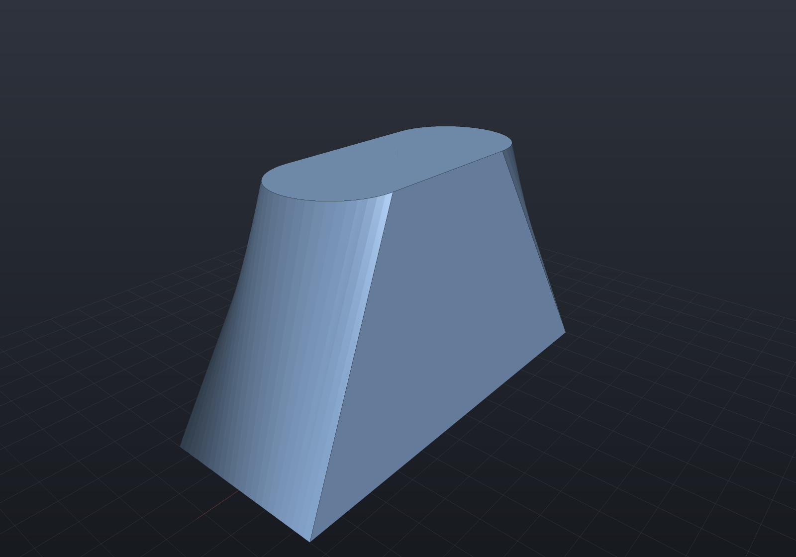
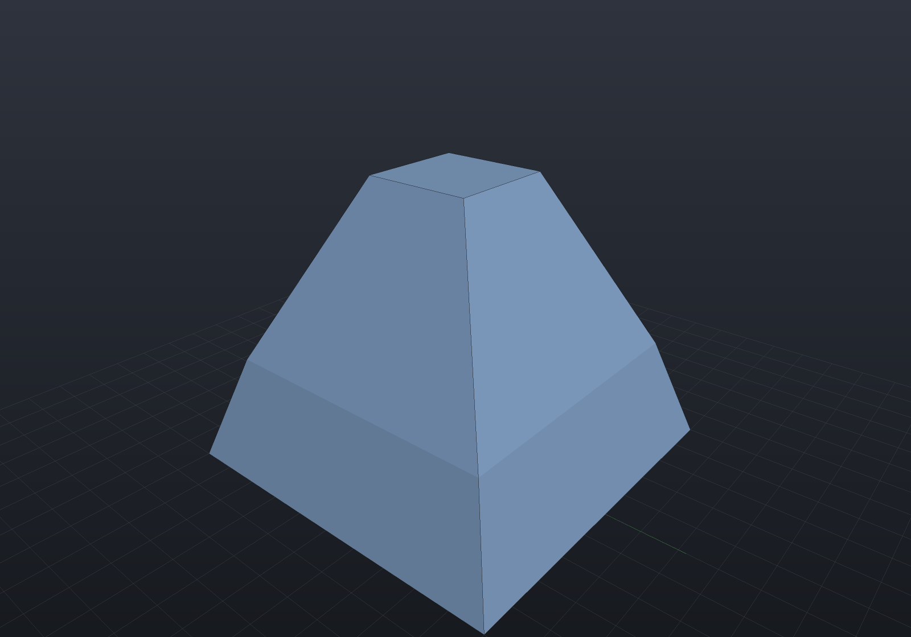
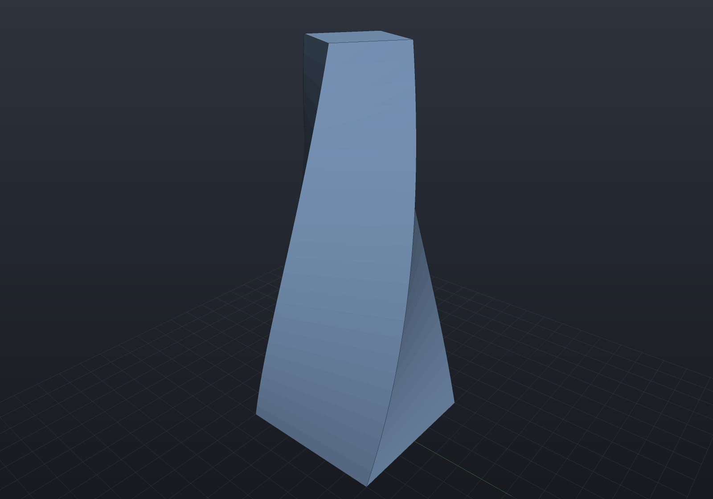
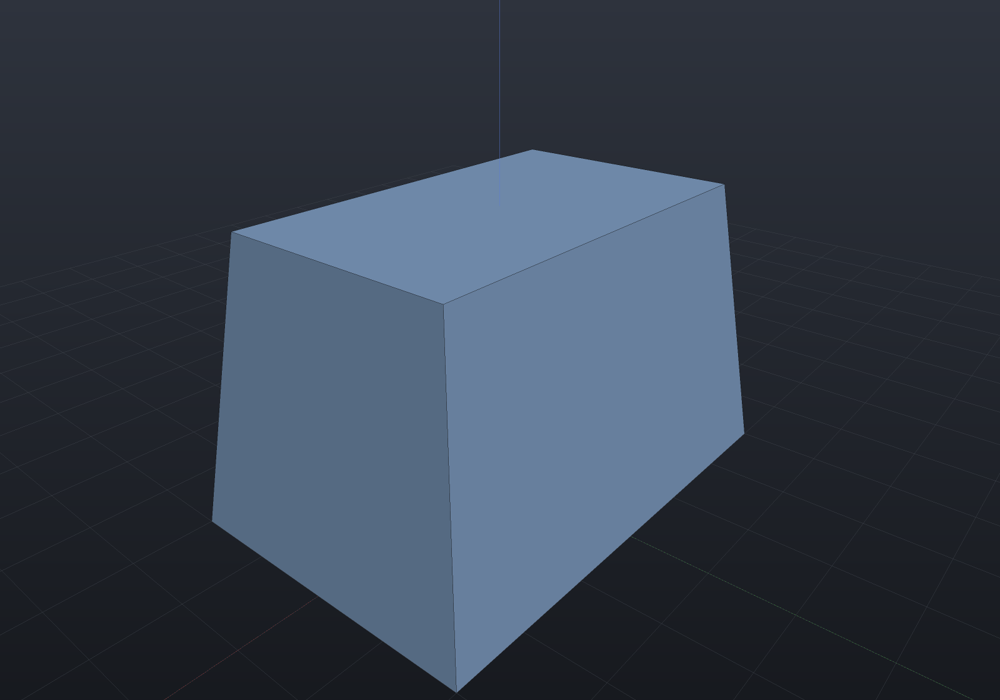
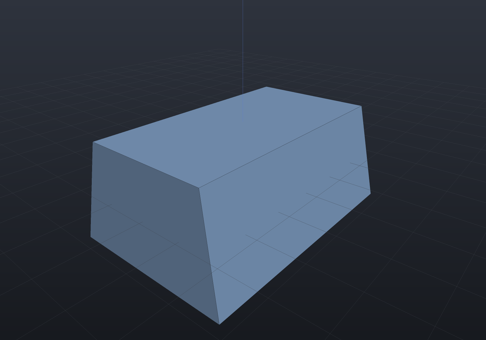
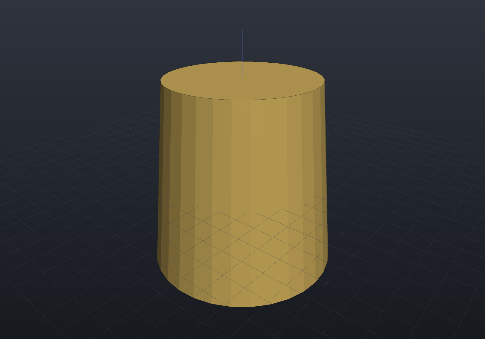
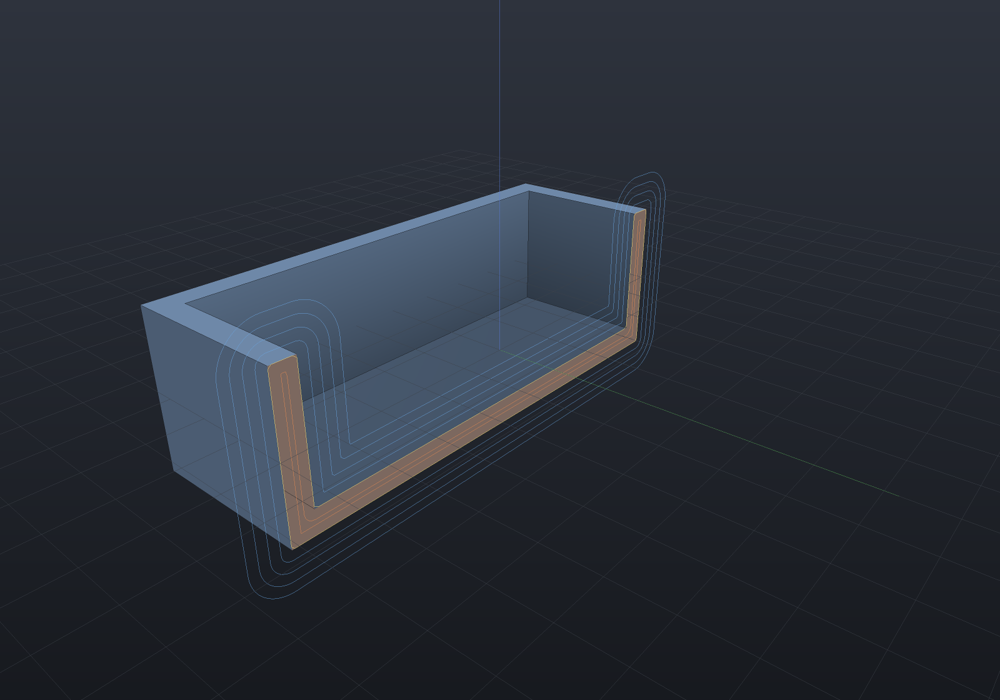
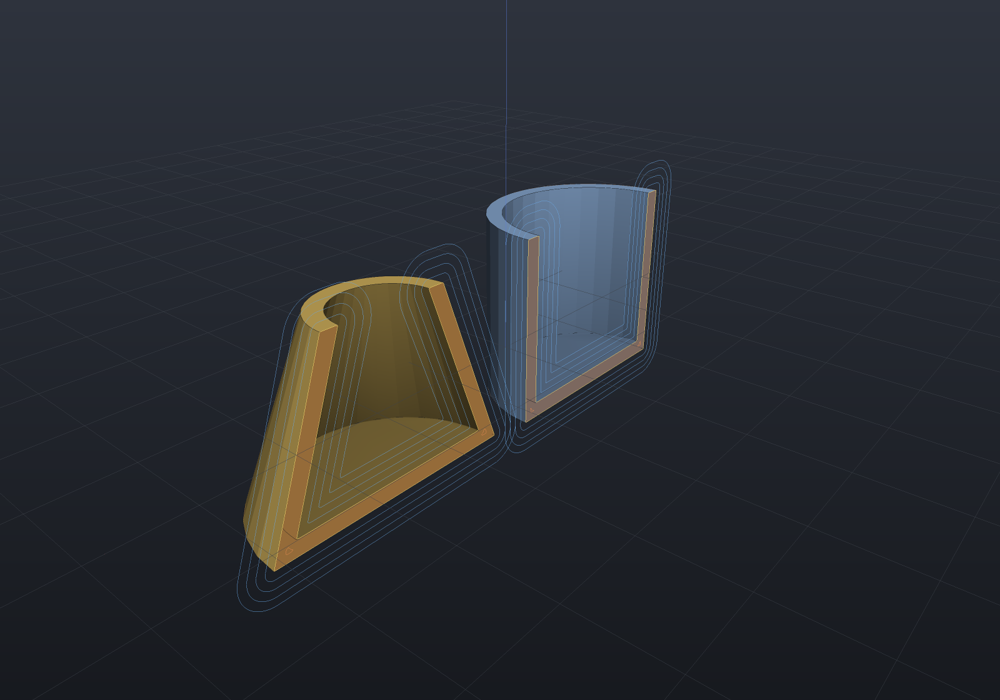
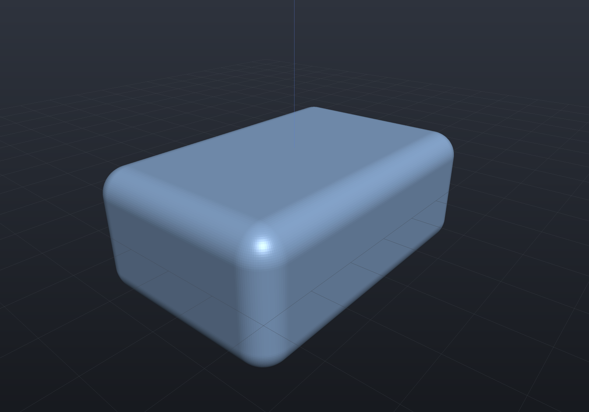

Four operations from the mould-making and industrial-design toolbox, all exact B-Rep
constructions under the hood: **loft** skins a solid through cross-sections, **draft**
adds the mould-release taper, **shell** hollows a solid to constant walls, and
**round edges** fillets every convex edge of a solid in one boolean-free operation.
Each is B-Rep-Native under rigid placements and uniform scaling, bridges implicit and
mesh through the exact B-Rep, and refuses what it cannot do exactly by name —
`shape.Explain(target)` tells the story per node.

## Loft: skin through sections

`Shape.Loft` takes two or more sketches, each placed by its own `SketchPlane`, and
skins a closed solid through them. Sections must have the same segment count (they
correspond by segment index); winding and starting segment are aligned automatically to
the least-twist match, and the ends are capped. Here a rectangle (four lines) becomes a
slot (two lines, two arcs):

```csharp render:loft-transition
var transition = Shape.Loft(
[
    (Sketch.Rectangle(24, 10), SketchPlane.XY),
    (Sketch.Slot(16, 7), SketchPlane.At((0, 0, 14), Vector3d.UnitX, Vector3d.UnitY)),
]);

var scene = new Scene();
scene.Add(new Part("transition", transition));
```



`LoftStyle.Smooth` (the default) interpolates *all* sections with one skin, so
intermediate sections leave no edge; `LoftStyle.Ruled` runs straight strips between
consecutive sections and keeps each junction as a real edge:

```csharp render:loft-ruled
var funnel = Shape.Loft(
[
    (Sketch.Rectangle(20, 20), SketchPlane.XY),
    (Sketch.Rectangle(16, 16), SketchPlane.At((0, 0, 6), Vector3d.UnitX, Vector3d.UnitY)),
    (Sketch.Rectangle(6, 6), SketchPlane.At((0, 0, 16), Vector3d.UnitX, Vector3d.UnitY)),
], LoftStyle.Ruled);

var scene = new Scene();
scene.Add(new Part("funnel", funnel));
```



Ruled lofts of polygonal sections are exact prismatoids — the two-rectangle loft above
has the closed-form volume `h·(A₀/3 + Aₘᵢₓ/6·2 + A₁/3)`, and the tests hold the
tessellated solid to it at nine digits.

### Evolution laws: `LoftAlong`

`Shape.LoftAlong` generates the sections itself: one sketch carried along a spine in
rotation-minimizing frames (the same frames `Sweep` uses), scaled and twisted by *laws*
evaluated along the way — OCCT's pipe shell with an evolution law. The generated
sections feed `Loft` unchanged:

```csharp render:loft-along
// A tapered, twisted column: square section, linear 1 → 0.45 scale, 60° of twist.
var spine = new Line3d(new Vector3d(0, 0, 0), new Vector3d(0, 0, 30));
var column = Shape.LoftAlong(
    Sketch.Rectangle(12, 12), spine, sectionCount: 12,
    scale: s => 1 - 0.55 * s,
    twist: s => s * Math.PI / 3);

var scene = new Scene();
scene.Add(new Part("column", column));
```



Without laws, prefer `Shape.Sweep` — its swept surface is exact along the whole path,
where a loft interpolates a finite number of stations. The law is what `LoftAlong`
exists for.

## Draft: the mould-release taper

`shape.Draft(angleDegrees, neutralOrigin, pullDirection, faces?)` tapers side faces
about the **neutral plane** (through `neutralOrigin`, perpendicular to the pull
direction) so the part releases from its mould. Geometry on the neutral plane does not
move — it is the parting line. The operation is exact: each face's plane is rotated
about its neutral line, and every corner is re-solved as the intersection of three
planes, so a drafted box is *exactly* a frustum:

```csharp render:draft-boss
var outline = Sketch.Polygon([
    new(-15, -10), new(15, -10), new(15, 10), new(-15, 10),
]);

// 8 degrees is far more than a real mould needs - it makes the taper visible.
var boss = Shape.Extrude(outline, 18)
    .Draft(8, neutralOrigin: (0, 0, 0), pullDirection: Vector3d.UnitZ);

var scene = new Scene();
scene.Add(new Part("boss", boss));
```



A face selector (the same query vocabulary as chamfer/fillet) drafts a subset; chaining
calls gives per-face angles, exactly — the operation is closed-form and composable
(`Draft.Apply` also takes a per-face angle selector directly at the kernel level):

```csharp render:draft-two-angles
var block = Shape.Box(30, 20, 12)
    .Draft(4, (0, 0, -6), Vector3d.UnitZ,
        s => s.PlanarFacesWithNormal(Vector3d.UnitX)
              .Concat(s.PlanarFacesWithNormal(-Vector3d.UnitX)))
    .Draft(12, (0, 0, -6), Vector3d.UnitZ,
        s => s.PlanarFacesWithNormal(Vector3d.UnitY)
              .Concat(s.PlanarFacesWithNormal(-Vector3d.UnitY)));

var scene = new Scene();
scene.Add(new Part("block", block));
```



**Curved faces taper too, and exactly.** A face of revolution about the pull direction
drafts by rotating its *generator* in its own axial half-plane about the point where
that generator crosses the neutral plane — the same rule, one dimension down. So a
drafted cylinder is exactly a cone, not a cone to some tolerance:

```csharp render:draft-cylinder
var boss = Shape.Cylinder(10, 20).Draft(6, (0, 0, -10), Vector3d.UnitZ);

var scene = new Scene();
scene.Add(new Part("tapered boss", boss, Palette.Brass));
```



Holed caps, profile-folding tapers and curved faces on any *other* axis are refused with
a message naming the problem.

## Shell: hollow to constant walls

`shape.Shell(thickness, openings)` hollows a solid **inward** to walls of the given
thickness, keeping the outer surface exactly. Faces named by the `openings` selector
are removed, opening the cavity through them — the classic tray; a `null` selector
seals the cavity as an internal void. Exact for polyhedral solids: an offset plane is a
plane, and every inner corner is the intersection of its three offset planes.

```csharp render:shell-tray section:y,0
var tray = Shape.Box(50, 34, 16)
    .Shell(2.5, s => s.PlanarFacesWithNormal(Vector3d.UnitZ));

var scene = new Scene();
scene.Add(new Part("tray", tray));
```



> [!NOTE]
> This is a *different operation* from `shape.Shell(thickness)` without a selector —
> the SDF onion `|d| − t/2`, which skins the surface **symmetrically** (half the wall
> outside the original surface) and is implicit-Native. The two are different
> geometry, so they are different calls: which walls a design gets is its explicit
> choice, never a representation's. `Explain` on the SDF shell names this overload as
> the exact route.

**Curved faces shell exactly too.** A cylinder offsets to a cylinder, a cone to a cone
and a torus to a torus, so a cylinder hollows to a cup and a pipe elbow opened at both
ends to a genus-1 tube whose volume matches Pappus:

```csharp render:shell-cup section:y,0
var cup = Shape.Cylinder(14, 24).Shell(2, s => s.PlanarFacesWithNormal(Vector3d.UnitZ));
var cone = Shape.Cone(16, 8, 22).Shell(2, s => s.PlanarFacesWithNormal(Vector3d.UnitZ));

var scene = new Scene();
scene.Add(new Part("cup", cup, Palette.Steel,
    Matrix4d.CreateTranslation((-18, 0, 0))));
scene.Add(new Part("conical cup", cone, Palette.Brass,
    Matrix4d.CreateTranslation((18, 0, 0))));
```



What is refused, by name: a carrier with no exact offset of its own family (swept and
NURBS surfaces), and a rim the construction cannot reproduce as a concentric circle —
which is what catches a *sealed* elbow, whose moved cap planes cut the offset torus in a
quartic rather than a circle. Open that face instead.

The kernel API also supports a per-face wall thickness — a thick base under thin walls:
`Shelling.Shell(solid, face => IsBase(face) ? 4.0 : 1.5, openings)`.

## Round edges: whole-solid rounding

`shape.RoundEdges(radius)` rounds **every** convex edge and corner with one radius —
the exact morphological opening `(K ⊖ B_r) ⊕ B_r`, built directly rather than through
booleans: each face keeps its own plane with a shrunk boundary, each edge becomes an
exact cylindrical band, each corner an exact spherical patch. A box becomes 26 faces:

```csharp render:round-edges
var block = Shape.Box(30, 20, 12).RoundEdges(2.5);

var scene = new Scene();
scene.Add(new Part("block", block));
```



The tessellated volume converges quadratically onto Steiner's formula
`V₀ + A₀r + (r²/2)Σℓθ + (4π/3)r³` for the eroded solid. Convex prisms and sheared
boxes keep exact lune corner patches, and **general trihedral corners** (a
tetrahedron's, a drafted block's) build trimmed spherical-triangle patches — see
[chamfer & fillet](chamfer-fillet.md#rounding-every-edge-at-once). Concave edges and
higher-valence vertices are refused by name. For organic rounding of arbitrary shapes,
the implicit route (`Offset(-r)` then `Offset(+r)` on the field) remains available.
