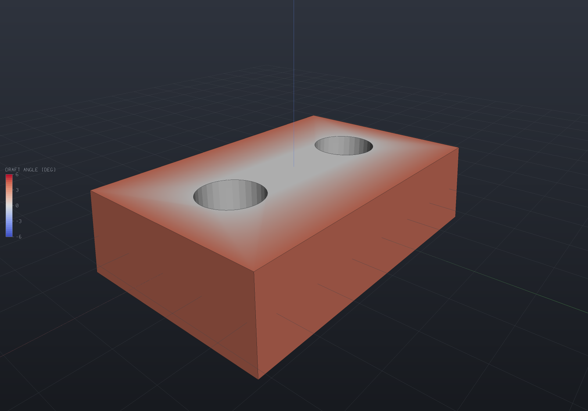
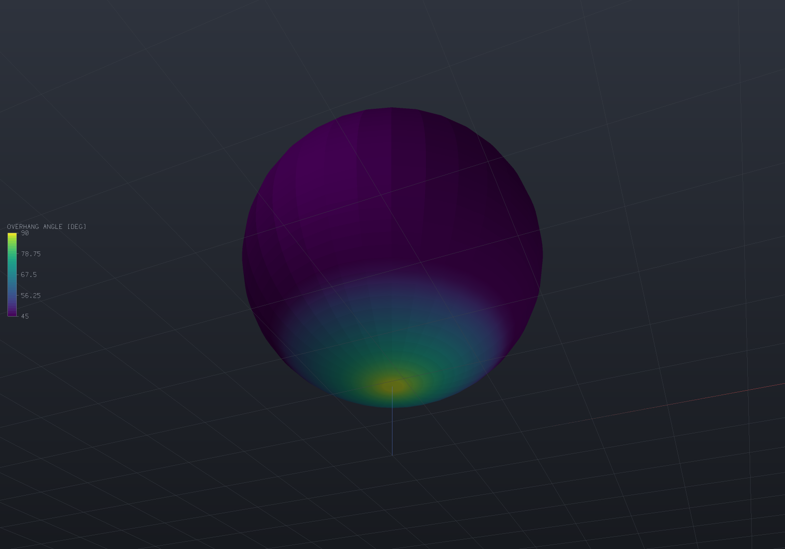
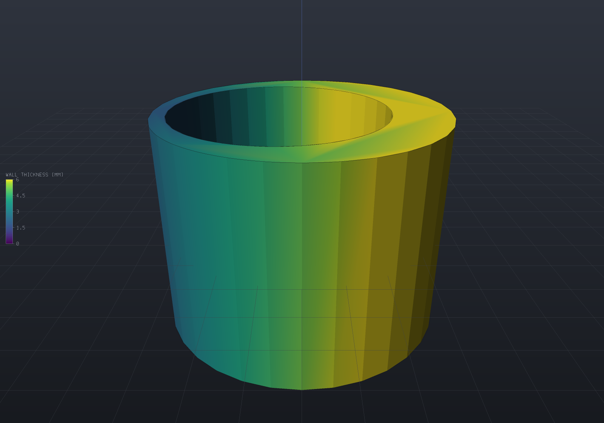

Three questions a part has to answer before anyone cuts metal or starts a print: will it
come out of the mould, will it print without support, and is any wall too thin?
`Manufacturability` answers all three over a `Part`, and each answer comes in two pieces
— a **report** you can assert on, and a **`MeshField`** the viewer colours with no extra
code, because [a result is just data on a mesh](fields.md).

```csharp
var report = Manufacturability.CheckDraft(part, pull: Vector3d.UnitZ, minimumAngleDegrees: 3);

part.AddResult(report.Field);      // one number per display-mesh vertex
part.FieldDisplay = report.Display; // the map and range the check wants to be read on
```

Every check states which of its numbers are exact and which are measured. That split is
the point: a design-for-manufacture report that cries wolf on correct geometry is worse
than no report, so the *verdict* comes from the most exact source the part has, while the
*picture* is drawn from the display mesh and says so.

## How to read these plots

All three quantities live on **facets** and a `MeshField` lives on **vertices**, so each
vertex carries the **worst** reading among the facets touching it — which is what a check
is for, and which has one consequence worth knowing before you act on a picture.

A vertex on a sharp edge belongs to both faces, so the worse face's value bleeds one ring
into its neighbour; and a large planar face with no interior vertices is *interpolated
across its whole extent* from its corners. On the housing below the flat top passes
comfortably (it is square to the pull) and still shows a pale halo, because the only
vertices it has are its corners and the bore rims. **The report is the verdict; the
picture is a locator.** Refine the mesh where you want the plot to be sharp.

## Draft angle

The draft angle at a point is `asin(n · pull)` for the outward normal `n`. A wall
**parallel** to the pull reads 0 — it cannot release — and a face square to the pull
reads ±90. The **sign** says which mould half the face belongs to, so a signed field also
shows you where the parting line is.

```csharp render:dfm-draft
// A cast housing: the body is drafted 4 degrees, and the two cored bores are not --
// the classic real defect, since the core pins are modelled straight.
var top = SketchPlane.At((0, 0, 9), Vector3d.UnitX, Vector3d.UnitY);
var housing = Shape.Box(70, 45, 18)
    .Draft(4, (0, 0, -9), Vector3d.UnitZ)
    .Drill(StandardHoles.Clearance(12), [new(-18, 0), new(18, 0)], depth: 22, top);

var part = new Part("housing", housing);
var draft = Manufacturability.CheckDraft(part, Vector3d.UnitZ, minimumAngleDegrees: 3);

if (draft.Passes) throw new Exception("the straight bores should be reported");
if (draft.Failing.Count != 2) throw new Exception("exactly the two bores");

part.AddResult(draft.Field);
part.FieldDisplay = draft.Display;

var scene = new Scene();
scene.Add(part);
```



The report names them:

```text
Draft against pull (0, 0, 1), minimum 3.00 deg
! face 6 (Cylindrical) at (-18, 4.44089E-16, 0): 0.00 deg over 763.407 area (640 samples)
! face 7 (Cylindrical) at (18, 4.44089E-16, 0): 0.00 deg over 763.407 area (640 samples)
2 of 8 face(s) under 3.00 deg, 1526.81 of area; worst 0.00 deg.
```

Each failing row carries the face's `Bounds().Center` — a face is located by its bounds,
never by a plane's stored origin, which is an arbitrary in-plane point — its area, and
whether the angle was read off one exact normal or measured over N samples.

`Display` uses the **diverging** map over a range centred on zero and saturating at twice
the minimum, so the two mould halves take the two colours and the neutral midpoint is
exactly the vertical band the check is about.

### Exact where it can be, sampled where it cannot

A **planar** face has one normal, so its draft is one number with no discretization in
it: `Samples` is 1 and `Sampled` is false. A drafted block's walls read the angle they
were drafted at to within 4.4e-16 of a degree — `Shape.Draft` rotates each plane by
exactly the angle, so that is an identity rather than a tolerance.

A **curved** face has a normal that varies, so it is read at a grid of points over the
trimmed parameter domain plus every point of its pulled boundary loops, and the row says
how many samples that took. Raise `curvedFaceSamples` where an extremum between samples
would matter.

```csharp run:dfm-draft-exactness
var block = Shape.Box(40, 30, 20).Draft(3, (0, 0, 0), Vector3d.UnitZ);
var report = Manufacturability.CheckDraft(new Part("b", block), Vector3d.UnitZ, 2);

foreach (var wall in report.Faces.Where(f => Math.Abs(f.WorstReleaseDegrees) < 45))
{
    if (wall.Samples != 1) throw new Exception("a plane is one exact normal");
    if (Math.Abs(wall.WorstReleaseDegrees - 3) > 1e-13) throw new Exception("the drafted angle, exactly");
}

// Reverse the pull and every sign inverts -- the faces swap mould halves.
var down = Manufacturability.CheckDraft(new Part("d", block), -Vector3d.UnitZ, 2);
for (int i = 0; i < report.Faces.Count; i++)
    if (Math.Abs(report.Faces[i].WorstReleaseDegrees + down.Faces[i].WorstReleaseDegrees) > 1e-13)
        throw new Exception("reversing the pull must reverse every sign");
```

### What it deliberately cannot see

The draft angle is a **local** property of a normal. A face can have ample draft and
still be shadowed by material above it, so that no rigid pull frees it — a genuine
undercut. Deciding that is a visibility question along ±pull, not a normal question, and
this check does not attempt it.

A part with no B-Rep — a raw mesh, an `.stl` import, an SDF — has no faces to list, so
the verdict falls back to the display mesh's facets and `Note` says so. That reading is
conservative on convex curved faces: an inscribed facet is steeper than the surface it
approximates, so it reports slightly *less* draft than the surface has.

## Overhangs

A facet's overhang angle is `asin(-n · build)`: a **vertical wall** reads 0, a
downward-facing **ceiling** reads +90, and an upward-facing surface reads negative. A
facet needs support when that angle **exceeds** the threshold — strictly, so a surface
drawn at exactly the stated self-supporting angle is self-supporting.

```csharp render:dfm-overhang
// The canonical overhang: a ball printed from the bottom up.
var part = new Part("ball", Shape.Sphere(14).Translate((0, 0, 20)));
var overhangs = Manufacturability.CheckOverhangs(part, Vector3d.UnitZ, thresholdDegrees: 45);

// The cap below 45 degrees from vertical is 2.pi.R^2.(1 - sin 45) of the surface.
double exact = 2 * Math.PI * 14 * 14 * (1 - Math.Sin(Math.PI / 4));
if (Math.Abs(overhangs.OverhangArea / exact - 1) > 0.03) throw new Exception("the cap area");

part.AddResult(overhangs.Field);
part.FieldDisplay = overhangs.Display;

// An overhang faces DOWN, so a picture of one has to be taken from below -- and lit by a
// matcap, because the scene's key light is above and would leave the answer in shadow.
var camera = new CameraState(-Math.PI / 2 + 0.4, -0.7, 62, (0, 0, 18));
var shading = ShadingStyle.Clay;

var scene = new Scene();
scene.Add(part);
```



`Display` runs Viridis from the threshold to 90°, so everything self-supporting clamps to
the bottom colour and only what needs support lights up. Beside the area,
`ProjectedArea` is those facets projected onto the build plane — the footprint support
material would occupy.

Nothing here says the part is printed upright: `buildDirection` is an argument, so
comparing candidate orientations is three calls and a `Min`.

This leg is pure mesh arithmetic and exact for the mesh it is given. Two things follow
from that, and both are worth knowing before you trust a number.

### The comparison is on the dot product, not on the angle

`asin` is monotone, so "the angle exceeds the threshold" and "the dot product exceeds the
threshold's sine" are the same statement — mathematically. In doubles they are not quite:
a wall built at exactly 45° reports a **steepest angle of 45.000000000000007**, because
`asin` round-trips `1/sqrt(2)` an ulp high. A check comparing degrees would call a wall
drawn at exactly the stated angle an overhang. The dot-product form carries one fewer
rounding and gets it right, so that is the form the counts and the verdict use, while the
reported degrees exist for humans.

```csharp run:dfm-overhang-tie
// A 45-degree wall: the triangle (0,0)-(20,0)-(0,20) extruded and laid on its side.
var wall = Shape.Extrude(Sketch.Start(0, 0).LineTo(20, 0).LineTo(0, 20).Close(), 30)
    .Transform(Matrix4d.CreateFromAxisAngle(Vector3d.UnitX, -Math.PI / 2));

var tie = Manufacturability.CheckOverhangs(new Part("a", wall), Vector3d.UnitZ, 45);
if (!tie.Passes) throw new Exception("a wall at exactly the threshold is self-supporting");
if (!(tie.SteepestDegrees > 45)) throw new Exception("...and its reported angle is an ulp over 45");

// A shade under and the whole wall is reported, to the last bit.
var below = Manufacturability.CheckOverhangs(new Part("b", wall), Vector3d.UnitZ, 44.9);
if (Math.Abs(below.OverhangArea - 20 * Math.Sqrt(2) * 30) > 1e-9) throw new Exception("the wall area");
```

### A curved surface reports the tessellation's angle

An inscribed n-gon pyramid's lateral faces are **steeper** than the cone they approximate
— by exactly `atan(cos(pi/n))` — so a 45° cone reads 44.8617° at 32 segments and 44.9915°
at 128, and passes a 45° threshold for a reason that is about the mesh rather than about
the rule. That bias is always in the safe direction for a print (it under-reports
steepness on convex curvature), but it means a nominally-at-threshold *curved* surface is
decided by your tessellation quality. Use `MeshQuality` deliberately when that matters.

There is no build plate in this model, either: a face resting on the bed is reported like
any other ceiling, because the check knows the build *direction* and not where the plate
is.

## Wall thickness

This is the one with a real design question in it, so here is the estimator stated
plainly. From every display-mesh vertex a ray runs **into** the material along the
reversed vertex normal; the first surface it leaves through is the opposite wall, and the
reported thickness is `t · |n · n_hit|` — the perpendicular distance from the vertex to
the **plane of the facet it hit**, not the raw ray length.

```csharp render:dfm-thickness
// An eccentric tube: outer R20, a R15 bore offset 3 mm. The wall runs 2 mm on the thin
// side to 8 mm on the thick one, which no single dimension on a drawing would tell you.
var tube = Shape.Cylinder(20, 30).Subtract(Shape.Cylinder(15, 40).Translate((3, 0, 0)));

var part = new Part("tube", tube);
var thickness = Manufacturability.CheckThickness(part, minimumThickness: 3);

if (thickness.Passes) throw new Exception("the thin side is under 3 mm");
if (Math.Abs(thickness.Minimum - 2) > 0.05) throw new Exception("the thin side is 2 mm");

part.AddResult(thickness.Field);
part.FieldDisplay = thickness.Display;

var camera = new CameraState(Math.PI / 2, 0.45, 75, (0, 0, 0));

var scene = new Scene();
scene.Add(part);
```



The thin side measures **1.9904** against an analytic 2 at the default density. That
deficit is the discretization rather than the estimator, which is a measurement and not
an assumption: at 32 / 64 / 128 / 256 segments per circle the error runs
−9.63e-3 / −2.41e-3 / −6.02e-4 / −1.51e-4 — ratios of exactly 4.00, so it converges
quadratically — and it is one-sided, always **under**, which is the direction a
minimum-thickness check should err in.

### Where it is exact, where it lies, and where it declines

**Exact** wherever the opposing surface is planar, because the perpendicular distance
from a point to a plane is exactly the ray length times the cosine between the two
normals. That covers plates, ribs, bosses, webs and shelled prisms — the geometry a
thickness check is actually run on. A shelled box reads its wall to 2.2e-16 relative, at
scales from 1e-3 to 1e3.

It is also what makes a **tapered** wall read its true perpendicular thickness where the
raw ray length would over-report it. On a right-triangular prism with 20 mm legs the ray
from the right-angle corner is 14.5297 long and the answer is
`a·b / hypot(a, b) = 14.1421`; the correction recovers it exactly.

**It lies** against a *curved* opposing surface, where it measures to the tangent plane at
the hit: under-reporting where that surface is locally convex as seen from the vertex (the
far side of a bore) and over-reporting where it is locally concave (the outer wall of a
shaft, read from the bore). Because every vertex of the whole surface is probed, a wall
between a convex and a concave surface is measured from both sides and the conservative
reading is the one the minimum keeps. It also measures **along the surface normal**, so it
reports what a caliper on that normal reports and not the largest inscribed ball — at a
fillet or an inside corner the medial-axis thickness is smaller.

**It declines** where a ray never leaves the material — a rib end, a boss top over a
through-hole. Those points are counted in `UnmeasuredCount` and given the model's own
diagonal in the field.

That last spelling is deliberate and is the one place a plausible-looking picture would
have been a lie. `FieldRange` skips NaN when ranging, but a NaN still paints as the
colour map's **bottom stop** — which on a thickness plot is the colour of the thinnest
wall in the part. An unmeasurable point drawn that way is the exact defect the check
exists to find. The conservative end of the scale plus a number in the report is honest;
a convincing picture is not.

```csharp run:dfm-thickness-unmeasured
var wedge = Shape.Extrude(Sketch.Start(0, 0).LineTo(20, 0).LineTo(0, 20).Close(), 30);
var part = new Part("wedge", wedge);
var report = Manufacturability.CheckThickness(part, 1);

if (report.UnmeasuredCount != 2) throw new Exception("the two acute corners fire along the prism");
for (int v = 0; v < report.Field.Count; v++)
    if (double.IsNaN(report.Field.ValueAt(v))) throw new Exception("no NaN in a field a user looks at");
if (!(report.Minimum < report.Field.Range.Max)) throw new Exception("unmeasured is the LARGEST value");
```

One more limit worth stating: the probe is at mesh **vertices**. On a prism whose walls
are planes that is exact everywhere, because the thickness between two planes is
constant; on a face whose opposing surface curves, the thinnest point can fall between
vertices, so refine the mesh where the answer matters.

## Re-running a check

`Part.AddResult` replaces a result of the same name, so re-running a check after a
parameter change updates the display in place rather than accumulating twins — and a part
can carry all three at once, with `FieldDisplay` naming the one to show.

```csharp run:dfm-three-at-once
var part = new Part("plate", Shape.Box(60, 40, 6));

part.AddResult(Manufacturability.CheckDraft(part, Vector3d.UnitZ, 1).Field);
part.AddResult(Manufacturability.CheckOverhangs(part, Vector3d.UnitZ, 45).Field);
part.AddResult(Manufacturability.CheckThickness(part, 5).Field);
if (part.Results.Count != 3) throw new Exception("three checks, three results");

// Re-running one replaces it.
part.AddResult(Manufacturability.CheckThickness(part, 5).Field);
if (part.Results.Count != 3) throw new Exception("a re-run must not accumulate twins");

part.FieldDisplay = new FieldDisplay { Field = Manufacturability.FieldNames.WallThickness };
if (!part.TryResolveFieldDisplay(out _, out string? error)) throw new Exception(error);
```
