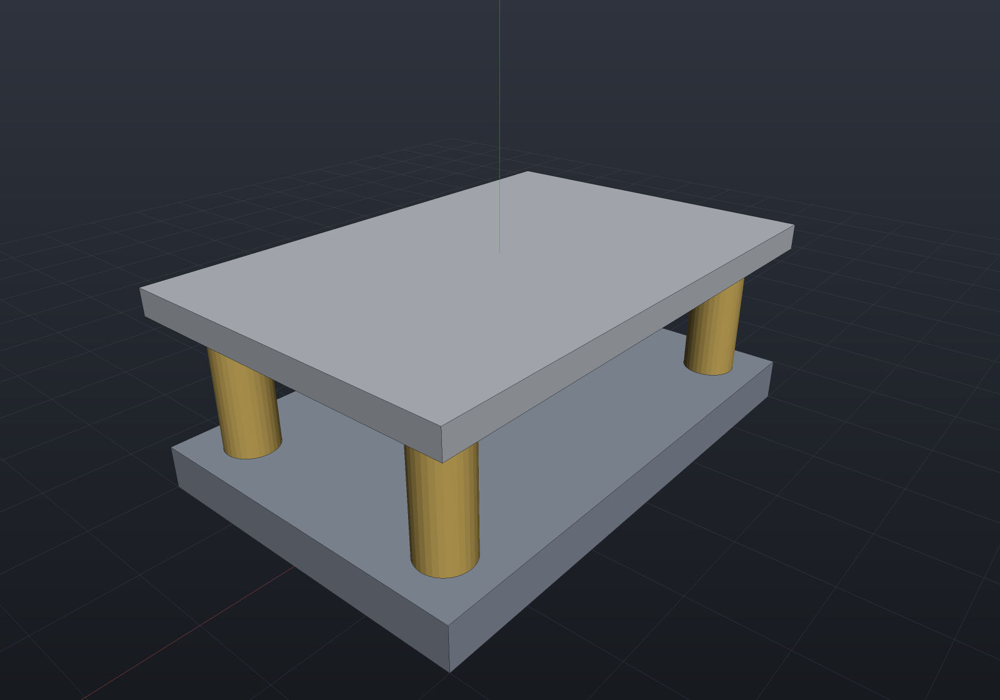

# Materials & mass

A `Part` can say what it is **made of**. `Material` carries a name, a mass density,
an optional display colour and — optionally — the analysis properties a simulation
needs (Young's modulus, Poisson's ratio, conductivity, specific heat, expansion).
It is one type, in `EngrCAD.Core`, shared by the document model and by
[structural](fea-structural.md), [thermal](fea-thermal.md), [modal](fea-modal.md)
and [buckling](fea-buckling.md) analysis, so the density a bill of materials weighs
a part with is the density a solve integrates.

```csharp render:materials-rig
// A catalogue material carries no colour (appearance is a finish, not a property of
// the stuff), so WithColor is how a design states one. Nothing else changes.
var steel     = Materials.Steel.WithColor(new PartColor(0.60f, 0.64f, 0.70f));
var aluminium = Materials.Aluminium6061.WithColor(new PartColor(0.80f, 0.82f, 0.85f));
var brass     = Materials.Brass.WithColor(new PartColor(0.85f, 0.72f, 0.38f));

// `.Of(material)` sets Part.Material and returns the part, so it fits in the
// expression that builds it.
var basePlate = new Part("base plate", Shape.Box(120, 80, 10)).Of(steel);
var cover     = new Part("cover", Shape.Box(120, 80, 6)).Of(aluminium);
var pillar    = new Part("pillar", Shape.Cylinder(6, 30)).Of(brass);

var rig = new Assembly("rig");
rig.Add(basePlate, Frame3d.FromXY((0, 0, 5), Vector3d.UnitX, Vector3d.UnitY));
rig.Add(cover, Frame3d.FromXY((0, 0, 43), Vector3d.UnitX, Vector3d.UnitY));
foreach (var (x, y) in new[] { (48.0, 28.0), (-48.0, 28.0), (-48.0, -28.0), (48.0, -28.0) })
    rig.Add(pillar, Frame3d.FromXY((x, y, 25), Vector3d.UnitX, Vector3d.UnitY));

var scene = new Scene();
scene.AddTab("rig").Add(rig);
```



## Units: one convention, stated once

**Densities are in tonne/mm³** — the consistent **mm / N / MPa / tonne / s** system
`EngrCAD.Core.ModelUnits` states for the whole repository. Structural steel is
`7.85e-9`, not 7850 and not 7.85e-6.

That is not an arbitrary pick. A density is either a number an *equation* consumes
or a number a *report* prints, and only the second can be converted afterwards: a
mass matrix has to balance against a stiffness in MPa and a length in mm with no
room for a factor, whereas mass properties form exactly one product from the
density and can convert it at the end. So the convention lives where it cannot be
converted, and the readable units are accessors.

```csharp run:materials-units
// Transcribing a datasheet: type the kg/m3 figure, never the exponent.
var delrin = new Material("Delrin",
    density: ModelUnits.DensityFromKilogramsPerCubicMetre(1410));

if (Math.Abs(delrin.Density - 1.41e-9) > 1e-20) throw new Exception("tonne/mm3");
if (Math.Abs(delrin.DensityKilogramsPerCubicMetre - 1410) > 1e-6)
    throw new Exception("reads back as the datasheet figure");

// A mass computed from it is therefore in TONNES; grams and kilograms are accessors.
var block = new Part("block", Shape.Box(100, 20, 5)).Of(Materials.Aluminium6061);
double tonnes = block.MassProperties().Mass;                  // 10 000 mm3 x 2.7e-9
if (Math.Abs(ModelUnits.MassToGrams(tonnes) - 27.0) > 1e-6) throw new Exception("27 g");
if (Math.Abs(block.MassGrams()!.Value - 27.0) > 1e-6) throw new Exception("27 g");
```

| Quantity | Unit | Steel reads |
| --- | --- | --- |
| Length | mm | — |
| Force | N | — |
| Stress, modulus | MPa = N/mm² | E = 210 000 |
| Density | tonne/mm³ | 7.85e-9 |
| Mass | tonne | `ModelUnits.MassToGrams` / `MassToKilograms` |
| Conductivity | mW/(mm·K) | 50 — numerically the SI W/(m·K) |
| Specific heat | mm²/(s²·K) | 4.60e8 — the SI J/(kg·K) × 1e6 |
| Gravity | mm/s² | `ModelUnits.Gravity` = 9806.65 |

The SI system (m / N / Pa / kg) is equally consistent and works identically; what
does not work is mixing them, which nothing here can detect — hence the
conversions.

## Mass properties need no density argument

`Part.MassProperties()` reads `Part.Material`, so an assembly total is one call.
Parts with no material contribute density 1, which makes their mass a copy of their
volume — the honest answer when nobody has said what they are made of, rather than a
silent zero. The explicit density overload is still there for a part whose material
is not modelled.

```csharp run:materials-mass
var steel = new Part("bracket", Shape.Box(60, 40, 8)).Of(Materials.Steel);
var cover = new Part("cover", Shape.Box(60, 40, 3)).Of(Materials.Aluminium6061);

var rig = new Assembly("rig");
rig.Add(steel, Frame3d.WorldXY);
rig.Add(cover, Frame3d.FromXY((0, 0, 20), Vector3d.UnitX, Vector3d.UnitY));

var total = rig.Flatten().MassProperties();          // <- the whole call
double grams = ModelUnits.MassToGrams(total.Mass);

// 19 200 mm3 of steel (150.72 g) + 7 200 mm3 of aluminium (19.44 g).
if (Math.Abs(grams - 170.16) > 1e-6) throw new Exception($"expected 170.16 g, got {grams}");

// The centre of mass hugs the heavier part, and the bulk density is the mixture's.
if (total.Centroid.Z > 6) throw new Exception("the steel bracket dominates");
if (Math.Abs(total.Density - total.Mass / total.Volume) > 1e-18)
    throw new Exception("bulk density = total mass / total volume");
```

## In the bill of materials

A **MATERIAL** column appears in `Bom.ToText()` and `ToCsv()` as soon as any line
states one, and not otherwise — a column that would be empty on every row is not
printed. **Mass** is opt-in (`mass: true`) rather than automatic, because it is the
only part of a bill of materials that evaluates geometry:

```csharp run:materials-bom
var plate = new Part("base plate", Shape.Box(120, 80, 10)).Of(Materials.Steel);
var pillar = new Part("pillar", Shape.Cylinder(6, 30)).Of(Materials.Brass);
var shim = new Part("shim", Shape.Box(20, 20, 1));          // material not stated

var rig = new Assembly("rig");
rig.Add(plate, Frame3d.WorldXY);
foreach (var (x, y) in new[] { (48.0, 28.0), (-48.0, 28.0), (-48.0, -28.0), (48.0, -28.0) })
    rig.Add(pillar, Frame3d.FromXY((x, y, 25), Vector3d.UnitX, Vector3d.UnitY));
rig.Add(shim, Frame3d.FromXY((0, 0, 60), Vector3d.UnitX, Vector3d.UnitY));

var bom = Bom.For(rig);
Console.WriteLine(bom.ToText(mass: true));
//  QTY  ITEM        KIND  MATERIAL           MASS (g)  TOTAL (g)  WHERE
//    1  base plate  made  Structural steel    753.6      753.6    rig/base plate
//    4  pillar      made  Brass C36000         28.839    115.354  rig/pillar, ...
//    1  shim        made  -                        -          -   rig/shim

var plateLine = bom.Lines.Single(l => l.Item == "base plate");
if (Math.Abs(plateLine.UnitMassGrams!.Value - 753.6) > 1e-6)
    throw new Exception($"96 000 mm3 of steel is 753.6 g, got {plateLine.UnitMassGrams}");

// An unstated material is an UNKNOWN mass, not a zero: the line reports null, the
// text prints "-", the CSV cell is empty, and the footer total says what it covers.
if (bom.Lines.Single(l => l.Item == "shim").UnitMassGrams is not null)
    throw new Exception("an unstated material has no mass");
if (!bom.ToText(mass: true).Contains("over the 2 of 3 items stating a material"))
    throw new Exception("the total should say what it covers");
```

`BomLine.Material` is the whole `Material`, not just its name, so a purchasing view
can reach the density; `UnitMassGrams` and `TotalMassGrams` are the per-item and
per-line figures.

## The same material drives an analysis

Nothing has to be restated for a solve. The catalogue entries carry elastic and
thermal properties already, and a document material picks them up with
`WithElasticity` / `WithThermal`:

```csharp run:materials-analysis
// A document material: a name and a density, nothing more. This is what a bill of
// materials is made of, and it is legal to build.
var alloy = new Material("Mystery alloy", density: 7.8e-9);
if (alloy.HasElasticity) throw new Exception("no modulus stated");

// A structural model refuses it BY NAME — the refusal lives where the property is
// needed, not in the constructor, because most parts never see a solver.
var mesh = TetMesher.Mesh(Shape.Box(40, 10, 10).ToMesh());
try
{
    _ = new StructuralModel(mesh, alloy);
    throw new Exception("should have been refused");
}
catch (FeaException ex) when (ex.Message.Contains("no Young's modulus")) { }

// The same object with a modulus is accepted.
var model = new StructuralModel(mesh, alloy.WithElasticity(200_000, 0.3));
if (!model.DefaultMaterial.HasElasticity) throw new Exception("now it has one");
```

## Colour

If a material states a `Color`, it becomes the **default** colour of any part
carrying it that has none of its own. A material colour deliberately does **not**
consume a palette slot, so attaching a material to one part never re-colours the
others — and because no catalogue entry carries a colour, assigning
`Materials.Steel` to a part moves no pixels at all.

An explicit `Part.Color` still wins over the material's, and
`DocumentEdits.SetMaterial` leaves a part's colour alone: a material only ever
supplied the default at add time, and silently recolouring a part someone has
already coloured would be a second, hidden edit.

## What carries where

- **Documents.** `Part.Material` round-trips through
  [`Document.Save`/`Load`](documents.md); only the properties actually stated are
  written, so a file for a scene with no materials is byte-identical to what it
  always was.
- **The viewer.** The properties panel shows the material name and the part's mass
  (from the display mesh, so it can never lower a B-Rep on the UI thread), and the
  BOM overlay shows the material column.
- **MCP.** `describe_part` reports the material with its density in *both*
  spellings — tonne/mm³ to compute with, kg/m³ to check against a datasheet.
