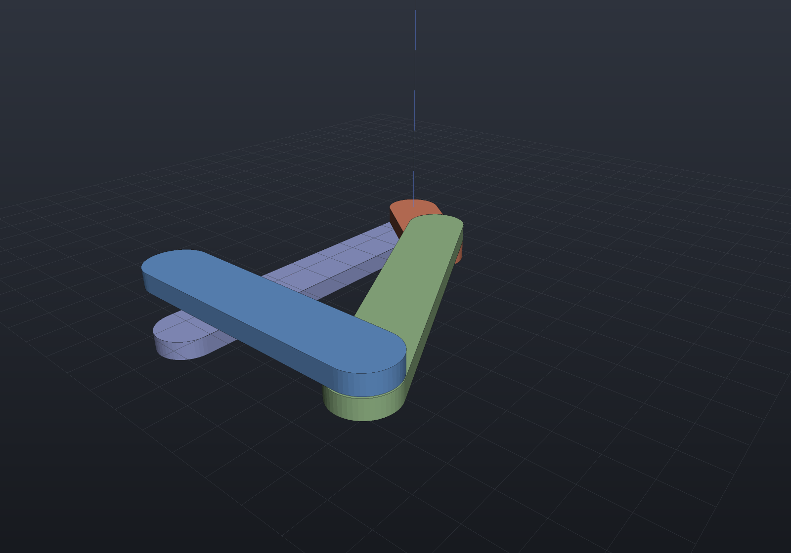
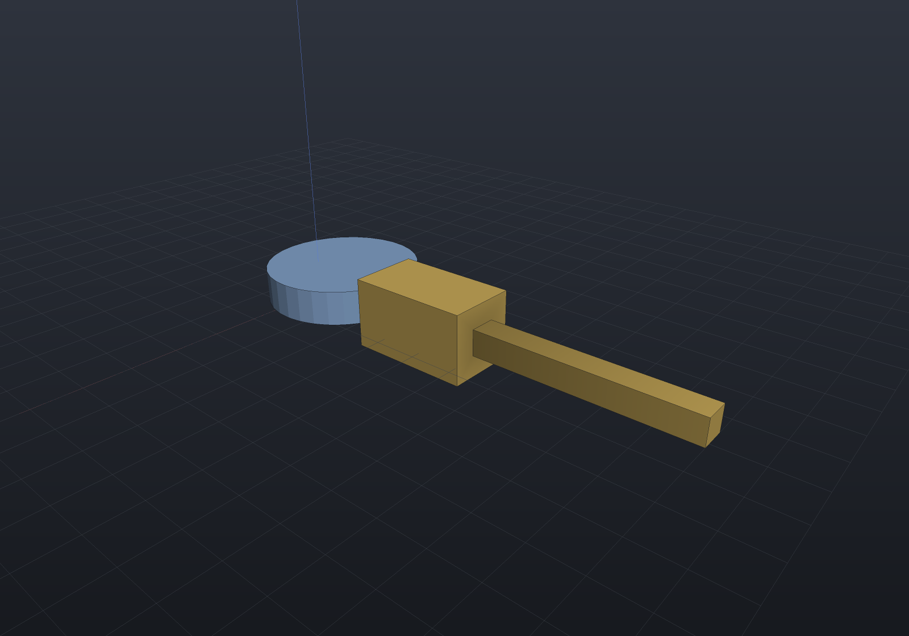
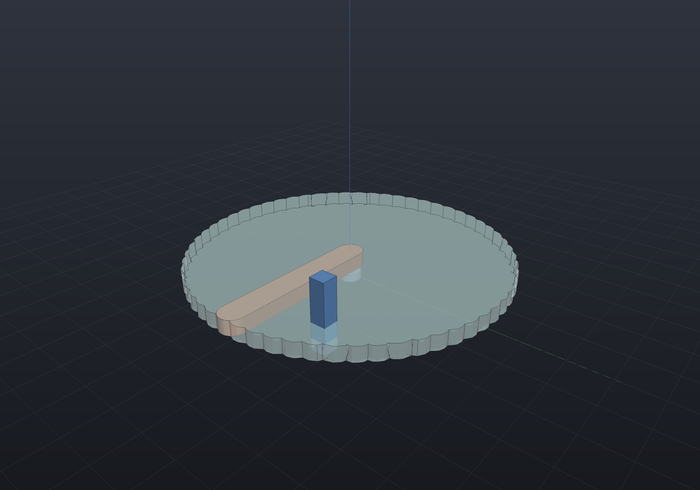
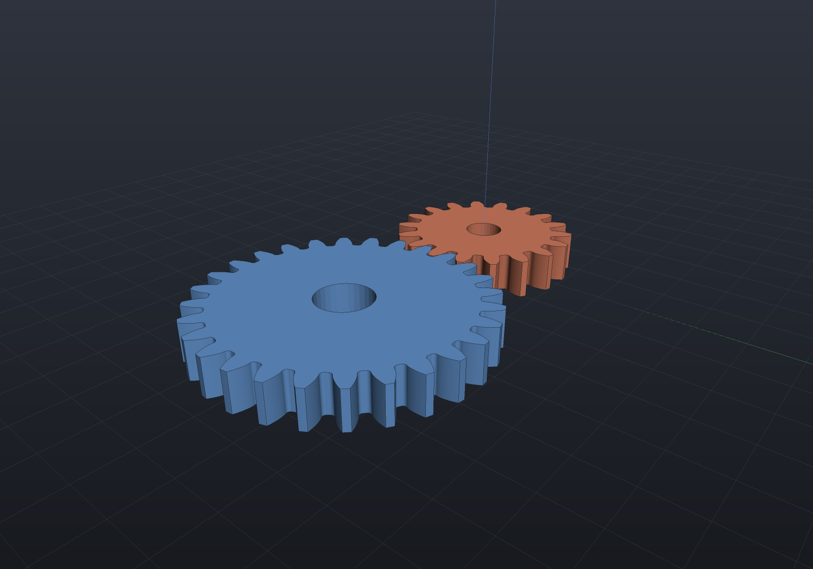
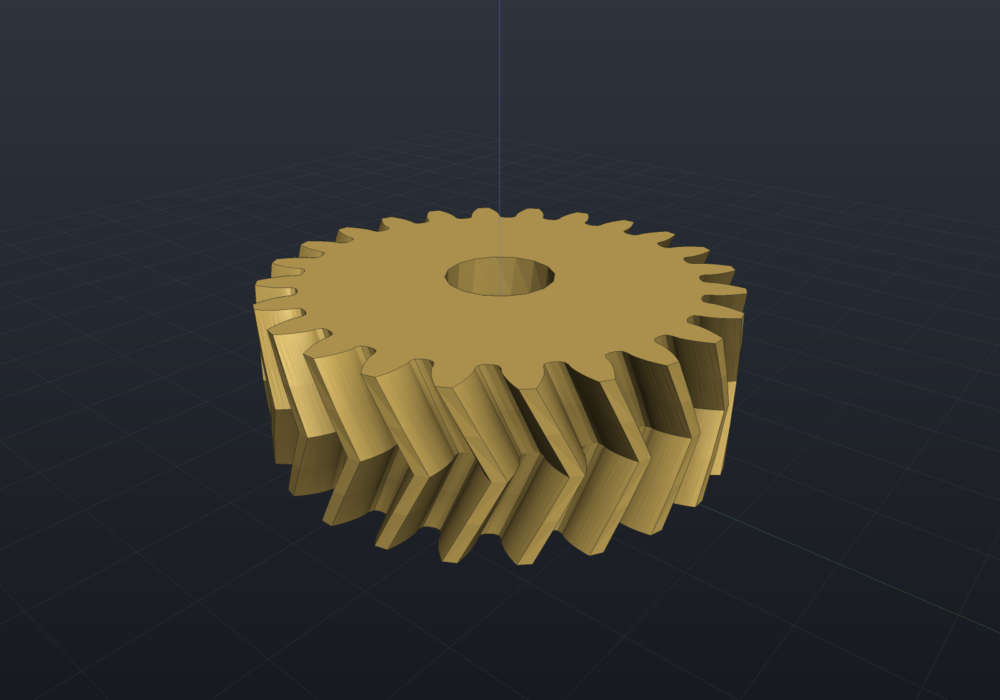
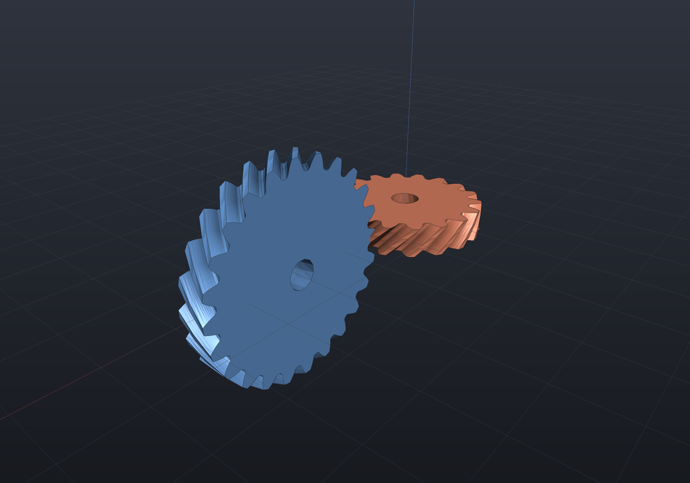

# Mechanisms

A **mechanism is the same mate system, driven**. The
[mate solver](assemblies.md) already reports remaining degrees of freedom from a
rank-revealing factorization — a fully-constrained assembly is static, and a
mechanism is a mate system with DOF &gt; 0 plus a driver consuming them. So
mechanisms add no second solver: a vocabulary of **joints** over the existing
mates, scalar **couplings** (screws, gears, cams) beside them in the residual
vector, and a continuation loop around the solve.

| Joint | DOF | Made of |
| --- | --- | --- |
| `Joint.Revolute` | 1 | concentric + coincident (a hinge) |
| `Joint.Prismatic` | 1 | concentric + a spin lock (a slider) |
| `Joint.Cylindrical` | 2 | concentric (a pin in a bore) |
| `Joint.Spherical` | 3 | coincident (a ball joint) |
| `Joint.Planar` | 3 | a planar mate (a face sliding on a face) |
| `Joint.Screw` | 1 | concentric + the pitch coupling θ·P/2π = z |
| `Joint.Fixed` | 0 | a rigid connection |

Every joint's nominal DOF is **asserted against the solver's measured rank** when
it is added — a wrong joint definition fails immediately and by name, not three
sweeps later. Joint ends are ordinary `MateRef`s, so they can come from explicit
coordinates, semantic B-Rep selectors, or typed `FaceRef`/`AxisRef` queries.

## A four-bar linkage

Links are parts, joints are hinges, and posing the linkage is one `SolveAt` with
an angle driver:

```csharp render:mechanism-fourbar
// Crank 15, coupler 40, rocker 30 on a 45 ground span: a Grashof crank-rocker.
Part Bar(string name, double length, double z, PartColor color) => new(name,
    Shape.Extrude(Sketch.Slot(length + 8, 8), 2.5).Translate(length / 2, 0, z), color);

var rig = new Assembly("linkage");
var frame = rig.Add(Bar("frame", 45, -3.2, Palette.Slate));
var crank = rig.Add(Bar("crank", 15, 0, Palette.Coral));
var coupler = rig.Add(Bar("coupler", 40, 2.7, Palette.Sage));
var rocker = rig.Add(Bar("rocker", 30, 5.4, Palette.Sky));

// Author the links ROUGHLY on the elbow-up branch; Assemble polishes exactly.
Frame3d Posed(double x, double y, double angle) => Frame3d.FromXY((x, y, 0),
    (Math.Cos(angle), Math.Sin(angle), 0), (-Math.Sin(angle), Math.Cos(angle), 0));
crank.Frame = Posed(0, 0, 0);
coupler.Frame = Posed(15, 0, 0.84);
rocker.Frame = Posed(45, 0, 1.68);

var z = Vector3d.UnitZ;
var crankPin = Joint.Revolute(
    MateGeometry.Axis(frame, (0, 0, 0), z), MateGeometry.Axis(crank, (0, 0, 0), z), "crank pin");
var mechanism = new Mechanism(rig)
    .Ground(frame)
    .Add(crankPin)
    .Add(Joint.Revolute(MateGeometry.Axis(crank, (15, 0, 0), z), MateGeometry.Axis(coupler, (0, 0, 0), z)))
    .Add(Joint.Revolute(MateGeometry.Axis(coupler, (40, 0, 0), z), MateGeometry.Axis(rocker, (30, 0, 0), z)))
    .Add(Joint.Revolute(MateGeometry.Axis(frame, (45, 0, 0), z), MateGeometry.Axis(rocker, (0, 0, 0), z)));

var assembled = mechanism.Assemble();
if (assembled.RemainingDegreesOfFreedom != 1)     // the 1 DOF IS the mechanism
    throw new Exception(assembled.ToString());
mechanism.SolveAt(MechanismDriver.Angle(crankPin), 0.9);

var scene = new Scene();
scene.AddTab("linkage").Add(rig);
```



## Sweeping, velocities, mobility

`Sweep` samples a driver across a range with **continuation**: every step seeds
from the previous converged pose, never the assembled one — reseeding lets the
solver change branch mid-sweep (a four-bar flips elbow-up to elbow-down and the
motion tears). A failed step halves and retries (the solver writes nothing on
failure, so the last good pose is intact), and a sweep that cannot proceed
reports the parameter honestly.

`RatesAt` computes velocities and accelerations **from the analytic Jacobian**
(J·q̇ = −∂C/∂t, then J·q̈ = −r̈₀ with the second-order terms assembled exactly),
and `Mobility()` puts the Grübler/Kutzbach formula beside the measured rank —
disagreement is informative, not an error: overconstrained-but-mobile linkages
(a planar linkage built in space, Bennett, Sarrus) are exactly where the formula
lies and the rank is right.

```csharp run:mechanism-slider-crank
// A slider-crank (r = 5, l = 20), authored exactly assembled at crank angle 90°.
Frame3d Posed(double x, double y, double angle) => Frame3d.FromXY((x, y, 0),
    (Math.Cos(angle), Math.Sin(angle), 0), (-Math.Sin(angle), Math.Cos(angle), 0));
var rig = new Assembly("engine");
var ground = rig.Add(new Part("ground", Shape.Box(4, 2, 1)));
var crank = rig.Add(new Part("crank", Shape.Box(4, 2, 1)));
var rod = rig.Add(new Part("rod", Shape.Box(4, 2, 1)));
var slider = rig.Add(new Part("slider", Shape.Box(4, 2, 1)));
double x0 = Math.Sqrt(20 * 20 - 5 * 5);
crank.Frame = Posed(0, 0, Math.PI / 2);
rod.Frame = Posed(0, 5, Math.Atan2(-5, x0));
slider.Frame = Frame3d.FromXY((x0, 0, 0), Vector3d.UnitX, Vector3d.UnitY);

var z = Vector3d.UnitZ;
var crankPin = Joint.Revolute(
    MateGeometry.Axis(ground, (0, 0, 0), z), MateGeometry.Axis(crank, (0, 0, 0), z), "crank pin");
var slide = Joint.Prismatic(
    MateGeometry.Axis(ground, (0, 0, 0), Vector3d.UnitX),
    MateGeometry.Axis(slider, (0, 0, 0), Vector3d.UnitX), "slide");
var mechanism = new Mechanism(rig)
    .Ground(ground)
    .Add(crankPin)
    .Add(Joint.Revolute(MateGeometry.Axis(crank, (5, 0, 0), z), MateGeometry.Axis(rod, (0, 0, 0), z)))
    .Add(Joint.Revolute(MateGeometry.Axis(rod, (20, 0, 0), z), MateGeometry.Axis(slider, (0, 0, 0), z)))
    .Add(slide);
mechanism.Assemble();

// A full crank cycle, 49 sampled frames of pure poses (the animation input format).
var study = mechanism.Sweep(MechanismDriver.Angle(crankPin), 0, 2 * Math.PI, frames: 49);
if (!study.Completed) throw new Exception(study.ToString());
if (Math.Abs(crankPin.Angle - 2 * Math.PI) > 1e-8)
    throw new Exception("the unwrapped angle should read a full turn");

// Velocity against the closed form x = R cos θ + √(L² − R² sin²θ), θ = π/2 + t.
const double omega = 2.0, t = 0.4;
var rates = mechanism.RatesAt(MechanismDriver.Angle(crankPin), t, rate: omega);
double theta = Math.PI / 2 + t, s = Math.Sin(theta), c = Math.Cos(theta);
double root = Math.Sqrt(20 * 20 - 5 * 5 * s * s);
double expected = omega * (-5 * s - 5 * 5 * s * c / root);
if (Math.Abs(rates.For("slider").Velocity.X - expected) > 1e-6)
    throw new Exception($"slider velocity {rates.For("slider").Velocity.X} vs closed form {expected}");

// Grübler says −2 (spatial formula, planar linkage); the measured rank says 1.
var mobility = mechanism.Mobility();
if (mobility.Agrees || mobility.MeasuredDegreesOfFreedom != 1)
    throw new Exception(mobility.ToString());
```

## Gears, belts, cams

Higher pairs are **scalar couplings between joint coordinates** — one residual
row each, no new solver. A gear ratio is Δθ₂ = ∓(N₁/N₂)·Δθ₁ (external mesh
counter-rotates), a belt the same with pitch radii, a screw's pitch the same idea
inside `Joint.Screw`:

```csharp run:mechanism-gear
var rig = new Assembly("gearbox");
var housing = rig.Add(new Part("housing", Shape.Box(50, 20, 4)));
var gearA = rig.Add(new Part("gearA", Shape.Cylinder(10, 4)));
var gearB = rig.Add(new Part("gearB", Shape.Cylinder(20, 4)),
    Frame3d.FromXY((30, 0, 0), Vector3d.UnitX, Vector3d.UnitY));
var z = Vector3d.UnitZ;
var pinA = Joint.Revolute(
    MateGeometry.Axis(housing, (0, 0, 0), z), MateGeometry.Axis(gearA, (0, 0, 0), z), "pin A");
var pinB = Joint.Revolute(
    MateGeometry.Axis(housing, (30, 0, 0), z), MateGeometry.Axis(gearB, (0, 0, 0), z), "pin B");
var mechanism = new Mechanism(rig).Ground(housing).Add(pinA).Add(pinB)
    .Add(Coupling.Gear(pinA, pinB, teethA: 20, teethB: 40));

mechanism.SolveAt(MechanismDriver.Angle(pinA), Math.PI / 2);
if (Math.Abs(pinB.Angle + Math.PI / 4) > 1e-8)
    throw new Exception($"20:40 external mesh should counter-rotate at half speed, got {pinB.Angle}");

var rates = mechanism.RatesAt(MechanismDriver.Angle(pinA), Math.PI / 2, rate: 3);
if (Math.Abs(rates.For(pinB).AngleRate + 1.5) > 1e-8)
    throw new Exception("gear rates should follow the ratio exactly");
```

A cam is a coupling whose law is a **profile**: `CamLaw.FromSketch` reads a
radial cam drawn as a `Sketch` about its pivot — every sampled radius is the
outermost crossing of the sketch's *exact* signed distance, and the law between
samples is a C² periodic spline whose slope and curvature feed the Jacobian and
the acceleration analysis. Here the textbook eccentric circular cam lifts a
follower:

```csharp render:mechanism-cam
var profile = Sketch.Circle(new Vector2d(3, 0), 9);        // radius 9, centre 3 off the pivot
var cam = new Part("cam", Shape.Extrude(profile, 4), Palette.Steel);
var follower = new Part("follower",
    Shape.Box(8, 14, 8).Translate(0, 7, 2) | Shape.Box(3, 26, 3).Translate(0, 26, 2),
    Palette.Brass);

var rig = new Assembly("camshaft");
var camOcc = rig.Add(cam);
// The follower rides along +Y; at cam angle 0 the profile reaches √(9² − 3²) up.
var followerOcc = rig.Add(follower,
    Frame3d.FromXY((0, Math.Sqrt(81 - 9), 0), Vector3d.UnitX, Vector3d.UnitY));

var camPin = Joint.Revolute(
    MateGeometry.World((0, 0, 0), Vector3d.UnitZ),
    MateGeometry.Axis(camOcc, (0, 0, 0), Vector3d.UnitZ), "cam pin");
var followerSlide = Joint.Prismatic(
    MateGeometry.World((0, 0, 0), Vector3d.UnitY),
    MateGeometry.Axis(followerOcc, (0, 0, 0), Vector3d.UnitY), "follower");
var mechanism = new Mechanism(rig)
    .Add(camPin)
    .Add(followerSlide)
    .Add(Coupling.Cam(camPin, followerSlide,
        CamLaw.FromSketch(profile, followerAngle: Math.PI / 2)));

mechanism.SolveAt(MechanismDriver.Angle(camPin), 2.2);     // the follower rides the profile

var scene = new Scene();
scene.AddTab("cam").Add(rig);
```



### Roller and offset followers, and the pressure angle

A real follower is rarely a knife edge. A **roller** follower's centre does not ride
the profile — it rides the profile's *planar offset* at the roller radius, and a
planar offset is not a radial one: the shortcut r(θ) + R is wrong by O(R·r′²/r²),
worst exactly where the cam is steepest. `CamLaw.FromSketch` takes a `CamFollower`
and reads the offset **exactly**, with no offset curve ever built: the sketch's
signed distance is a true planar distance outside the profile, so the roller centre
is the outermost crossing of the isolevel `sd = R` along the follower's travel line —
the same march and bisection the point follower gets. An **offset** follower moves
the travel line off the pivot (positive to the *right* of the travel direction),
which is the knob a designer turns to improve the **pressure angle** — reported by
`CamLaw.PressureAngle` from the law's own slope via the instant-centre relation
tan φ = (slope − offset)/distance.

The eccentric circle makes every claim checkable in closed form, because the offset
of a circle is a circle:

```csharp run:mechanism-cam-followers
var profile = Sketch.Circle(new Vector2d(3, 0), 8);        // radius 8, centre 3 off the pivot
const double a = 8, e = 3, r = 2;

// Roller compensation: the centre rides the circle of radius a + r, so the law is
// e·cosθ + √((a+r)² − e²·sin²θ) — NOT the point law plus r, which misses by 0.12
// at θ = π/2 on this very fixture.
var roller = CamLaw.FromSketch(profile, CamFollower.Roller(r));
roller.Evaluate(Math.PI / 2, out double lift, out _, out _);
if (Math.Abs(lift - Math.Sqrt((a + r) * (a + r) - e * e)) > 1e-6)
    throw new Exception("the roller centre rides the planar offset");
var point = CamLaw.FromSketch(profile);
point.Evaluate(Math.PI / 2, out double radial, out _, out _);
if (Math.Abs(radial + r - lift) < 0.1)
    throw new Exception("the radial shortcut should measurably disagree here");

// An offset follower: travel line 2.5 to the right of the pivot, and the pressure
// angle from the law's own slope. On the rise, the offset earns its keep.
var follower = CamFollower.Roller(r, angle: 0, offset: 2.5);
var offsetLaw = CamLaw.FromSketch(profile, follower);
double theta = 4.5;                                        // on the rise (slope > 0)
double improved = Math.Abs(offsetLaw.PressureAngle(theta, follower));
double plain = Math.Abs(roller.PressureAngle(theta, CamFollower.Roller(r)));
if (improved >= plain)
    throw new Exception("a positive offset reduces the rise-side pressure angle");
```

The roller radius never enters the pressure angle (the contact normal passes through
the roller's centre whatever its radius); for a zero-based catalogue rise over a
prime circle, pass `baseDistance: Math.Sqrt(primeRadius * primeRadius - offset * offset)`
so the denominator is the follower centre's true distance.

## Limits, dead centres, honest stops

`WithLimits` puts hard stops on a revolute (degrees) or prismatic (length)
joint. A solve past a stop is **rolled back completely** and refused naming the
joint; a sweep walks up to the stop and reports it. At a **dead centre** the
Jacobian loses rank along the driven direction — the sweep detects it (the same
rank machinery behind the DOF report, with a widened threshold for the
diagnosis), names the driven joint and the parameter, and *refuses to guess a
branch*; the same pose driven from a different joint is harmless and says
nothing.

```csharp run:mechanism-limits
var rig = new Assembly("rig");
var fixedOne = rig.Add(new Part("base", Shape.Box(4, 2, 1)));
var moving = rig.Add(new Part("door", Shape.Box(4, 2, 1)));
var hinge = Joint.Revolute(
    MateGeometry.Axis(fixedOne, (0, 0, 0), Vector3d.UnitZ),
    MateGeometry.Axis(moving, (0, 0, 0), Vector3d.UnitZ), "hinge").WithLimits(-45, 45);
var mechanism = new Mechanism(rig).Ground(fixedOne).Add(hinge);

var study = mechanism.Sweep(MechanismDriver.Angle(hinge), 0, Math.PI / 2, frames: 19);
if (study.Completed) throw new Exception("the sweep should stop at the 45° stop");
if (!study.Diagnostics.Any(d => d.Contains("past its stop") && d.Contains("hinge")))
    throw new Exception("the stop should be reported by joint name");
if (Math.Abs(hinge.AngleDegrees - 45) > 0.5)
    throw new Exception("the assembly should be left ON the stop");
```

## Interference and swept volume

`CheckInterference` runs per-frame clash detection over a study's sampled poses:
instance bounds are the broad phase, transversal mesh crossing the narrow phase —
so parts *resting* on each other are not clashes — with exact intersection
volumes opt-in per confirmed range. `SweptVolume` turns the motion itself into a
`Shape`: implicit-**native** (the part's field lowered once and placed per pose),
mesh via Surface Nets, B-Rep honestly impossible.

```csharp render:mechanism-swept
var rig = new Assembly("rig");
var ground = rig.Add(new Part("ground", Shape.Cylinder(3, 2), Palette.Slate));
var arm = rig.Add(new Part("arm",
    Shape.Extrude(Sketch.Slot(47, 7), 4).Translate(20, 0, 3), Palette.Coral));
rig.Add(new Part("post", Shape.Box(4, 4, 18).Translate(0, 0, 9), Palette.Sky),
    Frame3d.FromXY((30, 18, 0), Vector3d.UnitX, Vector3d.UnitY));

var pin = Joint.Revolute(
    MateGeometry.Axis(ground, (0, 0, 0), Vector3d.UnitZ),
    MateGeometry.Axis(arm, (0, 0, 0), Vector3d.UnitZ), "pin");
var mechanism = new Mechanism(rig).Ground(ground).Add(pin);

var study = mechanism.Sweep(MechanismDriver.Angle(pin), 0, 2 * Math.PI, frames: 61);
var clashes = study.CheckInterference();
if (clashes.Clear) throw new Exception("the arm sweeps through the post — that must be reported");

var swept = new Part("swept volume", study.SweptVolume("arm"), Palette.Teal)
    { DisplayMode = DisplayMode.Translucent };

var scene = new Scene();
var tab = scene.AddTab("sweep");
tab.Add(rig);
tab.Add(swept);
```



The clash report names the pair and the driver-parameter ranges
(`rig/arm × rig/post: [0.42, 0.63]`-style); pairs directly connected by a joint
are skipped by default, because a pin modeled at its bore's exact diameter
interpenetrates once tessellated.

A swept volume built from the study's own frames inherits whatever frame count the
sweep happened to use, which is not a fidelity setting anyone chose. `maxTravel`
replaces it with a bound in **model units** — extra placements are rigidly
interpolated between the recorded frames until no point of the part moves further than
that between consecutive ones:

```csharp run:mechanism-adaptive-sweep
var rig = new Assembly("rig");
var ground = rig.Add(new Part("ground", Shape.Box(2, 2, 1)));
var arm = rig.Add(new Part("arm", Shape.Box(20, 2, 2)));
var pin = Joint.Revolute(
    MateGeometry.Axis(ground, (0, 0, 0), Vector3d.UnitZ),
    MateGeometry.Axis(arm, (0, 0, 0), Vector3d.UnitZ), "pin");
var mechanism = new Mechanism(rig).Ground(ground).Add(pin);

// Nine frames over a full turn: 45 degrees between placements leaves visible scallops.
var study = mechanism.Sweep(MechanismDriver.Angle(pin), 0, 2 * Math.PI, frames: 9);
double disk = Math.PI * 100 * 2;                       // radius 10, thickness 2
double coarse = study.SweptVolume("arm").ToMesh().Volume();
double refined = study.SweptVolume("arm", maxTravel: 0.5).ToMesh().Volume();

if (!(coarse < refined && refined > 0.97 * disk))
    throw new Exception($"refinement should close the gap: {coarse:g6} -> {refined:g6} of {disk:g6}");
```

Travel is measured *exactly*, as the largest displacement of the part's own
bounding-box corners between two poses — not a rotation angle times an assumed radius
— so a body spinning about its own centre costs few extra placements and one on the end
of a long arm costs many. The recorded frames are all kept, so refining can only add
material, and omitting the bound leaves the geometry bit-identical.

## Driving two things at once

`SolveAt` and `Sweep` take a *list*, which is what a 2-DOF mechanism needs: with one
driver the pose is a family and the solver would be picking a member of it. A
cylindrical joint is the smallest honest case — spin and slide on one joint:

```csharp run:mechanism-multi-driver
var rig = new Assembly("rig");
var ground = rig.Add(new Part("base", Shape.Box(4, 2, 1)));
var sleeve = rig.Add(new Part("sleeve", Shape.Box(4, 2, 1)));
var joint = Joint.Cylindrical(
    MateGeometry.Axis(ground, (0, 0, 0), Vector3d.UnitZ),
    MateGeometry.Axis(sleeve, (0, 0, 0), Vector3d.UnitZ));
var mechanism = new Mechanism(rig).Ground(ground).Add(joint);

var spin = MechanismDriver.Angle(joint);
var slide = MechanismDriver.Slide(joint);

var one = mechanism.SolveAt(spin, Math.PI / 4);
if (one.RemainingDegreesOfFreedom != 1) throw new Exception("one driver leaves the slide free");

var both = mechanism.SolveAt([(spin, Math.PI / 4), (slide, 3.5)]);
if (both.RemainingDegreesOfFreedom != 0) throw new Exception("two drivers pin a 2-DOF joint");

// A sweep moves every driver along ONE parameter -- a coordinated motion (here a
// helix: a full turn while sliding 10), not a grid of every combination.
var study = mechanism.Sweep([(spin, 0, 2 * Math.PI), (slide, 0, 10.0)], frames: 21);
if (!study.Completed) throw new Exception(study.ToString());
if (study.Frames[10].Values.Count != 2) throw new Exception("each frame records every driver");
```

Driving the same coordinate twice is refused by name — one coordinate cannot hold two
targets — while two drivers on one joint driving *different* variables is the whole
point. `MotionFrame.Values` carries every driver's value; `Value` stays the first
driver's, so code written for a single-driver study reads exactly what it did.

## Rack and pinion, and the cam-law catalogue

A rack and pinion is Δz = r·Δθ, which is a cam pair with a straight law — so that is
how it is built, rather than as a fourth kind of constraint. It reads the **unwrapped**
angle, so a rack driven through three turns keeps advancing instead of resetting at
every seam:

```csharp run:mechanism-rack
var rig = new Assembly("rig");
var ground = rig.Add(new Part("base", Shape.Box(4, 2, 1)));
var pinion = rig.Add(new Part("pinion", Shape.Cylinder(12.5, 4)));
var rack = rig.Add(new Part("rack", Shape.Box(120, 6, 4)));
var spin = Joint.Revolute(
    MateGeometry.Axis(ground, (0, 0, 0), Vector3d.UnitZ),
    MateGeometry.Axis(pinion, (0, 0, 0), Vector3d.UnitZ), "pinion");
var slide = Joint.Prismatic(
    MateGeometry.Axis(ground, (0, 0, 0), Vector3d.UnitX),
    MateGeometry.Axis(rack, (0, 0, 0), Vector3d.UnitX), "rack");
var mechanism = new Mechanism(rig).Ground(ground).Add(spin).Add(slide)
    .Add(Coupling.RackAndPinion(spin, slide, pitchRadius: 12.5));

mechanism.Sweep(MechanismDriver.Angle(spin), 0, 3 * 2 * Math.PI, frames: 25);
if (Math.Abs(slide.Displacement - 12.5 * 3 * 2 * Math.PI) > 1e-6)
    throw new Exception($"three turns should advance 3 x 2 pi r, got {slide.Displacement}");
```

For cams, the standard dwell–rise–dwell laws are a catalogue rather than an exercise.
What separates them is what happens where a rise meets a dwell — **cycloidal** and
**modified trapezoid** end with zero acceleration and join a dwell smoothly, while
**harmonic** steps (the classic source of cam noise) and buys the lowest peak velocity
in exchange. Peak acceleration factors are 2π, 8π/(2+π) = 4.888 and π²/2 respectively,
which is the number you choose between them on:

```csharp run:mechanism-cam-laws
double span = Math.PI;                                  // a 180-degree rise
double rise = 10;

var cycloidal = CamLaw.Cycloidal(rise, span);
var trapezoid = CamLaw.ModifiedTrapezoid(rise, span);
var harmonic = CamLaw.HarmonicRise(rise, span);

double Peak(CamLaw law)
{
    double peak = 0;
    for (int i = 0; i <= 4000; i++)
    {
        law.Evaluate(span * i / 4000.0, out _, out _, out double curvature);
        peak = Math.Max(peak, Math.Abs(curvature));
    }
    return peak / (rise / (span * span));
}

if (Math.Abs(Peak(cycloidal) - 2 * Math.PI) > 1e-3) throw new Exception("cycloidal peaks at 2 pi");
if (Math.Abs(Peak(trapezoid) - 4.8881) > 1e-3) throw new Exception("modified trapezoid peaks at 4.888");
if (Math.Abs(Peak(harmonic) - Math.PI * Math.PI / 2) > 1e-3) throw new Exception("harmonic peaks at pi^2/2");

// Chain them into a cycle. Spans are scaled to fill one turn, so a profile stated in
// degrees of its own cycle keeps its shape.
var profile = CamLaw.Segments(
    (90.0, CamLaw.Dwell()),                       // low dwell
    (90.0, CamLaw.Cycloidal(rise, 90)),           // rise
    (90.0, CamLaw.Dwell(rise)),                   // high dwell
    (90.0, CamLaw.Cycloidal(-rise, 90)));         // return

profile.Evaluate(Math.PI, out double top, out _, out _);
if (Math.Abs(top - rise) > 1e-6) throw new Exception("the cycle should be at full lift half way round");
```

A rise **clamps outside its own span** (zero before, its rise after, with zero slope
and curvature at both), which is exactly what lets `Segments` chain it without the
composer having to know anything about the laws it is chaining. Continuity across a
joint stays the segments' business: smoothing it centrally would hide the very property
the catalogue exists to let you choose.

## Involute gear geometry

`Coupling.Gear` constrains a ratio; `Gears.Spur` draws the teeth. A `GearSpec` is
the standard vocabulary — module, tooth count, pressure angle (20° default),
profile shift — with the ISO 53 basic rack (profile A) proportions as overridable
coefficients, and its derived properties state the base-circle identities as
arithmetic: base pitch = π·m·cos α, base diameter = z·m·cos α, tooth thickness
= m·(π/2 + 2x·tan α).

The flank is the closed-form involute of the base circle, entered into the sketch
vocabulary as a tangent-continuous **biarc chain with the deviation reported**
(`GearProfile.MaxFitDeviation`, `BiArcFit`'s convention) — at the default
tolerance of module·10⁻⁴ a flank costs about 16 arcs. Everything else in the
outline is exact by construction: the tip and root arcs, the root fillets (whose
involute tangency is a closed form), and the radial stretch below the base circle,
which meets the involute's cusp tangent-continuously because that cusp tangent
*is* radial. What the factory cannot stand behind it refuses by name: tooth
counts below the rack undercut limit z_min = 2(h_a* − x)/sin²α (where a
generating cutter would trochoid-trim the root), pointed teeth, and fillets that
do not fit their gap.

```csharp render:mechanism-involute
var pinionSpec = new GearSpec(module: 2, teeth: 18);
var wheelSpec = new GearSpec(module: 2, teeth: 28);

var pinion = Gears.Spur(pinionSpec);          // the profile, deviation reported
if (pinion.MaxFitDeviation > pinion.FitTolerance)
    throw new Exception("the fit must honor its stated tolerance");
if (Math.Abs(pinionSpec.BasePitch - Math.PI * pinionSpec.BaseDiameter / 18) > 1e-12)
    throw new Exception("base pitch is an identity");

// Standard centre distance; a wheel gap centred on the line of centres meshes
// with the pinion tooth on it.
double a = (pinionSpec.PitchDiameter + wheelSpec.PitchDiameter) / 2;
var pinionShape = Gears.SpurGear(pinionSpec, faceWidth: 8, boreDiameter: 8);
var wheelShape = Gears.SpurGear(wheelSpec, faceWidth: 8, boreDiameter: 12)
    .RotateZ(Math.PI - Math.PI / wheelSpec.Teeth)
    .Translate(a, 0, 0);

var scene = new Scene();
var tab = scene.AddTab("gears");
tab.Add(new Part("pinion", pinionShape, Palette.Coral));
tab.Add(new Part("wheel", wheelShape, Palette.Sky));
```



The verification behind it is the law of gearing *asked rather than assumed*: two
generated gears are mounted at an extended centre distance (which an involute pair
tolerates — the ratio is set by the base circles, not the mounting) and rotated
into drive-flank contact by bisecting the pinion sketch's exact signed distance
over the wheel's outline. Through a sweep long enough to hand contact from tooth
pair to tooth pair, the measured transmission stays constant to ~9×10⁻⁶ rad —
and the same instrument reads 5.6×10⁻³ rad for a 25° wheel forced against a 20°
pinion, so it can see a wrong flank, not just a wrong ratio.

Because the tooth profile is lines and circular arcs, a spur gear is exact in all
three representations. `Gears.HelicalGear(spec, faceWidth, helixAngleDegrees)`
rides the twisted extrusion (the spur profile as the *transverse* section — mesh
and implicit only, `Explain` says so), and a bore is one `boreDiameter` argument;
keyways, internal gears and racks are filed follow-ups.

A helical pair's conjugate action needs no second instrument. At every transverse
section the pair **is** a spur pair, since a helical gear's section at height z is
its own spur profile rotated by ψ(z) and a meshing pair's two members are rotated
by +ψ(z) and −ψ(z); rotating both members rigidly moves the *phase* of contact and
not the ratio. So what the tests measure is the half that could actually be wrong
— that a real transverse section of the built solid, rotated back by ψ(z), lands
on the exact spur region's zero level, within a bound derived from the three error
sources (arc flattening, the wall-panel chord, the biarc fit) and mutation-checked
against a 5% twist error.

### Herringbone (double-helical)

Two helical halves of *opposite hand* in one solid. Their axial thrusts are equal
and opposite, so they cancel in the bearings — which is the whole reason the form
exists, and the geometric statement behind it is that the mid-plane is a plane of
**exact mirror symmetry**.

That symmetry is how the solid is built rather than a property checked afterwards.
Both halves share the same transverse section at the apex — the twist law is
Λ-shaped in z — so `HerringboneGears.Herringbone` sweeps the lower half through
the ordinary twisted extrusion, reflects its mesh in z = W/2 and welds the two
**by index**: the apex ring's vertices are exact fixed points of the reflection,
so nothing is welded by tolerance and the two coincident cap facets are simply
dropped. A union of two separately built halves would hand a large coincident
planar region to a boolean for an answer the symmetry already gives.

```csharp render:mechanism-herringbone
var spec = new GearSpec(module: 2, teeth: 24);
double width = 18, beta = 25;

var gear = HerringboneGears.Herringbone(spec, width, beta, boreDiameter: 12);

// The two halves' helix angles are equal and opposite: the section rotation law
// is Lambda-shaped, so it depends on z only through |z - W/2|.
double below = HerringboneGears.SectionAngleAt(spec, width, beta, 4);
double above = HerringboneGears.SectionAngleAt(spec, width, beta, width - 4);
if (Math.Abs(below - above) > 1e-15)
    throw new Exception("the mid-plane must be a mirror plane");

var scene = new Scene();
scene.AddTab("herringbone").Add(new Part("gear", gear, Palette.Brass));
```



The **apex relief groove** a hobbed double-helical gear carries is deliberately
not a parameter yet, and the reason is a measurement rather than an omission: a
groove is material genuinely *removed*, so it wants a boolean rather than another
weld, and subtracting an axial band from a gear fails in both engines — the exact
mesh boolean's imprint at every relief diameter, gap width and density tried, and
the B-Rep boolean as an unclosed solid with 1522 unpaired edges for the same band
against an ordinary spur gear. What the groove wants instead is a mixed-section
ring stack (a helical toothed run, an annular transition face, a plain relief
band, then the mirror), which is a construction rather than an argument, and it is
filed with those figures.

### Crossed helical (screw) gears

Two ordinary helical gears on **skew** shafts. The geometry is nothing new, so
what `CrossedHelicalPair` carries is the pairing arithmetic and the placement:
the two members must share a **normal** module and normal pressure angle (the same
hob cuts them), the shaft angle is Σ = β₁ + β₂ over *signed* helix angles, and the
centre distance is the sum of the pitch radii, m_n/2·(z₁/cos β₁ + z₂/cos β₂).

The signed form is one rule where the textbook states two: "β₁ + β₂ for the same
hand, β₁ − β₂ for opposite hands" is what Σ = β₁ + β₂ says once the second gear's
hand rides in the sign of its own angle.

> [!WARNING]
> **Crossed helical gears make POINT contact, not line contact.** Two helicoids on
> skew axes touch at a single point which travels across the flank as the pair
> turns, so the contact stress is concentrated and the load capacity is a small
> fraction of an equivalent parallel-axis pair's. These are for light drives,
> instrument trains and motion transfer between skew shafts — not for power. The
> wear-in that broadens the point into a patch is why they are usually run in
> dissimilar materials.

```csharp render:mechanism-crossed-helical
// A right-angle screw pair: 45 degrees on each member, same hand.
var pair = CrossedHelicalPair.Create(
    normalModule: 2, teeth1: 18, teeth2: 24,
    helixAngle1Degrees: 45, helixAngle2Degrees: 45);

if (Math.Abs(pair.ShaftAngleDegrees - 90) > 1e-12)
    throw new Exception("shaft angle is the signed sum of the helix angles");

// The ratio follows the TEETH, never the pitch radii - on skew axes those differ.
if (Math.Abs(pair.Ratio - 24.0 / 18.0) > 1e-12)
    throw new Exception("ratio is z2/z1");

var scene = new Scene();
var tab = scene.AddTab("screw pair");
tab.Add(new Part("driver", pair.FirstGear(faceWidth: 10, boreDiameter: 10), Palette.Coral));
tab.Add(new Part("driven", pair.SecondGear(faceWidth: 10, boreDiameter: 10), Palette.Sky));
```



Two things the arithmetic gets right that a habit gets wrong. The **ratio is
z₂/z₁ and not the pitch-radius ratio** — on parallel axes those coincide and the
habit is harmless, but r = m_n·z/(2·cos β), so a pair at 20° and 50° has radii out
by cos β₁/cos β₂ = 1.46, a 46% error for anyone who reads the radii. And every
**per-module coefficient scales by cos β** when a gear ordered in normal terms is
turned into a `GearSpec`, which reads them against the *transverse* module: the
addendum, dedendum, root fillet radius and profile shift are all radial *lengths*,
so `HelicalGearGeometry.FromNormal` divides each by m_t/m_n. Unscaled, a 0.38·m
root fillet reads 1.34× too large at 45° and a 24-tooth member is refused outright
for overlapping root fillets — a plausible-looking pair that cannot be drawn.

The pair is placed at the correct centre distance and shaft angle with its pitch
cylinders tangent at `ContactPoint`; the angular *phase* that would put a tooth of
one in the gap of the other is not solved, because that is a mate or a mechanism
driver rather than a property of the pairing.

## Saving a mechanism

`Mechanism.SaveMechanism()` writes the whole joint layer as one JSON envelope —
grounds, raw mates, joints, couplings — and `LoadMechanism` reads it back with
warnings (never exceptions) for anything the model no longer matches. Joint *mates*
are not restated (they are a deterministic function of the joint's two ends); what
cannot be re-derived rounds trip as data: the axis joints' perpendicular reference
directions, and the **unwrapped angle history** — a crank saved after two full turns
reloads at 4π and keeps counting, which no fresh construction at the same pose could
recover. Cam laws save their factory kind and arguments (a `FromSketch` law saves its
samples; a `FromFunction` lambda saves an `opaque` marker that loads as a warning
unless a `resolveOpaqueLaw` hook supplies it), and `save → load → save` is a
byte-identical fixed point:

```csharp run:mechanism-persistence
var rig = new Assembly("gearbox");
var housing = rig.Add(new Part("housing", MeshPrimitives.Box(4, 2, 1)));
var gearA = rig.Add(new Part("gearA", MeshPrimitives.Box(4, 2, 1)));
var gearB = rig.Add(new Part("gearB", MeshPrimitives.Box(4, 2, 1)),
    Frame3d.FromXY((30, 0, 0), Vector3d.UnitX, Vector3d.UnitY));
var z = Vector3d.UnitZ;
var pinA = Joint.Revolute(
    MateGeometry.Axis(housing, (0, 0, 0), z), MateGeometry.Axis(gearA, (0, 0, 0), z), "pin A");
var pinB = Joint.Revolute(
    MateGeometry.Axis(housing, (30, 0, 0), z), MateGeometry.Axis(gearB, (0, 0, 0), z), "pin B");
var mechanism = new Mechanism(rig).Ground(housing).Add(pinA).Add(pinB)
    .Add(Coupling.Gear(pinA, pinB, teethA: 20, teethB: 40));

// Two full turns of history, then save mid-motion.
mechanism.Sweep(MechanismDriver.Angle(pinA), 0, 4 * Math.PI, frames: 17);
string file = mechanism.SaveMechanism();

var reloaded = new Mechanism(rig);
var warnings = reloaded.LoadMechanism(file);
if (warnings.Count != 0) throw new Exception(string.Join("; ", warnings));
if (reloaded.SaveMechanism() != file) throw new Exception("save-load-save must be a fixed point");

var crank = (RevoluteJoint)reloaded.Joints[0];
if (Math.Abs(crank.Angle - 4 * Math.PI) > 1e-8)
    throw new Exception("the unwrapped history must survive: two turns is 4 pi, not 0");
reloaded.SolveAt(MechanismDriver.Angle(crank), 4 * Math.PI + 0.5);   // and keeps counting
```

Loading **re-adds** every joint, which re-asserts its nominal DOF against the
solver's measured rank — so a file that was valid when written can legitimately load
with a warning if the model changed underneath it; the joint is skipped and any
coupling referencing it is skipped by name, never guessed at.
