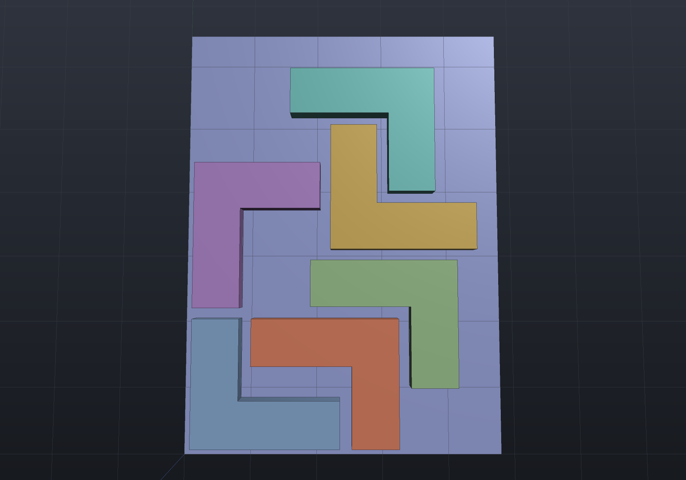

`Packing.Pack` lays several parts out on a printer's build plate — build123d's `pack`
helper: 2D bin packing of each part's [silhouette](2d-views.md) footprint, so a part
that overhangs its base still gets the room it needs. By default the packer is a
deterministic **shelf** algorithm (parts sorted deepest-first, placed left-to-right
into rows; no randomness, so the same parts always give the same plate) — simple and
predictable rather than optimal. [Quarter-turn rotation and nesting to the true
outline](#rotation-and-outline-nesting) are opt-in.

```csharp render:packing-plate
var bracketTop = SketchPlane.At((0, 0, 6), Vector3d.UnitX, Vector3d.UnitY);
var bracket = Shape.Extrude(Sketch.Rectangle(34, 18), 6)
    .Drill(StandardHoles.Clearance(5),
        LocationSet.At(new Vector2d(-12, 0), new Vector2d(12, 0)), 10, bracketTop);
var knob = Shape.Cylinder(9, 6).Translate(0, 0, 3)
    .SmoothUnion(Shape.Sphere(6).Translate(0, 0, 8), 2);
var shim = Shape.Extrude(Sketch.RoundedRectangle(26, 12, 3), 2);

var parts = new Shape[] { bracket, bracket, knob, knob, shim };
var layout = Packing.Pack(parts, plateWidth: 90, plateDepth: 70, gap: 3);
var placed = layout.Apply(parts);

var scene = new Scene();
// The plate itself, drawn under the packed parts (display only - no boolean).
scene.Add(new Part("plate", Shape.Box(90, 70, 2).Translate(45, 35, -1), Palette.Slate));
for (int i = 0; i < placed.Count; i++)
    scene.Add(new Part($"part {i}", placed[i]));
```


`Pack` returns the layout (placements in input order, each with its offset and
measured footprint); `Apply` — or the one-call `Packing.Arrange` — returns the
translated shapes. Parts move in XY only: how each part sits in z is the model's
business, not the packer's. A layout that does not fit **refuses loudly**, naming the
first part that ran out of plate and its footprint, rather than stacking silently.

## Rotation and outline nesting

`PackOptions` opens two doors, both **off by default** — a pack with neither is
bit-for-bit the layout above:

| Option | Values | What it changes |
| --- | --- | --- |
| `Rotation` | `None` (default), `Quarter`, `Free` | Whether the packer may turn a part about z. |
| `Nesting` | `BoundingBox` (default), `Outline` | Whether parts are kept apart by their boxes or by their true silhouettes. |

An L bracket is the fixture where that matters: its outline fills only 57% of its own
bounding box, and that missing 43% is exactly what a box packer throws away.

```csharp render:packing-nested
var bracket = Shape.Extrude(Sketch.Start(0, 0)
    .LineTo(44, 0).LineTo(44, 14).LineTo(14, 14).LineTo(14, 38).LineTo(0, 38).Close(), 6);

var parts = Enumerable.Repeat(bracket, 6).ToArray();
var layout = Packing.Pack(parts, plateWidth: 96, plateDepth: 130, new PackOptions
{
    Gap = 3,
    Rotation = PackRotation.Quarter,
    Nesting = PackNesting.Outline,
});
var placed = layout.Apply(parts);

var scene = new Scene();
scene.Add(new Part("plate", Shape.Box(96, 130, 2).Translate(48, 65, -1), Palette.Slate));
for (int i = 0; i < placed.Count; i++)
    scene.Add(new Part($"part {i}", placed[i]));

var camera = new CameraState(-Math.PI / 2, 1.5, 180, (48, 65, 0));
```



The brackets interlock, and three of the six are turned. Measured on those six parts,
same plate and same 3 mm gap — `UsedDepth` is the plate strip consumed, `Utilisation`
the packed outline area over it:

| Rotation | Nesting | Depth used | Utilisation |
| --- | --- | ---: | ---: |
| `None` | `BoundingBox` (the default) | 249.0 | 24% |
| `None` | `Outline` | 154.2 | 39% |
| `Quarter` | `BoundingBox` | 144.0 | 41% |
| `Quarter` | `Outline` | **120.5** | **49%** |

```csharp run:packing-utilisation
var bracket = Shape.Extrude(Sketch.Start(0, 0)
    .LineTo(44, 0).LineTo(44, 14).LineTo(14, 14).LineTo(14, 38).LineTo(0, 38).Close(), 6);
var parts = Enumerable.Repeat(bracket, 6).ToArray();

PackLayout Run(PackRotation rotation, PackNesting nesting) =>
    Packing.Pack(parts, 96, 260, new PackOptions
    {
        Gap = 3,
        Rotation = rotation,
        Nesting = nesting,
    });

var boxed = Run(PackRotation.Quarter, PackNesting.BoundingBox);
var nested = Run(PackRotation.Quarter, PackNesting.Outline);

// The outline fills well under two thirds of the box, which is what nesting has to win.
if (nested.PackedArea > 0.6 * nested.FootprintArea)
    throw new Exception("fixture has no room to win");
// Both layouts hold the same parts, so only the plate they consume can differ.
if (Math.Abs(nested.PackedArea - boxed.PackedArea) > 1e-6)
    throw new Exception("the two layouts do not carry the same parts");
if (nested.UsedDepth >= boxed.UsedDepth)
    throw new Exception($"nesting used {nested.UsedDepth}, boxes {boxed.UsedDepth}");
Console.WriteLine($"boxes {boxed.UsedDepth:F1} deep at {boxed.Utilisation:P0}, " +
    $"outlines {nested.UsedDepth:F1} at {nested.Utilisation:P0}");
```

### How the two work

**A quarter turn is exact** — `(x, y) → (−y, x)` is a sign swap, never a `cos` — so a
turned part's measured bounds are its transposed footprint to the last bit. For
`BoundingBox` nesting a quarter turn only *transposes* the footprint, so the four
poses collapse to two and the choice is not a per-part one (a shelf is as deep as its
deepest member): the packer runs the whole plate under both global preferences,
landscape and portrait, and keeps the shallower one. Ties break on used width, then on
the landscape preference.

**Outline nesting grows each silhouette by half the gap** and requires the grown
outlines to be disjoint. That is the same statement as "these parts are at least `gap`
apart", reached through one existing operation — [`Region2dOffset`](2d-views.md)'s
dilation — rather than a new distance predicate, and the grown outlines are then
searched bottom-left-first on a raster. Because a through hole is a hole in the
silhouette, small parts nest **inside** a ring:

```csharp run:packing-bore
var ring = Shape.Extrude(Sketch.Circle(30).WithHole(Sketch.Circle(20)), 4);
var disc = Shape.Cylinder(7, 4);
var parts = new Shape[] { ring, disc, disc, disc };

var boxed = Packing.Pack(parts, 70, 200, new PackOptions { Gap = 2 });
var nested = Packing.Pack(parts, 70, 200, new PackOptions
{
    Gap = 2,
    Nesting = PackNesting.Outline,
});

// The three discs land inside the bore, so the plate strip is just the ring's own.
var centre = new Vector2d(
    nested.Placements[0].Footprint.Center.X + nested.Placements[0].Offset.X,
    nested.Placements[0].Footprint.Center.Y + nested.Placements[0].Offset.Y);
for (int i = 1; i < parts.Length; i++)
{
    var here = new Vector2d(
        nested.Placements[i].Footprint.Center.X + nested.Placements[i].Offset.X,
        nested.Placements[i].Footprint.Center.Y + nested.Placements[i].Offset.Y);
    // bore radius 20 - disc radius 7 - gap 2 = 11
    if ((here - centre).Length > 11 + 1e-9)
        throw new Exception($"disc {i} did not nest in the bore");
}
Console.WriteLine($"boxed {boxed.UsedDepth:F0} deep, nested {nested.UsedDepth:F0}");
```

### What it costs, and what it refuses

The raster is **conservative**: a cell is marked occupied if the grown outline touches
it at all, so an empty overlap proves the parts really are apart — a coarse grid can
only refuse a legal placement, never accept an illegal one. Two consequences are worth
planning for.

*Placements are quantized* to `PackOptions.Resolution` (default
`min(plateWidth, plateDepth) / 256`, so the grid is a fixed size whatever the plate).
A fit with **no slack at all** is therefore refused where the box packer takes it —
four 40 × 10 bars turned upright span exactly 4 × 10 + 5 × 2 = 50 on a 50 mm plate, and
outline nesting cannot land them. Use `BoundingBox` there, or a finer `Resolution`.

*A finer raster is not monotonically better.* It refuses fewer placements, but it also
changes which placement the greedy search meets first: measured on the six brackets,
cell sizes 4 / 2 / 1 / 0.5 / 0.25 give depths 120.0 / 106.0 / 112.0 / 109.5 / 108.2.
Treat it as a cost/quality knob, not a convergence parameter.

*Bottom-left-first only nests when the plate is tight.* With room to spare, the lowest
free spot is beside the previous part rather than inside its concavity, so a roomy
plate reproduces row packing and outline nesting buys only its own quantization loss.
The gains above are all on plates barely wider than the parts — which is when packing
is worth doing at all.

**`PackRotation.Free` is refused by name.** A continuous orientation has no finite
candidate set, so the packer could neither search it exhaustively nor break ties
deterministically; it needs a no-fit polygon per part pair per angle, or an optimiser
with a stated stopping rule. Quietly sampling a few angles would be a search that is
not the one it claims to be.

Cost, win-x64, L brackets on an 86 × 400 plate at the default raster with quarter
turns: 68 ms for 4 parts, 83 for 8, 233 for 16, 435 for 24 — the silhouette and its
offset are once per part, the raster search is the rest.

## Exporting the plate as one STL

The packed shapes merge into a single print file through the ordinary mesh path:

```csharp run:packing-stl
var parts = new Shape[]
{
    Shape.Box(20, 12, 5),
    Shape.Cylinder(7, 6),
    Shape.Extrude(Sketch.RoundedRectangle(24, 10, 3), 3),
};
var placed = Packing.Arrange(parts, plateWidth: 80, plateDepth: 40, gap: 3);

var meshes = placed
    .Select(shape => (shape.ToMesh(), Matrix4d.Identity))
    .ToList();
string path = Path.Combine(Scratch, "plate.stl");
StlWriter.WriteFile(meshes, path);

var info = new FileInfo(path);
if (!info.Exists || info.Length < 84 + 50)
    throw new Exception("expected a non-empty binary STL");
Console.WriteLine($"wrote {info.Length} bytes to plate.stl");
```

The gap is honored between parts *and* to the plate edges, and the footprints come
from the mesh at the requested quality — the same measured-bounds caveat as
`Shape.Bounds` (a curved extreme reads a chord's sagitta small at coarse quality;
the default quality plus a millimetre-scale gap has plenty of margin).
