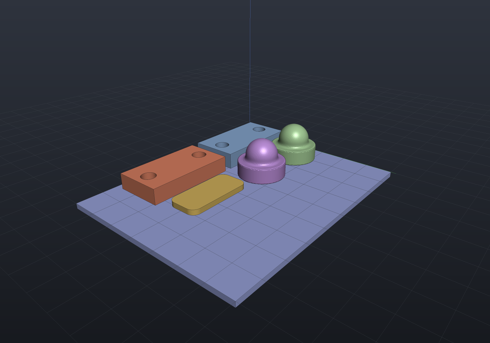

# Packing a build plate

`Packing.Pack` lays several parts out on a printer's build plate — build123d's `pack`
helper: 2D bin packing of each part's [silhouette](2d-views.md) footprint, so a part
that overhangs its base still gets the room it needs. The packer is a deterministic
**shelf** algorithm (parts sorted deepest-first, placed left-to-right into rows; no
randomness, so the same parts always give the same plate) — simple and predictable
rather than optimal, with no rotation or nesting in v1.

```csharp render:packing-plate
var bracketTop = SketchPlane.At((0, 0, 6), Vector3d.UnitX, Vector3d.UnitY);
var bracket = Shape.Extrude(Sketch.Rectangle(34, 18), 6)
    .Drill(StandardHoles.Clearance(5),
        LocationSet.At(new Vector2d(-12, 0), new Vector2d(12, 0)), 10, bracketTop);
var knob = Shape.Cylinder(9, 6).Translate(0, 0, 3)
    .SmoothUnion(Shape.Sphere(6).Translate(0, 0, 8), 2);
var shim = Shape.Extrude(Sketch.RoundedRectangle(26, 12, 3), 2);

var parts = new Shape[] { bracket, bracket, knob, knob, shim };
var layout = Packing.Pack(parts, plateWidth: 90, plateDepth: 70, gap: 3);
var placed = layout.Apply(parts);

var scene = new Scene();
// The plate itself, drawn under the packed parts (display only - no boolean).
scene.Add(new Part("plate", Shape.Box(90, 70, 2).Translate(45, 35, -1), Palette.Slate));
for (int i = 0; i < placed.Count; i++)
    scene.Add(new Part($"part {i}", placed[i]));
```



`Pack` returns the layout (placements in input order, each with its offset and
measured footprint); `Apply` — or the one-call `Packing.Arrange` — returns the
translated shapes. Parts move in XY only: how each part sits in z is the model's
business, not the packer's. A layout that does not fit **refuses loudly**, naming the
first part that ran out of plate and its footprint, rather than stacking silently.

## Exporting the plate as one STL

The packed shapes merge into a single print file through the ordinary mesh path:

```csharp run:packing-stl
var parts = new Shape[]
{
    Shape.Box(20, 12, 5),
    Shape.Cylinder(7, 6),
    Shape.Extrude(Sketch.RoundedRectangle(24, 10, 3), 3),
};
var placed = Packing.Arrange(parts, plateWidth: 80, plateDepth: 40, gap: 3);

var meshes = placed
    .Select(shape => (shape.ToMesh(), Matrix4d.Identity))
    .ToList();
string path = Path.Combine(Scratch, "plate.stl");
StlWriter.WriteFile(meshes, path);

var info = new FileInfo(path);
if (!info.Exists || info.Length < 84 + 50)
    throw new Exception("expected a non-empty binary STL");
Console.WriteLine($"wrote {info.Length} bytes to plate.stl");
```

The gap is honored between parts *and* to the plate edges, and the footprints come
from the mesh at the requested quality — the same measured-bounds caveat as
`Shape.Bounds` (a curved extreme reads a chord's sagitta small at coarse quality;
the default quality plus a millimetre-scale gap has plenty of margin).
