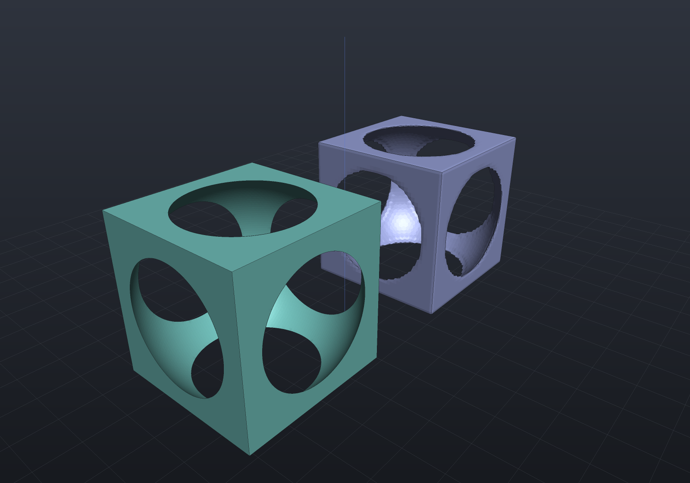
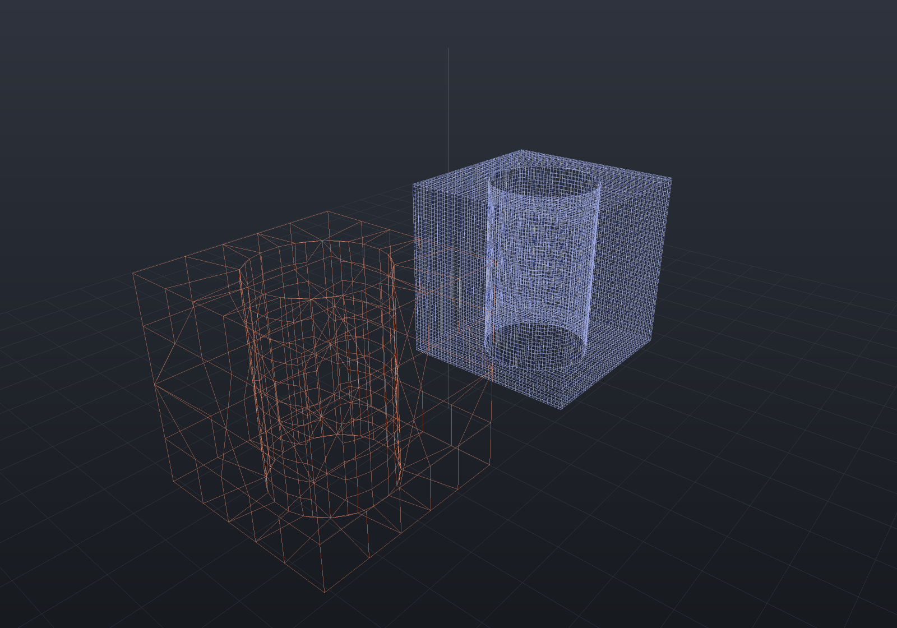

Every implicit shape becomes a mesh through **Surface Nets** — a dual contouring scheme
that samples the field on a grid and puts one vertex in each cell the surface passes
through. `MeshQuality.SdfResolution` sets the grid; `MeshQuality.SurfaceNets` sets how the
vertices are placed and how coarse the output may be.

## Sharp features are on by default

A cell's surface crossings all lie ON the surface, so their **mean lies strictly inside**
every convex corner and every edge. That is what plain Surface Nets computes, so a
polygonized box came back chamfered at every resolution — not as an error that refinement
reduces, but as the answer the averaging rule gives.

The fix is the field's own gradient. Sampling the normal at each crossing gives a tangent
plane, and the vertex goes at the minimiser of the summed squared distance to those planes
(the quadratic error function of dual contouring with Hermite data). At a box corner the
three crossings report three perpendicular normals, that minimiser is unique, and it **is**
the corner:

```csharp render:polygonize-sharp
var body = Shape.From(Sdf.Box(20, 20, 20) - Sdf.Sphere(12.5));

var plain = new MeshQuality
{
    SdfResolution = 40,
    SurfaceNets = new SurfaceNetsOptions { SharpFeatures = false },
};

var scene = new Scene();
scene.Add(new Part("averaged", Shape.From(body.ToMesh(plain)), Palette.Slate,
    Matrix4d.CreateTranslation((-16, 0, 11))));
scene.Add(new Part("sharp", body, Palette.Teal,
    Matrix4d.CreateTranslation((16, 0, 11))));
```



The teal solid is the default; the slate one behind it is the same field with
`SharpFeatures = false`. Its box edges are chamfered and its cavity rims are stepped, and
no resolution removes either.

The claim is an identity rather than a tolerance, and it is asserted as one: every vertex
of a polygonized `Sdf.Box` reads **exactly zero** from the box's own field, and the mesh's
volume is exactly the box's, at every resolution and at any placement or rotation.

**Smooth fields improve too**, which is the other half of why this is the default rather
than a mode for mechanical parts: on a curved surface the quadric is rank 1, so the vertex
is projected onto the field's own tangent plane instead of sitting inside by the chord
sagitta. Measured volume error against the analytic value, averaged against sharp:

| field | resolution | averaged | sharp |
|---|---|---|---|
| sphere | 16 | −2.66% | +0.57% |
| sphere | 64 | −0.119% | +0.025% |
| torus | 32 | −2.18% | +0.46% |
| torus | 128 | −0.113% | +0.024% |

`SharpFeatures = false` reproduces the previous output bit for bit. The cost is about
1.6–2.1× the plain walk, falling with resolution (the extra work is per crossing, and
crossings are a surface quantity).

### The feature angle

`FeatureAngleDegrees` (default 10) is the smallest deviation from flat that counts as a
feature. It is stated as an angle rather than as a matrix threshold because that is the
quantity a model has; below it the vertex keeps the averaged position in that direction,
which is the safe direction — declining to resolve a crease returns the incumbent answer,
where resolving one the samples barely constrain sends the vertex a long way off.

### Where a vertex may go

`ClampCells` (default 1) bounds how far outside its own cell a vertex may be placed, and
**both textbook answers are wrong**. Clamping to the strict cell chamfers a *rotated* box's
edges by a quarter of a cell, because a cell that sees both faces of an edge need not
contain the edge; not clamping at all lets an under-resolved lattice throw a vertex four
cells out, past its neighbours' neighbours. One cell is the neighbourhood a cell's own
crossings can speak about, and it is exact on every box placement while still bounding the
lattice.

## Adaptive output

The grid is uniform, so a large flat face costs one quad per cell whatever the surface is
doing. `SimplifyTolerance` merges the cells whose merged quadric still describes the same
surface, stated as a **length**: the root-mean-square distance a merged vertex is allowed
to sit from the tangent planes its cluster swallowed.

```csharp render:polygonize-adaptive style:wireframe
var body = Shape.From(Sdf.Box(20, 20, 20) - Sdf.Cylinder(6, 30));

Part At(string name, double? tolerance, Vector3d at, PartColor colour) =>
    new(name, Shape.From(body.ToMesh(new MeshQuality
    {
        SdfResolution = 48,
        SurfaceNets = new SurfaceNetsOptions { SimplifyTolerance = tolerance },
    })), colour, Matrix4d.CreateTranslation(at));

var scene = new Scene();
scene.Add(At("uniform", null, (-16, 0, 11), Palette.Slate));
scene.Add(At("adaptive", 0.05, (16, 0, 11), Palette.Coral));
```



Drawn as wireframe so the difference is the thing you can see: the same solid at the same
resolution, one quad per cell in slate and one quad per flat region in coral — dense only
where the bore actually curves.

A box collapses to **six quads** with its volume still exactly 1000 — a flat region is one
plane at any size, so collapsing it is provably lossless and spends none of the tolerance.
A drilled box at resolution 64 goes 12 008 faces → 1 160 (10.4×) for 0.03% of volume, with
the bore still round. Measured on the smooth-blend CSG fixture, the face count falls by
3.3× at resolution 48 and by **14.7× at 256** — the saving grows with the grid because the
surface it is describing does not.

Two properties are structural rather than checked:

- **Cracks are impossible.** The connectivity is the uniform walk's face buffer
  re-indexed, never re-derived, so there is no T-junction to make. A face whose corners all
  land in one cluster vanishes; a face straddling two becomes a triangle; every other face
  keeps the quad it always was.
- **It is bottom-up.** A top-down octree that stops subdividing where the field looks flat
  would save the sampling as well — and it cannot certify that no feature hides between the
  samples it took, which is exactly the argument the surface cull is built on. Collapsing
  cells the walk has already visited inherits that argument unchanged. The cost is stated:
  this saves faces and everything downstream of them, and saves no evaluation time.

Manifoldness is checked rather than argued: contracting a connected set of dual vertices is
a manifold quotient only when its induced subcomplex is a disk, so each octant's members are
split into connected components first and any cluster implicated in a repeated corner, a
duplicate directed edge or a pinched vertex link is reverted.

## What it composes with

These are `MeshQuality` settings, so they reach every route that polygonizes a field —
`Shape.ToMesh`, a `Part`'s display mesh, `--export`, the MCP server and the docs renderer:

```csharp
var scene = new Scene(new MeshQuality
{
    SdfResolution = 96,
    SurfaceNets = new SurfaceNetsOptions { SimplifyTolerance = 0.02 },
});
```

For the mesh-side quality knobs that apply after polygonization see
[remeshing](remeshing.md); for the B-Rep side see
[tessellation quality](quality.md).
