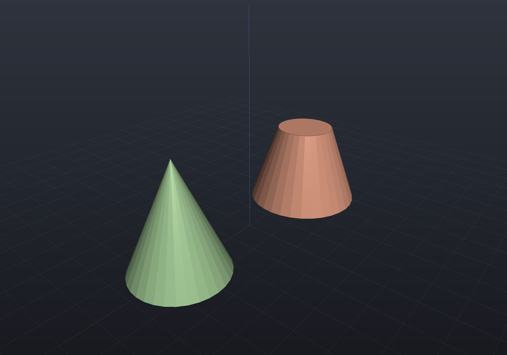

# Primitives

`Shape` provides five solid primitives — box, cylinder, sphere, torus, and cone. All
are centered at the origin with their axis along +Z; position them with
[transforms](transforms-patterns.md).

```csharp render:primitives
// Primitives are centered at the origin; the part transforms here sit each one
// on the ground plane and spread them out for the camera.
var scene = new Scene();
scene.Add(new Part("box", Shape.Box(24, 18, 12), Palette.Steel,
    Matrix4d.CreateTranslation((-40, 0, 6))));
scene.Add(new Part("cylinder", Shape.Cylinder(radius: 9, height: 20), Palette.Brass,
    Matrix4d.CreateTranslation((-13, 0, 10))));
scene.Add(new Part("sphere", Shape.Sphere(radius: 10.5), Palette.Coral,
    Matrix4d.CreateTranslation((13, 0, 10.5))));
scene.Add(new Part("torus", Shape.Torus(majorRadius: 10, minorRadius: 4), Palette.Teal,
    Matrix4d.CreateTranslation((40, 0, 4))));
```


Every primitive is available in **all three representations** — `ToBrep()` produces
exact analytic surfaces (planes, cylinders, spheres, tori), `ToImplicit()` produces
exact signed distance fields, and `ToMesh()` tessellates. A `Box(in Aabb)` overload
builds a box from explicit bounds instead of a centered size.

## Cone

`Shape.Cone(bottomRadius, topRadius, height)` is the cone frustum (OpenSCAD's
`cylinder(r1, r2)`): the radius grows linearly from `bottomRadius` at z = −height/2
to `topRadius` at z = +height/2. Setting either radius to zero makes that end a
pointed apex:

```csharp render:cone
var scene = new Scene();
scene.Add(new Part("frustum", Shape.Cone(bottomRadius: 10, topRadius: 5, height: 14),
    Palette.Copper, Matrix4d.CreateTranslation((-16, 0, 7))));
scene.Add(new Part("apex cone", Shape.Cone(8, 0, 18), Palette.Sage,
    Matrix4d.CreateTranslation((16, 0, 9))));
```



Cones are native in all three representations, like the other primitives.

Rigid transforms and uniform scaling keep every primitive exact; shearing a sphere,
torus, or cone has no analytic B-Rep surface and is rejected there (`Explain` names
the node) — see the [support matrix](representations.md).
