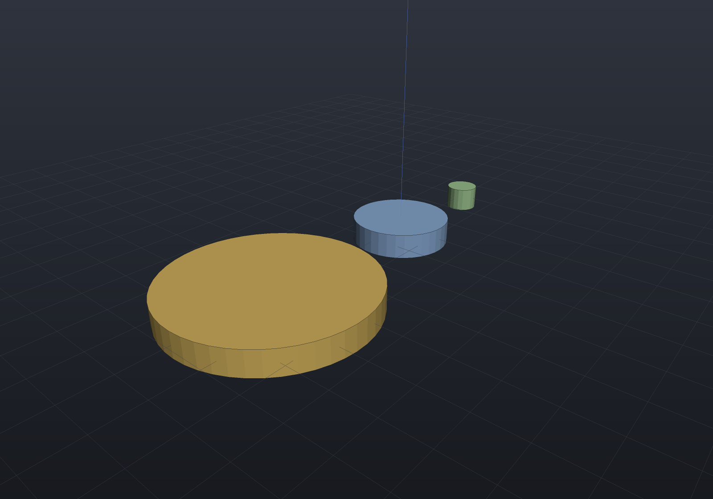

Every curved surface a viewer or exporter sees has been discretized, and the knob that
controls it is the scene's `MeshQuality`: `SegmentsPerCircle` for circles (default 32),
`CurveSamples` for generic curves (default 24), `SdfResolution` for the implicit route
(default 64). Fixed counts are predictable and fast — and wrong at both ends of the
scale: a 6 mm dowel does not need 32 segments, and a 400 mm flange rim visibly facets
with them.

`TessellationQuality` is the adaptive alternative, opt-in via
`MeshQuality.Tessellation`. Instead of a count you state a *criterion*:

- **`MaxAngleDegrees`** — no segment subtends more than this angle (OpenSCAD's `$fa`).
  Radius-free: every circle gets at least 360/angle segments.
- **`MaxChordDeviation`** — no chord sags more than this distance from the true circle,
  in model units (OCCT's linear deflection). This one *scales*: n ≈ π·√(r/2d), so the
  criterion binds at the model's **largest** curvature radius and a big part
  automatically gets the segments a small one never needed.

Both clamp to `[MinSegments, MaxSegments]` (defaults 8 and 512). Set one or both — the
stricter wins.

```csharp render:quality-adaptive
// One criterion, three sizes: 0.05 mm maximum chord deviation gives each disc the
// segment count ITS radius needs — count the facets on the rims.
var quality = new MeshQuality
{
    Tessellation = new TessellationQuality { MaxChordDeviation = 0.05, MinSegments = 12 },
};
var scene = new Scene(quality);
scene.Add(new Part("small", Shape.Cylinder(4, 6), Palette.Sage,
    Matrix4d.CreateTranslation((-30, 0, 0))));
scene.Add(new Part("medium", Shape.Cylinder(12, 6), Palette.Steel));
scene.Add(new Part("large", Shape.Cylinder(24, 6), Palette.Brass,
    Matrix4d.CreateTranslation((45, 0, 0))));
```



## One criterion drives the mesh AND the edge overlay

With fixed counts, the viewer's feature-edge overlay is deliberately *finer* than the
mesh — exact B-Rep edges sampled at 96+ segments per circle, so bore rims stay smooth
however coarse the fill. Zoom onto a large rim and you can watch the cost: the smooth
exact edge visibly **detaches** from the faceted fill it is supposed to outline, and
raising the overlay's count only makes the gap more obvious. The edge was never the
problem; the mesh was.

Under an adaptive quality both the display mesh and the feature edges resolve their
counts from the **same** criterion, so they agree by construction at any radius:

```csharp run:quality-agreement
var quality = new MeshQuality
{
    Tessellation = new TessellationQuality { MaxChordDeviation = 0.02, MinSegments = 12 },
};
var part = new Part("disc", Shape.Cylinder(40, 8));

int expected = quality.Tessellation.SegmentsFor(40);
var edges = part.GetFeatureEdges(quality);              // two rims
var (positions, _) = part.GetMesh(quality).ToIndexed();
int rim = positions.Count(p =>
    Math.Abs(p.Z - 4) < 1e-9 && Math.Abs(Math.Sqrt(p.X * p.X + p.Y * p.Y) - 40) < 1e-6);

if (edges.Count != 2 * expected) throw new Exception($"overlay {edges.Count} != {2 * expected}");
if (rim != expected) throw new Exception($"mesh rim {rim} != {expected}");
```

## What it does and does not change

- **Opt-in.** `Tessellation` defaults to null and the fixed counts then apply
  *bit-for-bit* — no existing model, render or export changes until you set it.
- **B-Rep route only.** The criterion resolves segment counts for tessellation; the
  implicit route's `SdfResolution` is a volumetric grid, not a per-radius quantity, and
  is deliberately untouched.
- **Per solid, not per face.** The resolution scans the solid's curvature radii
  (circular and elliptic edges; cylinder, sphere, revolved, extruded and swept
  surfaces) and resolves one count pair for the whole solid, sized by the largest
  radius. Shared edges therefore weld exactly as they always did.
- `SegmentsFor(radius)` is public — the criterion itself, usable anywhere you need the
  same answer the tessellation used.

## Following the camera (opt-in)

A criterion stated in model units is still a guess about how close you will get. The
viewer can instead derive one from the **camera**: half a device pixel of chord deviation
at the orbit target, fed to `MaxChordDeviation`, so a large rim gains segments as you
zoom onto it.

```csharp
return EngrCad.Configure()
    .WithAdaptiveDisplayQuality()      // window only; off by default
    .Run(args, BuildScene);
```

Three rules keep it from being a per-frame knob, and each is a decision rather than a
tuning constant:

- **It fires on SETTLE, never per frame.** A pose is evaluated only after it has been
  held unchanged for 300 ms, and each settled pose exactly once — so a wheel flurry or a
  drag queues nothing at all.
- **A factor of two, or nothing.** A settled target is adopted only when it is at least
  2× finer than the last one adopted, so a small zoom costs nothing.
- **It only ever refines.** Zooming back out re-meshes nothing, and the emitted quality
  carries the session's own segment count as its `MinSegments`, so no part can resolve
  below the quality the session started at. `Part.RefineMesh` enforces the same ratchet
  per part — it declines a coarser request rather than obeying it — so the guarantee does
  not rest on the controller's state surviving a tab switch. A part that visibly loses
  detail when you pull back reads as a bug even when the criterion is working; the trade
  is memory, not detail.

The re-tessellation runs on a background task under the tab loader's own generation
discipline (a stale result never lands), and it is the *tessellate half only* — the
cached B-Rep lowering is criterion-independent, which is what makes it affordable. The
feature-edge overlay is rebuilt with the mesh, so the one-criterion agreement above holds
at every refinement.

**Two things it deliberately does not do.** Headless renders and exports never consult
the camera: they are deterministic one-shots at the stated quality, and a PNG whose
resolution depended on framing would make the committed documentation images a function
of where the camera stood. And the baked ambient occlusion is not re-baked — it stays one
level behind, which is what keeps a zoom from costing a bake.

It is off by default because the *feel* is unmeasured: a background re-mesh triggered by
camera motion is exactly the kind of feature that behaves in every test and reads as
jerky in the hand. Off, the viewport is byte-identical to what it always was.
