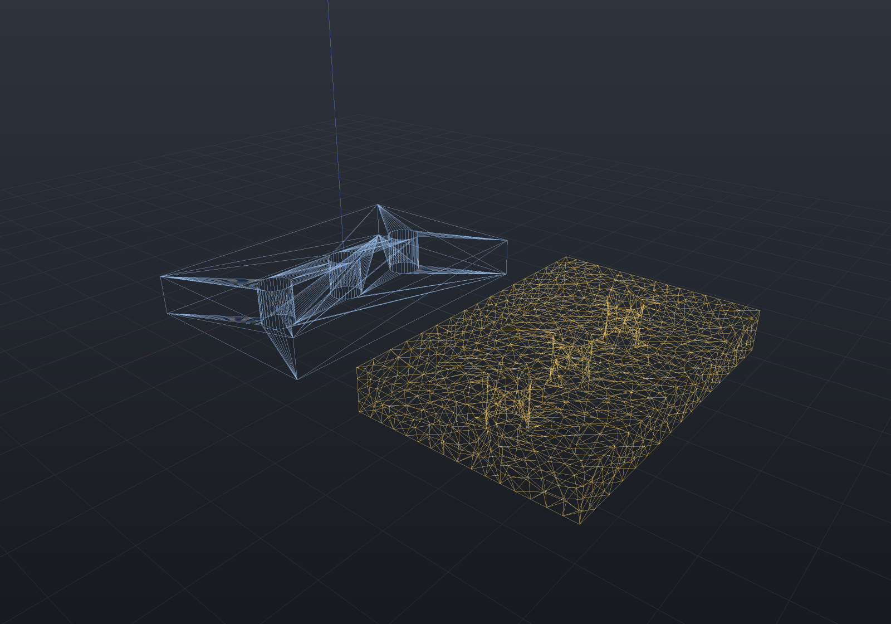

A tessellator's job is to be *accurate*: it puts samples where the surface curves and
none where it does not, so a drilled plate comes back with 30 mm chords across the flats
beside 0.5 mm chords around the bore rim. That is exactly right for rendering and
exactly wrong for anything that solves on the mesh. An FEA solver wants elements of a
known size with sensible aspect ratios; a smoothing, deformation or simulation pass
wants a triangle whose one-ring means something.

`Shape.Remeshed` is the isotropic remesher (`Remesher` in `EngrCAD.Mesh`, Botsch and
Kobbelt's split/collapse/flip/smooth loop) reachable from the modelling vocabulary:
rebuild the triangulation toward a uniform target edge length, keep the surface.

```csharp render:remesh-plate style:wireframe
// A drilled plate, as tessellated and then remeshed to a 3 mm edge. Drawn as wireframe:
// the whole point is the triangles, and the default shaded view hides them.
var top = SketchPlane.At((0, 0, 4), Vector3d.UnitX, Vector3d.UnitY);
var plate = Shape.Box(60, 40, 8)
    .Drill(StandardHoles.Clearance(6), [new(-18, 0), new(0, 0), new(18, 0)], depth: 10, top);

var scene = new Scene();
scene.Add(new Part("as tessellated", plate, Palette.Steel));
scene.Add(new Part("remeshed to 3 mm", plate.Remeshed(3.0, iterations: 14), Palette.Brass,
    Matrix4d.CreateTranslation((0, 55, 0))));
```



The source (left) is a handful of long fan triangles across the caps and a dense ring
at each bore; the remesh (right) is one uniform grade throughout — except at the bore
rims, which stay fine because they are *feature edges* and a pinned chain may be split
but never collapsed. That is the constraint doing its job, not the remesher failing.

The triangle count goes up — uniformity is not free — but the distribution is what
changes: measured on a Ø20 × 20 cylinder remeshed to a 2 mm target, the share of edges
inside the remesher's `[0.66 L, 1.33 L]` band goes from **42% to 95%**.

```csharp run:remesh-band
var cylinder = Shape.Cylinder(10, 20);

static double InBand(HalfEdgeMesh mesh, double target) =>
    (double)mesh.Edges.Count(e => e.Vector.Length >= 0.66 * target && e.Vector.Length <= 1.33 * target)
    / mesh.Edges.Count();

double before = InBand(cylinder.ToMesh(), 2.0);
double after = InBand(cylinder.Remeshed(2.0, iterations: 14).ToMesh(), 2.0);

if (before > 0.5) throw new Exception($"the tessellation should be uneven, was {before:P0}");
if (after < 0.85) throw new Exception($"the remesh should be even, was {after:P0}");
```

Note what that measures and what it does not. The **distribution** converges quickly;
the single **longest** edge lags well behind it, sitting near 2 L however many passes
are spent. Judge a plain remesh by the share in band, not by its extremes.

## Bounding the longest edge

Spending more passes does not fix the maximum, because the cause is not a shortage of
passes. It is the **flip stage**: the flip rule is pure valence arithmetic that never
looks at a length, so on an elongated quad it swaps the short diagonal for the long one
and manufactures exactly the edge the split stage exists to remove. Switch flips off and
the same run ends at *exactly* the 1.33 L threshold — the splits were doing their job all
along.

`PreventLongEdgeFlips` refuses a flip that would leave an edge above the split threshold,
unless it is shorter than the edge it replaces (a flip from 2.5 L to 1.5 L is progress,
and refusing it strands slivers). It is opt-in, so an existing remesh is unchanged:

```csharp run:remesh-bounded
var cylinder = Shape.Cylinder(10, 20);

static double MaxEdge(HalfEdgeMesh mesh) => mesh.Edges.Max(e => e.Vector.Length);

var options = new RemeshOptions(2.0) { Iterations = 14 };
double plain = MaxEdge(cylinder.Remeshed(options).ToMesh());
double bounded = MaxEdge(cylinder.Remeshed(options with { PreventLongEdgeFlips = true }).ToMesh());

// Measured 4.02 mm (2.01 L) against 2.92 mm (1.46 L) — the threshold is 1.33 L = 2.66 mm.
if (plain < 3.5) throw new Exception($"the plain maximum should stall high, was {plain:F2}");
if (bounded > 3.0) throw new Exception($"the bounded maximum should reach the band, was {bounded:F2}");
```

It costs nothing measurable: on a cylinder, a box and a UV sphere it improves the in-band
share, the maximum, the shortest edge *and* the run time together. The one measure that
can go the other way is the worst triangle angle, because a refused flip is a valence left
irregular — on the box and the sphere it improves several fold (5.6° → 28.9°, 5.2° → 30.9°)
and on the cylinder it is slightly poorer (0.89° → 0.58°).

## What it keeps, and what it does not

Two settings do most of the work.

**The shape is held by projection.** Smoothing is curvature flow: left alone it shrinks
the model a little every pass, so each pass ends by projecting every free vertex back
onto a target surface. `Shape.Remeshed` supplies one automatically — the child's mesh as
lowered — so what is preserved is the child's *tessellation at the requested quality*.
Remesh a sphere from a coarse lowering and the result is faithful to that coarse mesh,
not to the sphere. To project onto the exact geometry instead, pass
`SdfProjectionTarget` over the shape's own field:

```csharp run:remesh-exact-target
var sphere = Shape.Sphere(10);

var refined = sphere.Remeshed(new RemeshOptions(2.0)
{
    Iterations = 14,
    FeatureAngleDegrees = 0,                                   // a sphere has no creases
    ProjectionTarget = new SdfProjectionTarget(sphere.ToImplicit()),
}).ToMesh(new MeshQuality { SegmentsPerCircle = 16 });         // a deliberately coarse lowering

double worst = refined.Vertices.Max(v => Math.Abs(v.Position.Length - 10));
if (worst > 0.05) throw new Exception($"vertices should sit on the exact sphere, worst {worst}");
```

**Creases are protected by feature detection.** `FeatureAngleDegrees` (30° by default)
pins the ends of every edge whose dihedral is sharper than that, so a box stays a box
rather than melting into a rounded lump. The trap is that feature detection reads *the
mesh it is given*, not the surface you meant: a coarse tessellation of a smooth surface
has large dihedrals too, so a 12-segment sphere's facets meet at ~30° and much of it
gets pinned. Pass `0` (or a larger angle) when remeshing tessellated curvature — as the
sphere example above does.

## Remeshing part of a model

Whole-model remeshing is rarely what a real part wants: one bore wall may need 0.2 mm
triangles while the plate around it should not be touched at all. `RegionRemesher` takes
a face selection, remeshes it in place and stitches it back, leaving the rest of the
model exactly as it was.

```csharp run:region-remesh
var mesh = Shape.Box(40, 40, 10).ToMesh();
var top = MeshFaceSelection.FromIndices(
    mesh, mesh.Faces.Where(f => f.Vertices().All(v => v.Position.Z == 5)).Select(f => f.Index));

var result = RegionRemesher.Remesh(mesh, top, new RemeshOptions(3.0)
{
    Iterations = 10,
    FeatureAngleDegrees = 0,
});

result.Mesh.Validate();
if (!result.Mesh.IsClosed) throw new Exception("a region remesh must not open the model");
if (Math.Abs(result.Mesh.Volume() - 16000) > 1e-6) throw new Exception("the solid must not change");
if (result.Region.Count <= top.Count) throw new Exception("the region should have refined");
```

The region's rim is the contract: it may **gain** vertices but never move, and splits
along it are carried into the neighbouring faces so no T-junction is left behind. That
is what lets a finely remeshed patch meet a coarse model at all.

## The honest support story

Remeshing is defined on a triangulation, and `Explain` says so rather than pretending
otherwise:

```csharp run:remesh-explain
var shape = Shape.Box(20, 20, 20).Remeshed(3.0);

// B-Rep: impossible. A remesh produces a tessellation, not a surface, and there is no
// mesh-to-B-Rep import.
if (shape.Explain(TargetRep.Brep).IsConvertible) throw new Exception("should be impossible");

// Mesh: native ground, reached by the mesh route rather than through the field.
var mesh = shape.Explain(TargetRep.Mesh);
if (!mesh.IsConvertible) throw new Exception("mesh should work");

// Implicit: bridged through a mesh SDF of the remeshed triangles, so the field carries
// the tessellation's chord error rather than the box's exact one.
var field = shape.Explain(TargetRep.Implicit);
if (!field.IsConvertible) throw new Exception("implicit should work");
Console.WriteLine(field.Entries.Single(e => e.Node.StartsWith("Remeshed(")).Detail);
```

So `Remeshed` belongs at the **end** of a model, after the exact work is done — put it
in the middle and everything downstream inherits a tessellation. A uniform scale above
it scales the target edge length with it, so the node means the same thing wherever the
graph places it.
