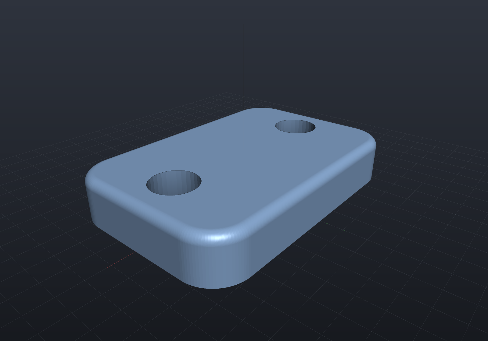
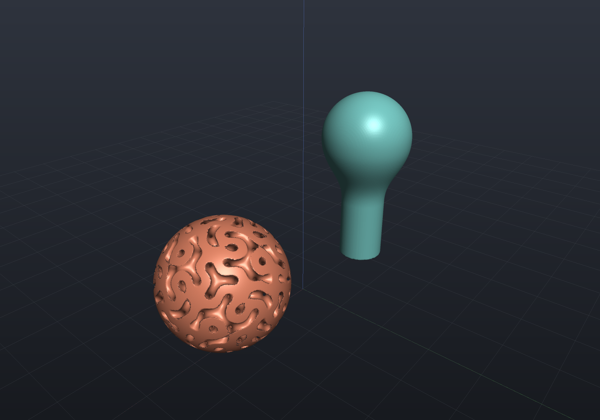
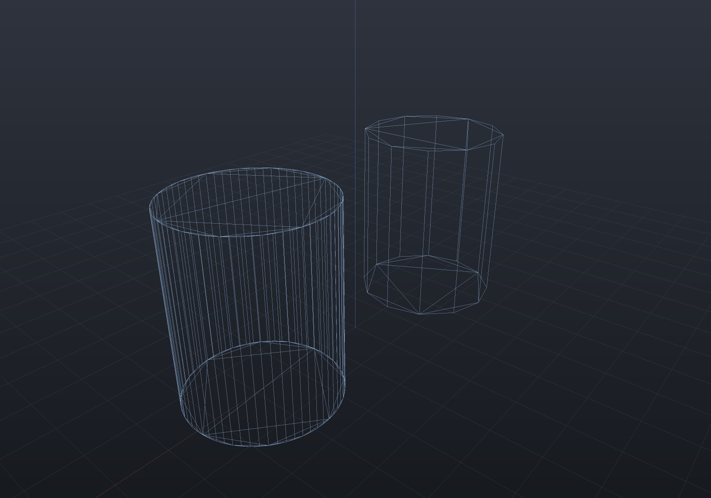
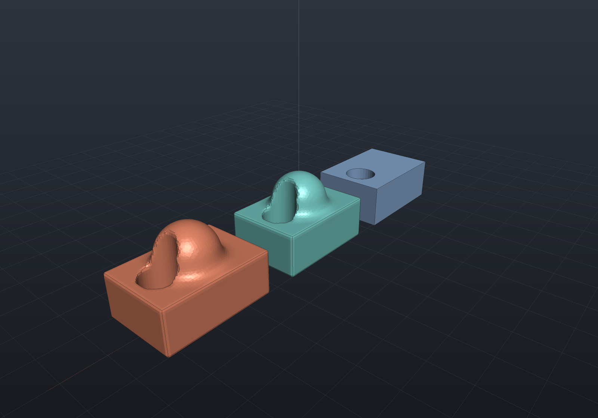
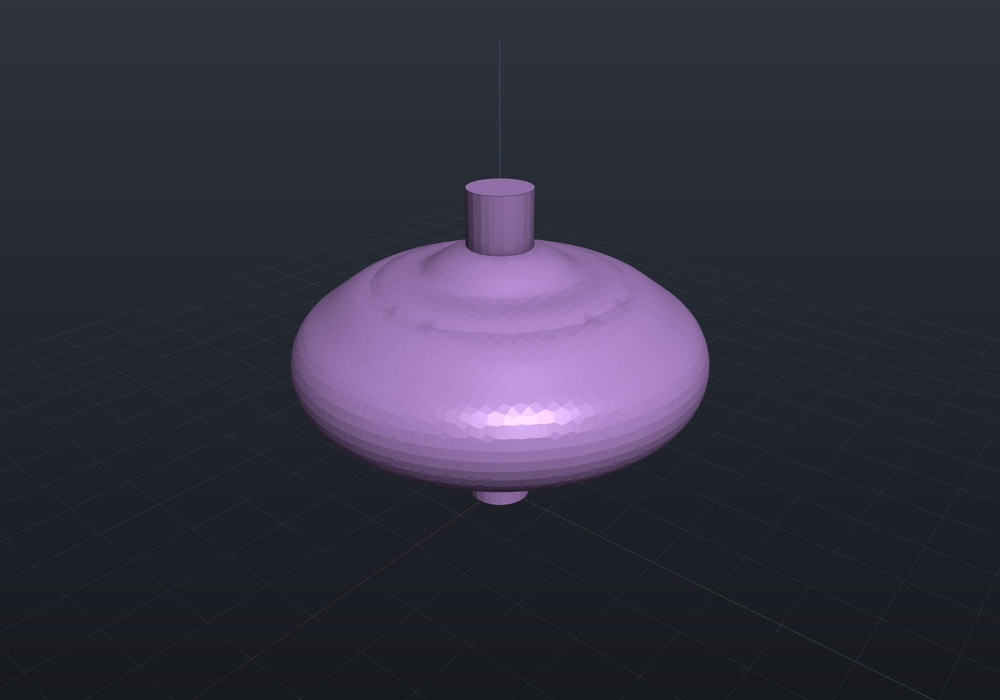

# The three representations

EngrCAD is a **hybrid kernel**: it carries three different mathematical descriptions
of a solid, because no single one serves precision modeling, organic geometry, and
manufacturing output at once.

| | What it stores | Where it wins | Its honest weakness |
|---|---|---|---|
| **B-Rep** | Parametric surfaces (planes, cylinders, cones, spheres, tori, NURBS, helical) stitched into topology: Solid → Shell → Face → Loop → Edge → Vertex | Exactness — a bore *is* a cylinder of radius 4, an edge *is* a circle; STEP export, drawings, face/edge selection, feature history | Every operation must produce a surface the catalog can spell; a smooth blend has no exact form, so it **refuses** rather than approximates |
| **Implicit** | A signed distance field — one function `f(x, y, z) → distance`, negative inside, composed as an AST of primitives and operators | Robustness and organic shapes — booleans are `min`/`max`, so smooth blends, offsets, shells and lattices are one-liners with no topology to corrupt | There are no faces or edges to name, measure or export; a surface only *appears* when the field is polygonized at a chosen resolution |
| **Mesh** | Discrete triangles in a half-edge structure — every edge knows its twin, so adjacency is O(1) | The lingua franca: rendering, 3D printing (STL/3MF), FEA tet meshing, imported scans; booleans, remeshing, decimation and repair on arbitrary triangle sets | It is a *sample* — a mesh of a sphere is a polyhedron that is not a sphere, and the chord error is baked in at tessellation time |

You rarely choose up front. Model with the one `Shape` vocabulary and decide the
representation at the end — that is the whole design of the API.

## B-Rep: exact boundaries

A B-Rep face is a region of an *analytic* surface, trimmed by loops of edges that are
themselves exact curves. Nothing is sampled, so the model answers questions with
identities rather than approximations:

```csharp run:rep-brep-exact
var body = Shape.Box(40, 30, 10) - Shape.Cylinder(4, 40).Translate(8, 5, 0);
BrepSolid solid = body.ToBrep();

// Six box faces plus one bore wall; the top and bottom carry the hole as a loop,
// not as extra faces.
if (solid.Faces.Count() != 7)
    throw new Exception($"expected 7 faces, found {solid.Faces.Count()}");

// The bore wall IS a cylinder — its radius is the number the model was built from,
// not a fit to samples.
var bore = solid.Faces.Single(f => f.IsCylindrical(out _, out _, out _));
bore.IsCylindrical(out _, out var axis, out double radius);
if (Math.Abs(radius - 4.0) > 1e-12)
    throw new Exception($"the bore carries its radius exactly; read {radius}");
if (Math.Abs(Math.Abs(axis.Z) - 1.0) > 1e-12)
    throw new Exception("the bore axis is exactly vertical");
```

That exactness is what drawings, dimensions, STEP interchange and the
[selection vocabulary](selection.md) stand on — "the cylindrical face of radius 4"
is a query with a well-defined answer. It is also what makes **feature edges** crisp
in the viewer: the overlay samples the exact edge curves, so a bore rim stays a
smooth circle however coarse the display mesh is.

The cost of exactness is a refusal culture: an operation the surface catalog cannot
spell (a smooth blend, a field offset, a lattice) is **Impossible** in B-Rep and says
so, rather than shipping an approximation wearing an exact label.

```csharp render:rep-brep
// Classic B-Rep territory: a machined plate. Every face is an exact plane,
// cylinder or torus band, and the fillet is topology surgery, not a mesh trick.
var plate = Shape.Extrude(Sketch.RoundedRectangle(60, 40, 8), 10)
    .Fillet(2, FaceSetRef.PlanarWithNormal(Vector3d.UnitZ))
    .Drill(StandardHoles.Counterbored(5), [new(-20, 0), new(20, 0)], depth: 14,
           SketchPlane.At((0, 0, 10), Vector3d.UnitX, Vector3d.UnitY));

var scene = new Scene();
scene.Add(new Part("plate", plate, Palette.Steel));
```



## Implicit: signed distance fields

An implicit solid is not a boundary at all — it is a rule for all of space. Evaluate
the field anywhere and the sign says inside or outside; the magnitude says how far
the surface is:

```csharp run:rep-implicit-field
Sdf field = Shape.Sphere(10).ToImplicit();

if (Math.Abs(field.Evaluate(new Vector3d(0, 0, 0)) - (-10.0)) > 1e-12)
    throw new Exception("the centre is 10 inside");
if (Math.Abs(field.Evaluate(new Vector3d(10, 0, 0))) > 1e-12)
    throw new Exception("a surface point reads zero");
if (Math.Abs(field.Evaluate(new Vector3d(13, 0, 0)) - 3.0) > 1e-12)
    throw new Exception("a point 3 outside reads +3");

// Operations become arithmetic ON the field. An offset is one subtraction:
Sdf grown = Shape.Sphere(10).Offset(2).ToImplicit();
if (Math.Abs(grown.Evaluate(new Vector3d(0, 0, 0)) - (-12.0)) > 1e-12)
    throw new Exception("offsetting by 2 shifts the field by exactly 2");
```

Because a boolean is just `min` (union) or `max` (intersection) of two fields, there
is no intersection curve to trace, no seam to weld and no topology to corrupt —
which is why the operations B-Rep refuses are *native* here.
[Smooth blends, offsets, shells and lattices](implicit.md) all fall out of field
arithmetic:

```csharp render:rep-implicit
// Organic territory: a blended body and a gyroid-latticed sphere. Neither has any
// exact boundary representation — both are one-liners as fields.
var blend = Shape.Cylinder(5, 26)
    .SmoothUnion(Shape.Sphere(10).Translate(0, 0, 16), blend: 6);

var lattice = Shape.Sphere(12).Lattice(Sdf.Gyroid(cellSize: 6, thickness: 1.2));

var scene = new Scene(new MeshQuality { SdfResolution = 180 });
scene.Add(new Part("smooth blend", blend, Palette.Teal,
    Matrix4d.CreateTranslation((-22, 0, 13))));
scene.Add(new Part("gyroid lattice", lattice, Palette.Coral,
    Matrix4d.CreateTranslation((22, 0, 13))));
```



The trade: the field has no named faces, so you cannot select "the top face", export
it to STEP, or dimension an edge — and a surface only exists once
[Surface Nets polygonizes](quality.md) the field at a resolution you choose. The
section-plane isolines in the [viewer](viewer.md) are the field made visible: iso-distance
contours on the cut, which is wall thickness at a glance.

## Mesh: discrete triangles

A mesh is the representation everything can *become* — the viewer draws one, a 3D
printer consumes one, the [FEA mesher](fea-meshing.md) fills one with tetrahedra,
and an [imported scan](import.md) arrives as one. EngrCAD stores meshes in a
half-edge structure (every edge knows its twin and its face), which is what makes
booleans, [remeshing](remeshing.md), decimation and repair walkable in O(1) steps.

Its honest nature is that it is a **sample**. A tessellated cylinder is a prism over
an inscribed n-gon — a different (slightly smaller) solid than the cylinder, with a
volume you can write down in closed form:

```csharp run:rep-mesh-sample
double exact = Math.PI * 8 * 8 * 20;                     // the cylinder: pi r^2 h

var coarse = Shape.Cylinder(8, 20).ToMesh(new MeshQuality { SegmentsPerCircle = 16 });
var fine = Shape.Cylinder(8, 20).ToMesh(new MeshQuality { SegmentsPerCircle = 128 });

// The mesh's volume is EXACTLY its inscribed n-gon prism's — an identity, not an
// approximation with unknowable error:
double ngon16 = 16 / 2.0 * 8 * 8 * Math.Sin(2 * Math.PI / 16) * 20;
if (Math.Abs(coarse.Volume() - ngon16) > 1e-9)
    throw new Exception("a mesh is the polyhedron it actually is");

// Refining converges on the true solid from inside:
if (!(coarse.Volume() < fine.Volume() && fine.Volume() < exact))
    throw new Exception("inscribed volumes approach pi r^2 h from below");
if ((exact - fine.Volume()) / exact > 5e-4)
    throw new Exception("128 segments is within 0.05% of the true volume");
```

So a mesh is never *wrong* — it is exactly right about a slightly different solid,
and the difference is controlled by [tessellation quality](quality.md). The same
wireframe seen at two densities makes the point visually:

```csharp render:rep-mesh
// The same cylinder tessellated at 12 and 64 segments per circle. Shape.From(mesh)
// re-enters the vocabulary, so both discrete solids sit in one scene.
var coarse = Shape.From(Shape.Cylinder(8, 20).ToMesh(new MeshQuality { SegmentsPerCircle = 12 }));
var fine = Shape.From(Shape.Cylinder(8, 20).ToMesh(new MeshQuality { SegmentsPerCircle = 64 }));

var scene = new Scene();
scene.Add(new Part("12 segments", coarse, Palette.Steel,
    Matrix4d.CreateTranslation((-14, 0, 10))) { DisplayMode = DisplayMode.Wireframe });
scene.Add(new Part("64 segments", fine, Palette.Steel,
    Matrix4d.CreateTranslation((14, 0, 10))) { DisplayMode = DisplayMode.Wireframe });
```



## Model once, choose at the end

A `Shape` is an immutable operation graph, not geometry. Lowering it chooses the
engine: `ToBrep()` (exact solids), `ToImplicit()` (signed distance fields),
`ToMesh()` (triangles). Each lowering uses native operations where the target has
them and *bridges* through another representation where it doesn't:

```csharp render:three-reps
var model = Shape.Box(30, 21, 12)
    .SmoothUnion(Shape.Sphere(7.5).Translate(0, 0, 8), blend: 4)
    - Shape.Cylinder(4.5, 40).Translate(8, 0, 0);

// The smooth blend has no B-Rep form, so the B-Rep column drops it:
var brepModel = Shape.Box(30, 21, 12) - Shape.Cylinder(4.5, 40).Translate(8, 0, 0);

var scene = new Scene();
scene.Add(new Part("to B-Rep", Shape.From(brepModel.ToBrep()), Palette.Steel,
    Matrix4d.CreateTranslation((-38, 0, 6))));
scene.Add(new Part("to implicit", Shape.From(model.ToImplicit()), Palette.Teal,
    Matrix4d.CreateTranslation((0, 0, 6))));
scene.Add(new Part("to mesh", Shape.From(model.ToMesh()), Palette.Coral,
    Matrix4d.CreateTranslation((38, 0, 6))));
```



Everything is convertible **to mesh** — what has no B-Rep form is polygonized from
the SDF path instead, so `ToMesh()` and `Scene.Add` never reject a shape. The
bridges are the *conversion triangle* in `EngrCAD.Interop`: implicit→mesh is Surface
Nets polygonization, B-Rep→mesh is exact tessellation, and mesh→implicit is
`MeshSdf` (a distance field over the triangles), which is how a scanned mesh joins
field arithmetic.

### Which one, when

| You want | Lower to | Why |
|---|---|---|
| STEP export, a drawing, dimensions | **B-Rep** | interchange and dimensioning need exact faces and edges |
| Face/edge selection, fillets, feature history | **B-Rep** | selectors and rim surgery are queries over exact topology |
| Smooth blends, uniform offset, shell, lattice | **Implicit** | field arithmetic; B-Rep refuses these by design |
| 3D printing | **Mesh** (via either route) | STL/3MF are triangle formats; print threads and blends via the implicit route with a clearance |
| FEA, rendering, scans | **Mesh** | tet meshing, the GPU and imported geometry all speak triangles |
| Mass properties | **B-Rep** when it lowers | tessellate-then-Richardson reaches ~1e-7 relative; mesh volumes are exact for the mesh itself |

## Explain: the honest support report

`Explain(target)` reports the per-node plan — **Native**, **Bridged** (through
another representation; approximate but robust), or **Impossible** — without doing
any work. `CanConvertTo` is the boolean version, and impossible conversions throw
`ShapeConversionException` carrying the same report:

```csharp run:explain
var model = Shape.Box(30, 21, 12)
    .SmoothUnion(Shape.Sphere(7.5).Translate(0, 0, 8), blend: 4);

var report = model.Explain(TargetRep.Brep);
Console.WriteLine(report);            // names the SmoothUnion node as Impossible

if (model.CanConvertTo(TargetRep.Brep))
    throw new Exception("a smooth blend must not be B-Rep convertible");
if (!model.CanConvertTo(TargetRep.Implicit) || !model.CanConvertTo(TargetRep.Mesh))
    throw new Exception("the blend is native in the implicit engine and meshable");

try
{
    model.ToBrep();
    throw new Exception("expected ShapeConversionException");
}
catch (ShapeConversionException ex)
{
    Console.WriteLine($"rejected as expected: {ex.Report.Entries.Count} nodes classified");
}
```

Transforms are never applied to finished geometry when the target can do better: the
lowering **bakes the accumulated matrix into construction inputs** (profiles,
directions, axes), so a rotated-then-drilled B-Rep stays exact. See
`src/EngrCAD.Modeling/README.md` for the full operation-by-target support matrix.

## Dropping down to the engine APIs

`Shape` is a convenience layer, not a cage. Exit to an engine for something the
vocabulary doesn't surface, then re-enter with `Shape.From(...)`:

```csharp render:drop-down
// Exit to the SDF AST for a custom field, re-enter, and keep modeling:
var ripple = Sdf.Blend(Sdf.Torus(12, 4), Sdf.Sphere(9), blendDistance: 6);

var body = Shape.From(ripple)
    .Union(Shape.Cylinder(2.5, 26).Translate(0, 0, 0))
    .ToMesh();  // lower once at the end

var scene = new Scene();
scene.Add(new Part("hybrid", Shape.From(body), Palette.Plum,
    Matrix4d.CreateTranslation((0, 0, 13))));
```



The same works in the other directions: `Shape.From(brepSolid)` re-enters an exact
solid after B-Rep surgery (e.g. `Filleting.FilletEdge`), and `Shape.From(mesh)` wraps
scanned or generated meshes (exact mesh SDF in implicit lowerings, direct
participation in mesh booleans).
