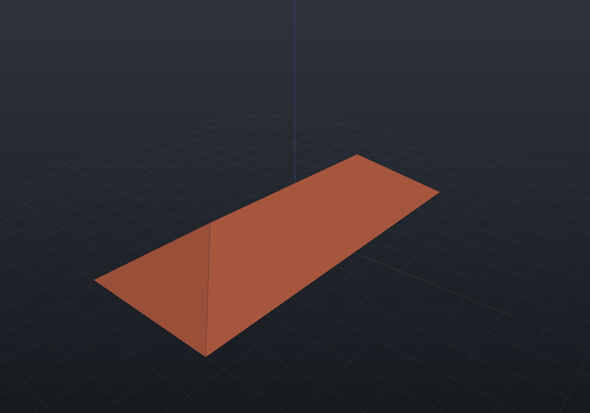
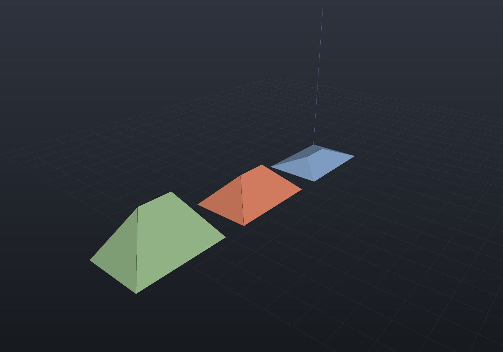
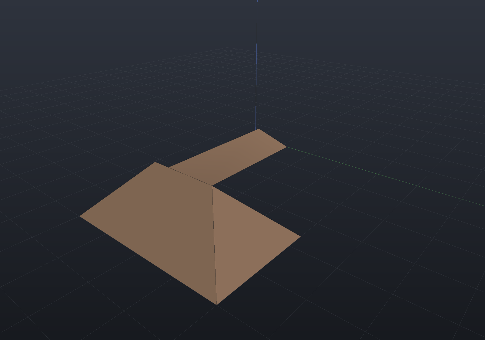
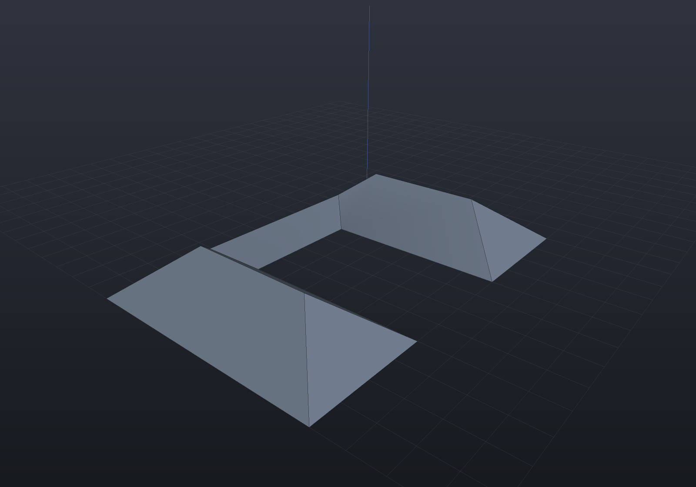
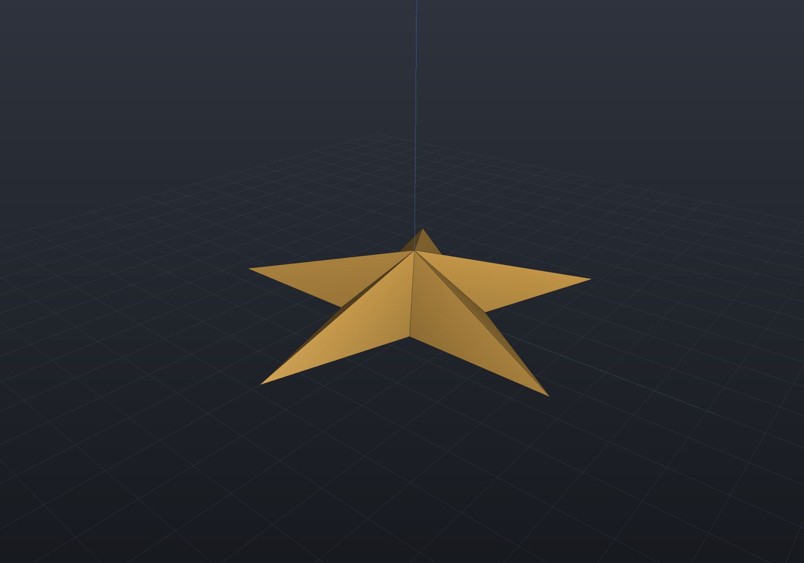

`Shape.Roof` raises a polygonal footprint into a solid by sweeping every base edge
inward at one pitch — OpenSCAD's `roof()`. The surface it produces is the
**straight skeleton**: the trace of the footprint's own corners as the wavefront
shrinks, which is what a hip roof's ridges and valleys are.

It is an **exact** operation rather than a polygonal approximation. Every face is a
single inclined plane, every ridge and valley is a straight line, and every apex is a
plane intersection — the same closed-form arithmetic `Draft` and `Shell` already do —
so a roof is B-Rep-**Native**, its mesh comes from that exact B-Rep, and its implicit
form is bridged through it.

## A hip roof

The textbook case: a rectangle. Two triangular ends and two trapezoids meeting at a
ridge, and every number in it is a closed form — the ridge is exactly
`length − width` long and sits at `width/2 · tan(pitch)`.

```csharp render:roof-hip
var footprint = Sketch.Rectangle(60, 24);
var roof = Shape.Roof(footprint, pitchDegrees: 35);

var facts = Shape.RoofFacts(footprint, RoofPitch.FromAngle(35));
if (Math.Abs(facts.Height - 12 * Math.Tan(35 * Math.PI / 180)) > 1e-9)
    throw new Exception("a hip roof's apex is half the width risen at the pitch");

var scene = new Scene();
scene.Add(new Part("roof", roof) { Color = PartColor.FromRgb(178, 92, 66) });
```



The volume has a closed form too, `tan(pitch) · (L·W²/4 − W³/12)`, which is what the
tests assert rather than a picture. A **square** collapses that ridge to a point and
the roof is a pyramid of exactly `area · height / 3`.

## Pitch or height — one number, two spellings

`RoofPitch` states the steepness either way. The two are related by the footprint's
own skeleton (`height = tan(pitch) · maxOffset`), so the type stores the one you gave
and derives the other; they cannot contradict each other.

```csharp render:roof-pitches
var footprint = Sketch.Polygon(
[
    new Vector2d(0, 0), new Vector2d(40, 0), new Vector2d(40, 26),
    new Vector2d(0, 26),
]);

var scene = new Scene();
double x = 0;
foreach (var pitch in new[] { RoofPitch.FromAngle(20), RoofPitch.FromAngle(45), RoofPitch.FromHeight(20) })
{
    var facts = Shape.RoofFacts(footprint, pitch);
    scene.Add(new Part($"{facts.PitchDegrees:F0} deg", Shape.Roof(footprint, pitch).Translate(x, 0, 0)));
    x += 50;
}
```



## An L-shape, and the split event

A convex footprint only ever collapses edges. A non-convex one also **splits**: a
reflex corner runs across the body and reaches an opposing edge, dividing the
wavefront in two. That is what puts the **valley** in an L-shaped roof, and an
implementation that stops at edge events is a well-verified subset that returns
nonsense for the first L it meets.

```csharp render:roof-lshape
var footprint = Sketch.Polygon(
[
    new Vector2d(0, 0), new Vector2d(30, 0), new Vector2d(30, 20),
    new Vector2d(18, 20), new Vector2d(18, 6), new Vector2d(0, 6),
]);

var facts = Shape.RoofFacts(footprint, RoofPitch.FromAngle(45));
if (facts.Skeleton.SplitEvents < 1)
    throw new Exception("an L-shape's reflex corner must reach the opposite edge");

var scene = new Scene();
scene.Add(new Part("L roof", Shape.Roof(footprint, 45)) { Color = PartColor.FromRgb(150, 120, 96) });
```



This footprint's skeleton was derived by hand and is what the test suite asserts:
four interior nodes at `(3,3)`, `(21,3)`, `(24,6)` and `(24,14)`, six faces whose
areas sum to the footprint's own 348, and — at 45° — an enclosed volume of exactly
**738**. Skipping split events cannot close it at all, which is the mutation that
proves they earn their place.

### A slot splits one edge twice

Cut a slot into a plate and *both* of its reflex corners reach the bottom edge at the
same instant, so the wavefront becomes three loops.

```csharp render:roof-slot
var slot = Sketch.Polygon(
[
    new Vector2d(0, 0), new Vector2d(60, 0), new Vector2d(60, 40), new Vector2d(40, 40),
    new Vector2d(40, 10), new Vector2d(20, 10), new Vector2d(20, 40), new Vector2d(0, 40),
]);

var scene = new Scene();
scene.Add(new Part("slotted roof", Shape.Roof(slot, 38)) { Color = PartColor.FromRgb(120, 132, 150) });
```



### A star is *not* a split-event shape

Worth stating, because it is the obvious guess and it is wrong: a **regular** star's
reflex corners all point at the centre (the notch between two points is *outside* the
polygon), so they arrive together and the whole wavefront resolves by edge events —
measured at zero splits and one interior node for every regular star tried. Break the
symmetry and the splits appear.

```csharp render:roof-star
var corners = new List<Vector2d>();
for (int i = 0; i < 10; i++)
{
    double r = i % 2 == 0 ? 24 : 9;
    double t = Math.PI * i / 5;
    corners.Add(new Vector2d(r * Math.Cos(t), r * Math.Sin(t)));
}

var scene = new Scene();
scene.Add(new Part("star roof", Shape.Roof(Sketch.Polygon(corners), 42)) { Color = PartColor.FromRgb(196, 150, 72) });
```



## What it refuses, and why

| Refused | Reason |
| --- | --- |
| A footprint with **holes** | A hole's wavefront *grows* into the outer one, so the two meet in a merge event whose first contact is — for every rectilinear footprint — an edge against an *edge* rather than a vertex against an edge, which the vertex-event simulation has no event for. Roof the outline and subtract the hole's own solid. |
| Arcs or Béziers in the footprint | A curved edge sweeps a curved *surface*; the straight skeleton is defined for straight edges. Approximate the curve with line segments first. |
| A pitch of 0° or 90° | A flat slab and a vertical wall are not roofs. |
| A **sheared** or non-uniformly scaled placement | It would change the pitch, which is the one thing the roof states. A uniform scale is fine — it scales the skeleton and the height together. |

The simulation also **refuses by name** rather than returning a plausible skeleton
when it meets a degeneracy it cannot decide: what is checked before anything is
returned is that the skeleton faces are simple, positively wound, and that their areas
sum to the footprint's own.
