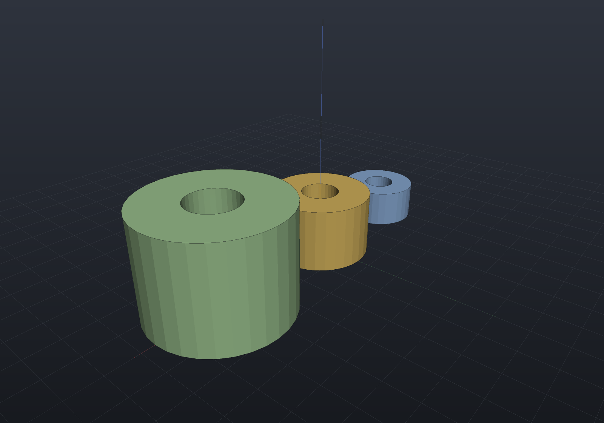

# Scripting (.csx models)

C# **is** EngrCAD's SCAD language — a model is code either way. The `.csx` route drops
the project file: one script, run through `tools/EngrCAD.Script`, with the same live
loop the compiled workflow gets from `dotnet watch`:

```text
dotnet run --project tools/EngrCAD.Script -- samples/scripts/bracket.csx              # live window
dotnet run --project tools/EngrCAD.Script -- samples/scripts/bracket.csx --view       # static window
dotnet run --project tools/EngrCAD.Script -- samples/scripts/bracket.csx --export bracket.step
dotnet run --project tools/EngrCAD.Script -- samples/scripts/bracket.csx --render bracket.png
```

In the live window, **saving the `.csx` re-runs it and swaps the scene in place** —
camera preserved, a script error keeps the last good scene and shows in the overlay
(the runner watches the file and drives the viewer's own hot-reload path, so the
behavior is identical to a `dotnet watch` edit). `--export` and `--render` take every
argument `EngrCad.Run` takes (`--render-style`, `--section`, STL/OBJ/STEP by
extension).

The script contract is one line: **define `Scene scene = ...;`** (or end with a `Scene`
expression). It is the same contract as this documentation's own executable snippets,
compiled through the same Roslyn scripting seam with the same namespaces imported — a
fence that works on this site works as a script verbatim, and vice versa.

```csharp
// bracket.csx — parameters at the top, save the file and the window follows.
double width = 64, depth = 42, thickness = 8;

Shape BossedPlate(double w, double d, double t, double bossD)
{
    var plate = Shape.Extrude(Sketch.RoundedRectangle(w, d, 6), t);
    var boss = Shape.Cylinder(bossD / 2, 1.5 * t).Translate(0, 0, 1.25 * t);
    return plate | boss;   // boss overlaps INTO the plate: transverse, never coplanar
}

var scene = new Scene();
scene.Add(new Part("bracket", BossedPlate(width, depth, thickness, 18), Palette.Steel));
```

The full version of this script lives at `samples/scripts/bracket.csx`.

## Reusable parametric components are plain C# methods

There is no special "module" construct and none is needed: a reusable parametric
component is **a method that takes parameters and returns a `Shape` (or a `Part`)** —
`BossedPlate` above. That is the whole pattern, and it is deliberately the same in
every tier of the toolchain:

- in a `.csx` script, define the method in the script (or `#load` a shared `.csx` of
  your components);
- in a compiled model program, put your component methods in a class library,
  reference it from any design, and get refactoring, tests and NuGet packaging for
  free — this is where the `.csx` route hands over to the
  [live-modeling loop](viewer.md) (`EngrCad.Run` + `dotnet watch`), which is the same
  experience with a project file;
- for components that must regenerate, cache, suppress and serialize inside a design,
  wrap the method in a [`Feature`](features.md) — and for hardware that also prepares
  its host, a [`HardwareComponent`](components.md).

```csharp render:scripting-components
// The component-method pattern, as this page's own executable example: one method,
// three differently-sized instances.
Shape Spacer(double outerD, double boreD, double height) =>
    Shape.Cylinder(outerD / 2, height)
        .Drill(HoleSpec.Simple(boreD), [new Vector2d(0, 0)], height * 1.05,
               SketchPlane.At((0, 0, height / 2), Vector3d.UnitX, Vector3d.UnitY));

var scene = new Scene();
var tab = scene.AddTab("spacers");
tab.Add(new Part("S", Spacer(12, 5, 6).Translate(-18, 0, 3), Palette.Steel));
tab.Add(new Part("M", Spacer(16, 6, 10).Translate(0, 0, 5), Palette.Brass));
tab.Add(new Part("L", Spacer(22, 8, 16).Translate(22, 0, 8), Palette.Sage));
```



## When to choose which

| Route | Startup | You get |
| --- | --- | --- |
| `.csx` + `EngrCAD.Script` | nothing but a text file | the SCAD loop: edit, save, see |
| console project + `EngrCad.Run` | `dotnet new console` + two references | hot reload via `dotnet watch`, a debugger, tests, NuGet — the product's core experience |

Both run the identical kernel and viewer; the `.csx` runner is a thin tool (about a
hundred lines over the `EngrCad.Run` front door), not a second product.
