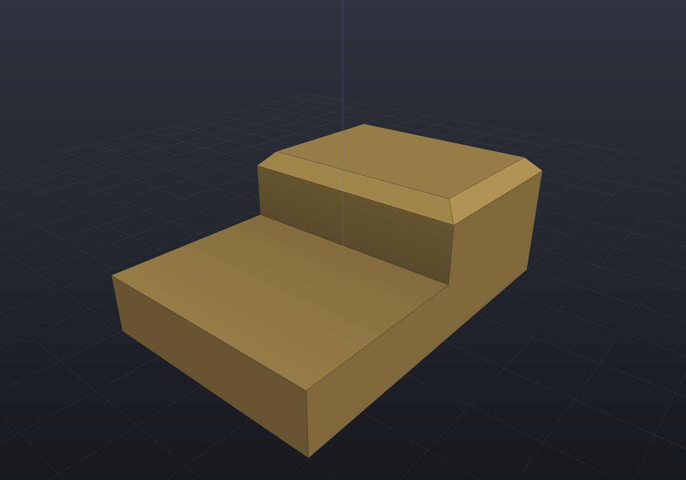

# Selecting faces and edges

Feature operations need a way to *say which geometry they mean* — the top face, the
largest bore, the second step of a stepped block. CadQuery answers with string
selectors (`">Z"`); build123d with `ShapeList.sort_by`/`group_by`/`filter_by`. EngrCAD
deliberately takes the second road, as plain LINQ: `BrepQueries` classifies
(`IsPlanar`, `IsCylindrical`, `IsCircular`...) and `BrepSelection` orders and groups —
type-safe, composable with `Where`/`Select`, and with nothing stringly to mistype.

| Query | Meaning |
| --- | --- |
| `faces.SortAlong(axis)` / `edges.SortAlong(axis)` | Sorted ascending along a direction (stable). |
| `faces.Extreme(axis)`, `.Highest()`, `.Lowest()` | The furthest face/edge along a direction (ties keep the first — deterministic). |
| `faces.GroupAlong(axis)[n]` | Faces grouped by level along a direction, ascending; index from the end for "one down from the top". |
| `faces.GroupByCoplanar()` | Groups of genuinely coplanar faces (same outward normal *and* same plane offset). |
| `faces.FilterBy(SurfaceKind.Cylindrical)` | Semantic surface-kind filter: `Planar`, `Cylindrical`, `Conical`, `Spherical`, `Toroidal`, `Revolved`, `Extruded`, `Swept`, `Nurbs`. |
| `faces.LargestByArea()`, `.SortByArea()`, `face.Area()` | Area queries — exact for planar faces, quadrature (~1–2%) for curved ones. |
| `faces.NthByRadius(n)` / `edges.NthByRadius(n)` | The n-th smallest distinct bore/rim radius (`-1` = largest). |

Every query is deterministic: ties keep input order, so a selection cannot flicker
between regenerations.

## Selecting rims to blend

A stepped block, its upper step found by *grouping the upward faces along Z* rather
than by typing its height — then chamfered by feeding the selection straight into
`ChamferEdges`:

```csharp render:selection-vocabulary
// A stepped block: an L-shaped side profile (x across, z up) extruded along y.
var lProfile = Sketch.Start(0, 0).LineTo(60, 0).LineTo(60, 10)
    .LineTo(30, 10).LineTo(30, 22).LineTo(0, 22).Close();
var block = Shape.Extrude(lProfile, 40,
    SketchPlane.At((-30, 20, 0), Vector3d.UnitX, Vector3d.UnitZ));

// "The top of the upper step": the highest planar face — no coordinates typed.
var stepped = block.ChamferEdges(2.5,
    solid => solid.Faces.FilterBy(SurfaceKind.Planar).Highest().RimEdges());

var scene = new Scene();
scene.Add(new Part("stepped block", stepped, new PartColor(0.75f, 0.62f, 0.35f)));
```



The selector runs against the *lowered solid at every regeneration*, so if the step
grows taller the query still finds it — this is the same topological-naming story the
[parametric features](features.md) use.

## Ordering, grouping, measuring

```csharp run:selection-queries
var plateTop = SketchPlane.At((0, 0, 8), Vector3d.UnitX, Vector3d.UnitY);
var plate = Shape.Extrude(Sketch.Rectangle(40, 30), 8)
    .Drill(StandardHoles.Clearance(6), [new Vector2d(-10, 0)], 20, plateTop)
    .Drill(StandardHoles.Clearance(3), [new Vector2d(10, 0)], 20, plateTop);
var solid = plate.ToBrep();

// Sort and take extremes along any direction.
var top = solid.Faces.Highest();                       // the z = 8 cap
var levels = solid.Faces.GroupAlong(Vector3d.UnitZ);   // bottom / sides+bores / top
if (!ReferenceEquals(levels[^1][0], top)) throw new Exception("grouping disagrees");

// Filter by surface kind, index bores by size without typing radii.
var bores = solid.Faces.FilterBy(SurfaceKind.Cylindrical).ToList();
if (bores.Count != 2) throw new Exception($"expected 2 bores, got {bores.Count}");
var smallBore = solid.Faces.NthByRadius(0);   // the M3 clearance bore (Ø3.4)
var largeBore = solid.Faces.NthByRadius(-1);  // the M6 clearance bore (Ø6.6)

// Area: exact for planar faces (arc terms closed-form), quadrature for curved.
double topArea = top.Area();
double expected = 40 * 30 - Math.PI * (1.7 * 1.7 + 3.3 * 3.3);
if (Math.Abs(topArea - expected) > 1e-6) throw new Exception($"top area {topArea}");
var main = solid.Faces.LargestByArea();
if (!main.IsPlanar(out _, out _)) throw new Exception("largest face should be planar");
```

`Area` is honest about its accuracy: planar faces are exact (straight edges and
circular arcs contribute closed-form boundary-integral terms — the drilled top cap
above lands to 1e-6), while curved faces integrate by quadrature over the trimmed
parameter domain, good to a percent or two. That is ordering-grade — right for
`LargestByArea` — not mass-property grade; use `BrepMassProperties` when the number
itself matters.

## Naming a construction step (`Shape.Tag`)

Every query above asks what a face **is**. `Shape.Tag` lets a design say where a face
**came from** — the persistent half of topological naming — and it answers the one question
a semantic query structurally cannot: *which* of two identical bosses is this?

```csharp run:selection-tags
var body = Shape.Box(80, 60, 12)
    | Shape.Cylinder(6, 20).Translate(-24, 0, 6).Tag("left")
    | Shape.Cylinder(6, 20).Translate(24, 0, 6).Tag("right");
var solid = body.ToBrep();

// Same shape, same height, same normals: PlanarWithNormal(Z) sees two identical
// candidates, and the tag tells them apart.
var leftTop = FaceRef.Extreme(
    FaceSetRef.PlanarWithNormal(Vector3d.UnitZ).Within(FaceSetRef.Tagged("left")),
    Vector3d.UnitZ).Resolve(solid, "top");

if (Math.Abs(leftTop.Bounds().Center.X + 24) > 1e-6)
    throw new Exception("that is not the left boss's top");
```

`Tag` changes no geometry in any representation and adds no row to `Explain` — it is a
label, not an operation. The B-Rep lowering stamps the name onto every face the tagged
sub-shape produced, and the faces carry it forward.

**A tag names a SET, never "the" face.** A boolean can split one face into several, and a
boss contributes both a cylinder and a plane, so `FaceSetRef.Tagged` is set-valued by
construction. `Within` narrows it against the semantic vocabulary (as above), and
`FaceRef.One`/`FaceRef.Extreme` make the "exactly one" claim deliberately, failing loudly
if it breaks. The descriptor round-trips like every other term
(`within(planar([0,0,1]),tagged(left))`), so a tagged selector persists with the rest of a
feature's parameters.

### Exactly where the guarantee stops

A tag is inherited wherever a face is *derived* from another, which covers the whole
boolean pipeline: untouched faces pass through by reference and every split fragment takes
its parent's tags.

| Operation | Tag survives? |
| --- | --- |
| Union / intersection / difference, `Drill` | Yes — including the subtracted tool's own walls |
| Transforms, patterns, mirroring | Yes |
| `Shape.From(brepSolid)` (which clones) | Yes |
| Rim `Fillet`/`Chamfer` | On the faces it does not rewrite. The shrunk blended face and the new bands carry nothing |
| `RoundEdges` (whole-solid), `Draft`, `Shell` | No — these rebuild every face on fresh geometry |
| STEP export / import | No — there is no AP214 entity for provenance |
| `ToImplicit()` / `ToMesh()` | Not applicable — a distance field and a triangle soup have no faces |

The failure is deliberately **one-sided**: a lost tag yields *fewer* faces, never a face
from somewhere else. So an over-narrow selection breaks its cardinality contract loudly
instead of quietly blending the wrong edge — which is the whole reason to prefer a
conservative scheme over a clever one.

Tags live inside the geometry-reference descriptor grammar, so they are restricted to ASCII
letters, digits and underscores. A tag the grammar cannot spell is **refused with a
suggestion** rather than sanitized: silently turning `"boss top"` into a descriptor that
resolves to nothing is precisely the failure mode a naming scheme must not have.

## The serializable spellings

Every query has a [GeometryRef](geometry-inputs.md) spelling, so parametric features
and mates can declare a selection that survives JSON round trips and re-resolves per
regeneration:

```csharp run:selection-refs
var plateTop = SketchPlane.At((0, 0, 8), Vector3d.UnitX, Vector3d.UnitY);
var plate = Shape.Extrude(Sketch.Rectangle(40, 30), 8)
    .Drill(StandardHoles.Clearance(6), [new Vector2d(-10, 0)], 20, plateTop)
    .Drill(StandardHoles.Clearance(3), [new Vector2d(10, 0)], 20, plateTop);
var solid = plate.ToBrep();

var bore = FaceSetRef.NthByRadius(-1);                  // "the largest bore"
var mainFace = FaceRef.Largest;                          // "the largest face"
var planar = FaceSetRef.OfKind(SurfaceKind.Planar);      // "the planar faces"
var step = FaceSetRef.GroupAlong(planar, Vector3d.UnitZ, -1); // "the top level"

// Descriptors are the cache key AND the serialized form — parse round-trips exactly.
foreach (GeometryRef reference in new GeometryRef[] { bore, mainFace, planar, step })
{
    var parsed = GeometryRef.Parse(reference.Descriptor, reference.GetType());
    if (parsed.Descriptor != reference.Descriptor)
        throw new Exception($"descriptor did not round-trip: {reference.Descriptor}");
}

var faces = bore.Resolve(solid, "Bore");
if (faces.Count != 1) throw new Exception("expected the one M6 bore");
```

A failed query names the input and what it found — `"Bore: NthByRadius: index 5 is
out of range — 2 distinct radius group(s) exist (1.7, 3.3)."` — rather than silently
selecting nothing.
