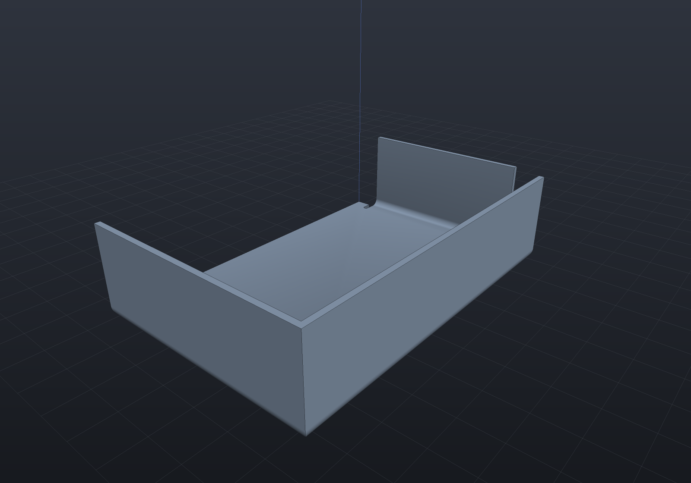
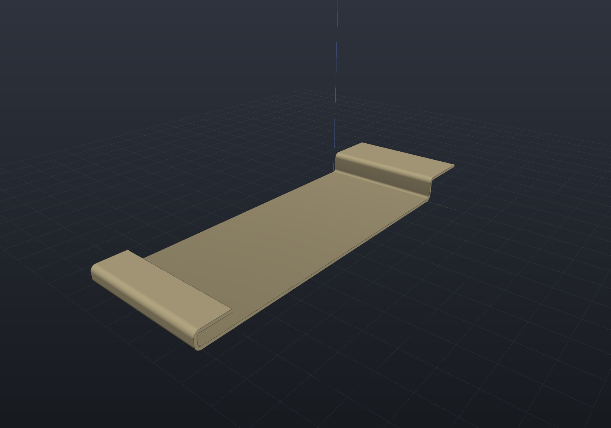
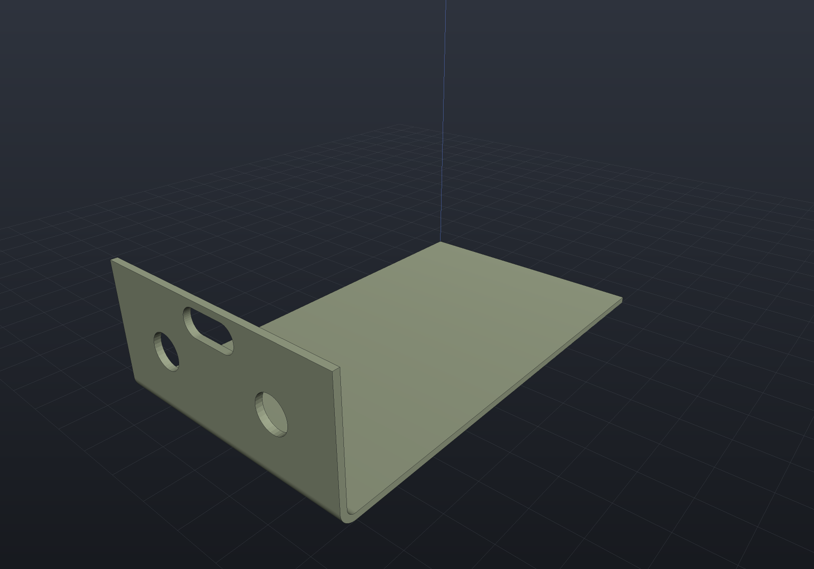

A sheet-metal part is not a solid that happens to be thin: it is a **flat blank plus a
list of bends**, and the two views of it — the folded body you assemble and the flat
pattern the shop cuts — have to agree exactly. EngrCAD models the declaration, and
derives both.

```csharp
var spec = new SheetMetalSpec(Thickness: 1.5, BendRadius: 1.5, KFactor: SheetMaterials.MildSteel);

var bracket = SheetMetalBody
    .Base(Sketch.Polygon([new(0, 0), new(90, 0), new(90, 60), new(0, 60)]), spec)
    .WithFlange(SheetFlangeTarget.BaseEdge(1), length: 25)
    .WithFlange(SheetFlangeTarget.BaseEdge(3), length: 25);

var solid = bracket.Solid;      // the folded part
var flat  = bracket.Unfold();   // the blank plus its bend lines
```

## The bend model

Two formulas cover industry practice, and both live in `SheetMetalSpec` so nothing
downstream can restate one of them differently.

| Quantity | Formula | What it is |
| --- | --- | --- |
| **Bend allowance** | `BA = θ·(R + K·T)` | The flat length one bend consumes — the arc length of the *neutral axis*. |
| **Outside setback** | `OSSB = (R + T)·tan(θ/2)` | Tangent line to **outer virtual sharp**, the corner the two outside faces would meet at if the bend were square. |
| **Bend deduction** | `BD = 2·OSSB − BA` | Derived, not a third model: flat length = sum of the two *outside* legs − BD. |

`K` is the **K-factor**: where in the thickness the neutral axis sits, as a fraction.
`K = 0.5` is mid-sheet; real values run 0.3–0.5 because the outer fibres stretch and
the neutral axis migrates inward. `SheetMaterials` carries the common defaults
(`SoftAluminium` 0.33, `Aluminium` 0.40, `MildSteel` 0.44, `Stainless` 0.45, `Coined`
0.50) — **transcribed from shop practice and flagged verify-against-datasheet**: the
authority is your press brake's bend-deduction chart, not this table.

Spring-back compensation is deliberately out of scope. It belongs to the press and the
material batch, not to the geometry.

```csharp run:sheet-bend-model
double theta = Math.PI / 2, radius = 2, thickness = 1.5, k = 0.44;

double allowance = SheetMetalSpec.BendAllowance(theta, radius, thickness, k);
double setback   = SheetMetalSpec.OutsideSetback(theta, radius, thickness);
double deduction = SheetMetalSpec.BendDeduction(theta, radius, thickness, k);

// A square bend's setback is exactly R + T, because tan(45 degrees) = 1.
if (Math.Abs(setback - (radius + thickness)) > 1e-12) throw new Exception("setback");
// And the deduction is what its definition says it is.
if (Math.Abs(deduction - (2 * setback - allowance)) > 1e-12) throw new Exception("deduction");

// Flat length of a 60 x 25 outside-dimensioned L, two ways round:
double flatLength = 60 + 25 - deduction;                      // outside legs, less BD
double walked = (60 - setback) + allowance + (25 - setback);  // leg, bend, leg
if (Math.Abs(flatLength - walked) > 1e-12) throw new Exception("the two forms must agree");
```

## Base flange and edge flanges

A **base flange** is a sketch plus a spec: a flat sheet solid, which is an extrusion,
exactly. An **edge flange** grows from one straight edge of it.

Three conventions are worth stating once, because every dimension on the drawing
depends on them:

- **`Length` is measured from the outer virtual sharp**, along the flange's outside
  face — the dimension a drawing carries. It must exceed the outside setback.
- **Bend outside**: the bend's tangent line *is* the edge you named, so the material
  continues outboard through the bend. The parent's flat region is therefore exactly
  the outline you drew, which is what makes the flat pattern "the base sketch plus one
  rectangle per flange".
- **A flange folds toward the face its edge is quoted on.** Name an edge of the top
  face and `SheetBendDirection.Up` raises the flange, with the top face becoming the
  *inside* of the bend; `Down` folds the other way.

```csharp render:sheet-metal-bracket
var spec = new SheetMetalSpec(Thickness: 1.5, BendRadius: 1.5, KFactor: SheetMaterials.MildSteel);

// A U-channel with a return lip: base, two side walls, and a flange on a flange.
var bracket = SheetMetalBody
    .Base(Sketch.Polygon([new(0, 0), new(90, 0), new(90, 60), new(0, 60)]), spec)
    .WithFlange(SheetFlangeTarget.BaseEdge(1), length: 25)
    .WithFlange(SheetFlangeTarget.BaseEdge(3), length: 25)
    .WithFlange(SheetFlangeTarget.FlangeTip(0), length: 10);

var scene = new Scene();
scene.Add(new Part("bracket", bracket.Solid) { Color = new PartColor(0.62f, 0.66f, 0.72f) });
```


The bends are **exact cylindrical bands welded straight into the parent's loops** —
never booleans. A bend meets both the parent sheet and the flange wall *tangentially*,
which is degenerate boolean input, and there is nothing to compute anyway: every face
is a closed form. So the whole part is B-Rep **Native**.

```csharp run:sheet-metal-native
var spec = new SheetMetalSpec(1.5, 1.5);
var body = SheetMetalBody.Base(Sketch.Rectangle(60, 40), spec)
    .WithFlange(SheetFlangeTarget.BaseEdge(1), 20);

var report = body.Solid.Explain(TargetRep.Brep);
if (!report.IsConvertible) throw new Exception(report.ToString());
```

### Partial flanges

Give a flange a `startOffset` and a `width` and it occupies part of the edge, leaving
the wall intact either side. **A flange's two ends are independent**: each is either
*flush* with its edge's own end — where the flange's cross-section is spliced into the
neighbouring wall — or *inset* from it, where the flange gets a cap and the leftover
wall a stub. A flange running to one end of a plate is one of each, which is the
ordinary shop case and needs no special path.

```csharp render:sheet-metal-tabs
var spec = new SheetMetalSpec(Thickness: 1.2, BendRadius: 1.2, KFactor: SheetMaterials.Aluminium);

var tabbed = SheetMetalBody
    .Base(Sketch.Polygon([new(0, 0), new(120, 0), new(120, 50), new(0, 50)]), spec)
    .WithFlange(SheetFlangeTarget.BaseEdge(1), length: 15, startOffset: 8, width: 14)
    .WithFlange(SheetFlangeTarget.BaseEdge(1), length: 15, startOffset: 28, width: 14)
    .WithFlange(SheetFlangeTarget.BaseEdge(3), length: 22, angleDegrees: 120);

var scene = new Scene();
scene.Add(new Part("tabbed", tabbed.Solid) { Color = new PartColor(0.72f, 0.68f, 0.55f) });
```


### Bend reliefs

Where a flange stops short of its edge, the parent material beside the bend has to give
way — so a **bend relief** is notched into it. Give a flange a `BendRelief` and one is
cut at each *inset* end (a flush end has no parent material beside it to relieve).

**A relief is a notch in the blank, not a cut in the folded body.** It changes
`BaseOutline` — the base sketch with every relief cut into it — which is what the folded
sheet is extruded from *and* what the flat pattern starts from. So there is no boolean
and no second description: the same declaration produces both views, exactly as an edge
flange does. It also makes the geometry *simpler*, because between its two notches a
relieved flange runs the full width of the shortened wall, which is the ordinary flush
case.

```csharp render:sheet-metal-relief
var spec = new SheetMetalSpec(Thickness: 2, BendRadius: 2, KFactor: SheetMaterials.MildSteel);

var bracket = SheetMetalBody
    .Base(Sketch.Polygon([new(0, 0), new(110, 0), new(110, 60), new(0, 60)]), spec)
    .WithFlange(
        SheetFlangeTarget.BaseEdge(1), length: 24, startOffset: 14, width: 32,
        relief: BendRelief.Obround(width: 5, depth: 10))
    .WithFlange(
        SheetFlangeTarget.BaseEdge(3), length: 18, startOffset: 20, width: 24,
        relief: BendRelief.Rectangular(width: 4, depth: 8));

var scene = new Scene();
scene.Add(new Part("relieved", bracket.Solid) { Color = new PartColor(0.62f, 0.66f, 0.72f) });
```


| | |
| --- | --- |
| `BendRelief.Rectangular(width, depth)` | Two sides and a flat bottom. |
| `BendRelief.Obround(width, depth)` | Rounded at the bottom with a semicircle of half the width — the fatigue-friendly form, since a square inside corner is a stress raiser. `Depth` reaches the *deepest* point, so it can never be less than half the width. |

Both dimensions default: **width** to one sheet thickness, **depth** to `R + T`, which
takes the notch past the bend's own tangent region. A **tear relief** is deliberately
absent from the vocabulary — it is what happens when no relief is cut at all, and the
shape the material tears into belongs to the press, not to the geometry.

Reliefs are cut only on the **base flange's** edges: a flange's own wall is built as a
plain rectangle rather than from a sketch, so a relief on a flange tip is refused by
name. A notch that reaches past the far side of its parent — or into a hole in it — is
refused too, naming the point: a notch is a *detour in the outline*, so one running out
of the parent leaves a self-intersecting blank, and it does so silently (the signed area
still reads base-minus-notches, and the extrusion still validates).

### Closed corners

Two flanges on **adjacent** edges are declared as one thing, because they are one
operation: `WithCorner` locates both bend lines before either is built and **miters**
them against each other, so the corner closes with no gap.

**The miter is a closed form, not an intersection.** Two bends of the same radius quoted
on the same face have axes that meet over the sheet's corner, and two equal-radius
cylinders with intersecting axes meet in **ellipses** — so each band's cut is an exact
`Ellipse3d` and nothing is traced. The two flanges' cut chains are the *same* curves (the
configuration is symmetric under reflection in the miter plane, which swaps them), so
they are welded rather than butted: nothing lies in the miter plane at all.

```csharp render:sheet-metal-corner
var spec = new SheetMetalSpec(Thickness: 1.5, BendRadius: 2, KFactor: SheetMaterials.MildSteel);

var tray = SheetMetalBody
    .Base(Sketch.Polygon([new(0, 0), new(90, 0), new(90, 60), new(0, 60)]), spec)
    .WithCorner(SheetFlangeTarget.BaseEdge(1), SheetFlangeTarget.BaseEdge(2), length: 25)
    // The other corner is left OPEN, the way a relieved one is: this flange stops short
    // of it and a relief notches the blank beside the bend.
    .WithFlange(
        SheetFlangeTarget.BaseEdge(3), length: 25, startOffset: 6, width: 48,
        relief: BendRelief.Obround());

var scene = new Scene();
scene.Add(new Part("tray", tray.Solid) { Color = new PartColor(0.62f, 0.70f, 0.80f) });
```



**What a corner does to the volume identity is the price of sharing material**, and it is
exact. Each flange's material now runs to the miter plane rather than stopping at the
sheet's corner, so the folded body *gains* the first moment of that flange's own
cross-section about the corner line — `((R+T)³ − R³)/3` from the bend's annular sector
plus `T·L·(R + T/2)` from the wall — while the blank is untouched. That the blank cannot
supply it is exactly what "an unrelieved corner shares material" means.

The pair must share one sheet corner and agree on radius, angle and length; anything else
refuses by name. To leave the corner *open* instead, inset one flange and cut a bend
relief.

### Hems, jogs and curls

Each is two or more ordinary bends, so none of them is new geometry — what the API adds
is the declaration and the arithmetic that turns a shop dimension into flange lengths.

A **hem** folds the edge back on itself as two bends the *same* way. It is deliberately
not one 180° fold: that has no geometry here at all (its outside setback
`(R+T)·tan(θ/2)` diverges) and a return leg flat against the sheet is coincident
boundary. The gap is `2R + L` for an intermediate leg `L`, so a gap of `2R` or less is a
*closed* hem and refuses by name — a tight hem is spelt with a small bend radius, which
is what flattening the material in the press means.

A **jog** is two equal and *opposite* bends, and its intermediate leg is closed form:
the perpendicular step is `(2R + T)(1 − cos θ) + L·sin θ`, so `L = (offset − (2R +
T)(1 − cos θ)) / sin θ`. Below the minimum the refusal names the smallest offset that
radius and angle allow.

A **curl** is a chain of equal hits, and it is honestly **polygonal**: a rolled edge past
180° is one continuous band this bend model cannot spell, and a press makes one in
successive hits anyway. The flat pattern, the bend table and the volume identity all
describe exactly the part this builds.

```csharp render:sheet-metal-hem-jog
var spec = new SheetMetalSpec(Thickness: 1.0, BendRadius: 1.0, KFactor: SheetMaterials.Aluminium);

var panel = SheetMetalBody
    .Base(Sketch.Polygon([new(0, 0), new(110, 0), new(110, 45), new(0, 45)]), spec)
    .WithHem(SheetFlangeTarget.BaseEdge(1), returnLength: 12, gap: 4)
    .WithJog(SheetFlangeTarget.BaseEdge(3), offset: 8, runLength: 20);

var scene = new Scene();
scene.Add(new Part("panel", panel.Solid) { Color = new PartColor(0.80f, 0.74f, 0.58f) });
```



### Cutouts on a flange

A flange's wall can carry holes, declared in the **flange's own local coordinates** —
`x` along the bend line from the flange's start, `y` out from the bend's tangent line.
One declaration reaches both views, exactly as a bend relief does: the folded wall is
punched and the blank gains the same holes through the flange's rigid flat frame.

```csharp render:sheet-metal-cutouts
var spec = new SheetMetalSpec(Thickness: 1.5, BendRadius: 2, KFactor: SheetMaterials.MildSteel);

var bracket = SheetMetalBody
    .Base(Sketch.Polygon([new(0, 0), new(100, 0), new(100, 60), new(0, 60)]), spec)
    .WithFlange(SheetFlangeTarget.BaseEdge(1), length: 30, cutouts:
    [
        Sketch.Circle(4).Placed((15, 12), (1, 0)),
        Sketch.Circle(4).Placed((45, 12), (1, 0)),
        Sketch.Slot(14, 6).Placed((30, 22), (1, 0)),
    ]);

var scene = new Scene();
scene.Add(new Part("bracket", bracket.Solid) { Color = new PartColor(0.68f, 0.72f, 0.60f) });
```



A cutout must lie strictly inside its wall. One crossing the **bend line** is refused by
name, and the reason is the flat pattern rather than the solid: a hole running into the
bend zone is a hole in a *cylindrical band*, whose flat shape is that band's development
— a different map from the flange's rigid frame — and the unfold's whole claim is that
it is bookkeeping over rigid frames.

## The flat pattern

`Unfold()` is **bookkeeping, not geometry re-derivation**: it walks the flange tree,
gives each bend its allowance, and splices a rectangle into the blank outline. Holes
drawn in the base sketch keep their position, because the flat pattern's coordinates
*are* the base sketch's.

The result carries the blank and one `FlatBendLine` per bend — both tangent lines of
the bend zone, the angle, the radius, the allowance and whether the fold is up or
down.

```csharp svg:sheet-metal-flat
var spec = new SheetMetalSpec(Thickness: 1.5, BendRadius: 1.5, KFactor: SheetMaterials.MildSteel);

var chassis = SheetMetalBody
    .Base(
        Sketch.Polygon([new(0, 0), new(120, 0), new(120, 70), new(0, 70)])
            .WithHole(Sketch.Circle(new Vector2d(30, 35), 6))
            .WithHole(Sketch.Circle(new Vector2d(90, 35), 6)),
        spec)
    .WithFlange(SheetFlangeTarget.BaseEdge(1), length: 22)
    .WithFlange(SheetFlangeTarget.BaseEdge(3), length: 22)
    .WithFlange(SheetFlangeTarget.BaseEdge(0), length: 14, startOffset: 15, width: 90);

var svg = chassis.Unfold().ToDrawing().ToSvg();
```


Reliefs appear in the blank as the notches they are, because the blank *is* the outline
they were cut into:

```csharp svg:sheet-metal-relief-flat
var spec = new SheetMetalSpec(Thickness: 2, BendRadius: 2, KFactor: SheetMaterials.MildSteel);

var svg = SheetMetalBody
    .Base(Sketch.Polygon([new(0, 0), new(110, 0), new(110, 60), new(0, 60)]), spec)
    .WithFlange(
        SheetFlangeTarget.BaseEdge(1), length: 24, startOffset: 14, width: 32,
        relief: BendRelief.Obround(width: 5, depth: 10))
    .WithFlange(
        SheetFlangeTarget.BaseEdge(3), length: 18, startOffset: 20, width: 24,
        relief: BendRelief.Rectangular(width: 4, depth: 8))
    .Unfold()
    .ToDrawing()
    .ToSvg();
```


### The bend table

`BendTable()` is the press brake's setup sheet: one row per bend in declaration order,
with the length of the bend line, the angle, which way it folds, the inside radius and
the allowance. Every column is read off the same `FlatBendLine` records the drawing's
bend zones are drawn from, so the table and the picture cannot disagree.

```csharp run:sheet-metal-bend-table
var spec = new SheetMetalSpec(1.5, 1.5);
var body = SheetMetalBody.Base(Sketch.Rectangle(80, 50), spec)
    .WithFlange(SheetFlangeTarget.BaseEdge(1), 25)
    .WithFlange(SheetFlangeTarget.BaseEdge(3), 18, direction: SheetBendDirection.Down);

Console.WriteLine(body.Unfold().BendTable());
// BEND  LENGTH   ANGLE  DIR   RADIUS  ALLOWANCE
//    1  50.000    90.0  UP     1.500      3.394
//    2  50.000    90.0  DOWN   1.500      3.394
var rows = body.Unfold().BendTable().Split('\n', StringSplitOptions.RemoveEmptyEntries);
if (rows.Length != 3) throw new Exception("a header and one row per bend");
```

### Out to the shop

`ToDxf()` writes what a laser cutter wants: the blank on a `CUT` layer, the bend
zones' tangent lines on a `BEND` layer given the `CENTER` line type, so a reader that
honours the LTYPE table shows them chain-dashed rather than as cuts.

```csharp run:sheet-metal-dxf
var spec = new SheetMetalSpec(1.5, 1.5);
var body = SheetMetalBody.Base(Sketch.Rectangle(80, 50), spec)
    .WithFlange(SheetFlangeTarget.BaseEdge(1), 25);

var flat = body.Unfold();
flat.ToDxf().SaveFile(Path.Combine(Scratch, "bracket-flat.dxf"));

// One outline plus two bend-zone lines.
var reloaded = DxfDocument.LoadFile(Path.Combine(Scratch, "bracket-flat.dxf"));
if (reloaded.ToSketches("CUT").Count != 1) throw new Exception("expected one blank outline");
if (reloaded.Entities.Count(e => e.Layer == "BEND") != 2) throw new Exception("expected two bend lines");
```

## The oracle: folded volume versus flat volume

The bend model has a built-in test, and it is sharper than "the two volumes are about
equal". A bend's folded material is an annular sector — `θ·T·(R + T/2)` per unit width
— while the blank spends `BA·T = θ·T·(R + K·T)` on it. So:

- at **K = 0.5** the folded body and the flat blank have **exactly** the same volume;
- at any other K they differ by **`Σ width·θ·T²·(0.5 − K)`**, a closed form.

That is the K-factor doing its job (a lower K means the neutral axis sits nearer the
inside, so the blank is shorter), not an error — and pinning it in both direction and
magnitude is what makes it a real check.

```csharp run:sheet-metal-volume-identity
var coined = new SheetMetalSpec(1.5, 2.0, SheetMaterials.Coined);   // K = 0.5
var body = SheetMetalBody.Base(Sketch.Polygon([new(0, 0), new(80, 0), new(80, 50), new(0, 50)]), coined)
    .WithFlange(SheetFlangeTarget.BaseEdge(1), 25);

double folded = BrepMassProperties.Compute(body.Solid.ToBrep()).Volume;
double flat = body.Unfold().Volume;
if (Math.Abs(folded / flat - 1) > 1e-6) throw new Exception($"folded {folded:g10} vs flat {flat:g10}");

// And away from 0.5 the gap is exactly the formula's.
var steel = new SheetMetalSpec(1.5, 2.0, SheetMaterials.MildSteel);
var other = SheetMetalBody.Base(Sketch.Polygon([new(0, 0), new(80, 0), new(80, 50), new(0, 50)]), steel)
    .WithFlange(SheetFlangeTarget.BaseEdge(1), 25);
double gap = BrepMassProperties.Compute(other.Solid.ToBrep()).Volume - other.Unfold().Volume;
double predicted = 50 * (Math.PI / 2) * 1.5 * 1.5 * (0.5 - SheetMaterials.MildSteel);
if (Math.Abs(gap - predicted) > 1e-4) throw new Exception($"gap {gap:g10}, predicted {predicted:g10}");
```

**A bend relief leaves that discrepancy exactly where it was**, which is what makes the
oracle worth extending rather than replacing: a relief takes the same material out of the
folded body and out of the blank, so it contributes nothing to the gap. A relief that
notched only one of the two views — the failure a "the volumes are about equal" test
waves through — shows up here as a gap wrong by the whole notch volume.

```csharp run:sheet-metal-relief-identity
var spec = new SheetMetalSpec(1.5, 2.0, SheetMaterials.SoftAluminium);
var body = SheetMetalBody.Base(Sketch.Polygon([new(0, 0), new(80, 0), new(80, 50), new(0, 50)]), spec)
    .WithFlange(SheetFlangeTarget.BaseEdge(1), 25, startOffset: 10, width: 30,
        relief: BendRelief.Obround(width: 3, depth: 4));

double gap = BrepMassProperties.Compute(body.Solid.ToBrep()).Volume - body.Unfold().Volume;
double predicted = 30 * (Math.PI / 2) * 1.5 * 1.5 * (0.5 - SheetMaterials.SoftAluminium);
if (Math.Abs(gap - predicted) > 1e-4) throw new Exception($"gap {gap:g10}, predicted {predicted:g10}");
```

## As a parametric feature

`BaseFlangeFeature` and `EdgeFlangeFeature` put sheet metal in the
[feature history](features.md), so a sheet part regenerates, caches, suppresses and
saves like any other. The bend line is named with an
[`EdgeSetRef`](geometry-inputs.md) resolved against the regenerated body — the
topological-naming story — and mapped back into the flange tree, so "the flange on
THAT edge" survives an edit upstream of it.

```csharp run:sheet-metal-feature
var history = new FeatureHistory();
history.Add(new BaseFlangeFeature(Sketch.Polygon([new(0, 0), new(80, 0), new(80, 50), new(0, 50)]))
{
    Thickness = 1.5,
    BendRadius = 2.0,
    KFactor = SheetMaterials.MildSteel,
});
history.Add(new EdgeFlangeFeature
{
    Length = 25,
    Edge = SheetMetalFeatures.EdgeBetween((80, 0, 1.5), (80, 50, 1.5)),
    // A relief is a parameter like any other, and an OPTIONAL one: null cuts none. It
    // can be the geometry's own nullable enum because a [Param] dropdown now offers a
    // "(none)" row for one -- the rule is that a parameter whose editor can express
    // absence takes the nullable type.
    Relief = null,
});

var result = history.Regenerate();
if (!result.Succeeded) throw new Exception(result.ToString());

// The flat pattern comes off the regenerated body, not off a second model.
var flat = SheetMetalFeatures.TryUnfold(result.Body)!;
if (flat.Bends.Count != 1) throw new Exception("expected one bend");
```

## What is not supported

Refused **by name**, rather than approximated:

| Not supported | Why |
| --- | --- |
| Bends along non-straight edges | **Not a gap but a theorem.** Folding a sheet along a curve is not an *isometry* of the sheet, so no flat blank produces it: along a circular bend line the band is a torus segment, whose Gaussian curvature is non-zero everywhere a flat sheet's is zero. The material would have to stretch or shrink, which is *forming* rather than bending and has no bend allowance. Approximate it as a chain of straight bends, or model it as forming and accept that its blank is not derivable. |
| Two flanges sharing a stretch of one edge | Two bends cannot occupy the same material — and a relief counts as part of the stretch its flange occupies. |
| Flanges on a flange's *side* edges | Only the tip: a side flange is a corner interaction. |
| A cutout crossing a bend line | Its flat shape is that band's *development*, not the flange's rigid frame, and the unfold is bookkeeping over rigid frames. |
| Reliefs on a flange's tip edge | A relief notches its parent's *outline*, and a flange's wall is built as a plain rectangle rather than from a sketch. Its **holes** are declarable (see Cutouts); its outline is not. |
| Louvres | A louvre's bend line is *interior* to a face rather than on an edge, and it is lanced as well as formed — so it is not an edge flange at all, and the torn ends of the lance belong to the press. |
| Tear reliefs, spring-back compensation | Both belong to the press rather than to the geometry — a tear relief is what happens when no relief is cut. |

Every one of these throws with a message naming what it hit and what to do instead.

## Multi-body sheets and welded assemblies

**A sheet part is one flange tree and one blank, by design rather than by omission.** A
weldment of sheet metal is several *parts* — each with its own base flange, its own tree
and its own blank — held together by an `Assembly`: the BOM counts them, mates position
them, and `SheetMetalFeatures.UnfoldAll` cuts them. Folding several bodies into one
`SheetMetalBody` would make `FlatPattern` mean two things at once, and a laser cuts one
blank per body either way.

What is *not* a sheet part is equally deliberate: a boolean of two sheet solids is a
solid, not a sheet part — a union node carries no flange tree, so it has no blank. Weld
the parts in an assembly, not in the geometry.

```csharp run:sheet-metal-weldment
var spec = new SheetMetalSpec(Thickness: 1.5, BendRadius: 2, KFactor: SheetMaterials.MildSteel);

SheetMetalBody Panel(double x, double y) => SheetMetalBody
    .Base(Sketch.Polygon([new(0, 0), new(x, 0), new(x, y), new(0, y)]), spec)
    .WithFlange(SheetFlangeTarget.BaseEdge(1), length: 18);

var chassis = new Assembly("chassis");
chassis.Add(new Part("side", Panel(60, 40).Solid));
chassis.Add(new Part("lid", Panel(60, 25).Solid), Frame3d.FromXY((0, 60, 0), (1, 0, 0), (0, 1, 0)));

var scene = new Scene();
scene.AddTab("Model").Add(chassis);

// One blank per body, each once, however deeply nested.
var blanks = SheetMetalFeatures.UnfoldAll(scene);
if (blanks.Count != 2) throw new Exception("expected one blank per body");
```

## Out to the shop without a script

`--flat` writes every sheet part's flat pattern from a model program, and the viewer's
**Flat** button does the same for the selected part (bend table in a window, DXF beside
it, path in the status bar).

```text
dotnet run --project mypart -- --flat blank.dxf      # the laser's outline plus bend lines
dotnet run --project mypart -- --flat blank.svg      # the same, to look at
dotnet run --project mypart -- --flat setup.txt      # the press brake's bend table
```

It is its own verb rather than an `--export` extension because "this scene as DXF" is
genuinely ambiguous — a drawing sheet, a section and a flat pattern are three different
2D answers to it. A scene with several sheet parts writes one file each,
`<stem>-<part><ext>`; each has its own blank, so one path cannot serve them.

## Mirrored placements

A mirrored sheet part is **re-declared, not re-placed**: a flange tree is ordered and
quoted on named edges, so a reflection has to move the *names*. `Shape.Mirror` rebuilds
the tree the other way round — the base sketch reflected (which reverses its winding, so
a segment at index `i` of `n` lands at `n − 1 − i`), every flange's span reversed along
its own edge, every cutout mirrored in its flange's local `x` — and places it on a proper
frame. The reflection is taken in the *sketch* plane, so the sheet's own `+Z` never moves
and `SheetBendDirection` keeps meaning one thing.
