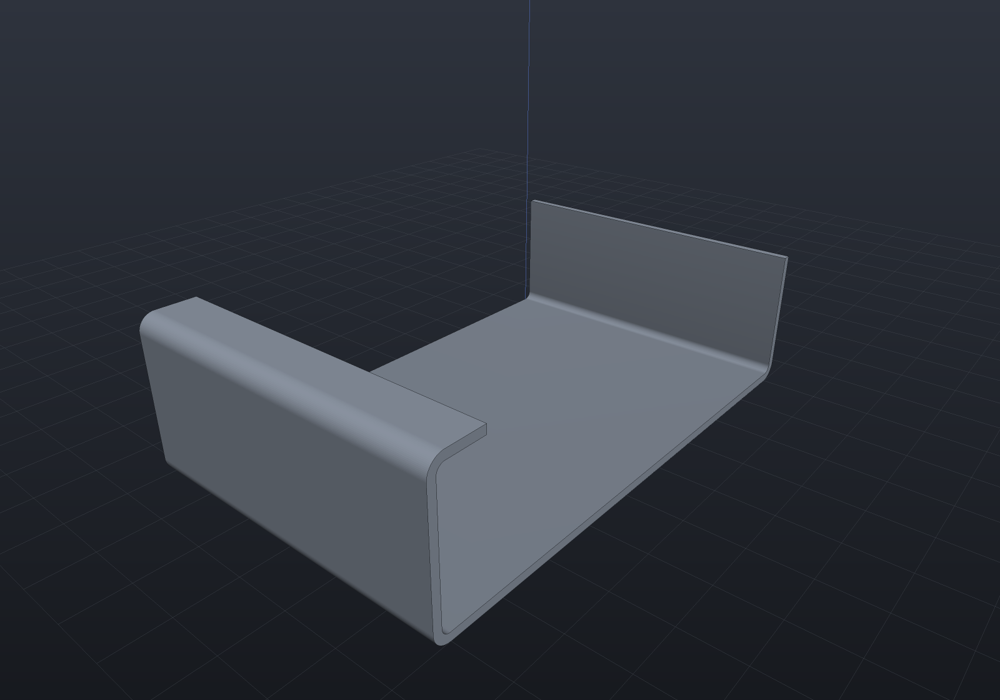
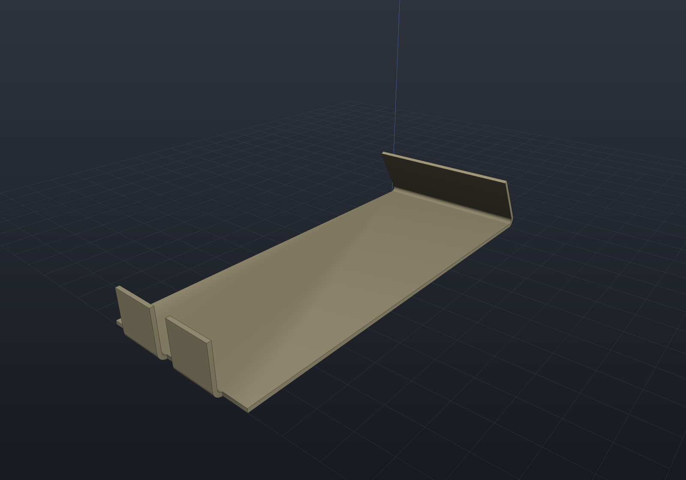
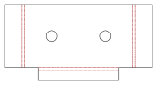

A sheet-metal part is not a solid that happens to be thin: it is a **flat blank plus a
list of bends**, and the two views of it — the folded body you assemble and the flat
pattern the shop cuts — have to agree exactly. EngrCAD models the declaration, and
derives both.

```csharp
var spec = new SheetMetalSpec(Thickness: 1.5, BendRadius: 1.5, KFactor: SheetMaterials.MildSteel);

var bracket = SheetMetalBody
    .Base(Sketch.Polygon([new(0, 0), new(90, 0), new(90, 60), new(0, 60)]), spec)
    .WithFlange(SheetFlangeTarget.BaseEdge(1), length: 25)
    .WithFlange(SheetFlangeTarget.BaseEdge(3), length: 25);

var solid = bracket.Solid;      // the folded part
var flat  = bracket.Unfold();   // the blank plus its bend lines
```

## The bend model

Two formulas cover industry practice, and both live in `SheetMetalSpec` so nothing
downstream can restate one of them differently.

| Quantity | Formula | What it is |
| --- | --- | --- |
| **Bend allowance** | `BA = θ·(R + K·T)` | The flat length one bend consumes — the arc length of the *neutral axis*. |
| **Outside setback** | `OSSB = (R + T)·tan(θ/2)` | Tangent line to **outer virtual sharp**, the corner the two outside faces would meet at if the bend were square. |
| **Bend deduction** | `BD = 2·OSSB − BA` | Derived, not a third model: flat length = sum of the two *outside* legs − BD. |

`K` is the **K-factor**: where in the thickness the neutral axis sits, as a fraction.
`K = 0.5` is mid-sheet; real values run 0.3–0.5 because the outer fibres stretch and
the neutral axis migrates inward. `SheetMaterials` carries the common defaults
(`SoftAluminium` 0.33, `Aluminium` 0.40, `MildSteel` 0.44, `Stainless` 0.45, `Coined`
0.50) — **transcribed from shop practice and flagged verify-against-datasheet**: the
authority is your press brake's bend-deduction chart, not this table.

Spring-back compensation is deliberately out of scope. It belongs to the press and the
material batch, not to the geometry.

```csharp run:sheet-bend-model
double theta = Math.PI / 2, radius = 2, thickness = 1.5, k = 0.44;

double allowance = SheetMetalSpec.BendAllowance(theta, radius, thickness, k);
double setback   = SheetMetalSpec.OutsideSetback(theta, radius, thickness);
double deduction = SheetMetalSpec.BendDeduction(theta, radius, thickness, k);

// A square bend's setback is exactly R + T, because tan(45 degrees) = 1.
if (Math.Abs(setback - (radius + thickness)) > 1e-12) throw new Exception("setback");
// And the deduction is what its definition says it is.
if (Math.Abs(deduction - (2 * setback - allowance)) > 1e-12) throw new Exception("deduction");

// Flat length of a 60 x 25 outside-dimensioned L, two ways round:
double flatLength = 60 + 25 - deduction;                      // outside legs, less BD
double walked = (60 - setback) + allowance + (25 - setback);  // leg, bend, leg
if (Math.Abs(flatLength - walked) > 1e-12) throw new Exception("the two forms must agree");
```

## Base flange and edge flanges

A **base flange** is a sketch plus a spec: a flat sheet solid, which is an extrusion,
exactly. An **edge flange** grows from one straight edge of it.

Three conventions are worth stating once, because every dimension on the drawing
depends on them:

- **`Length` is measured from the outer virtual sharp**, along the flange's outside
  face — the dimension a drawing carries. It must exceed the outside setback.
- **Bend outside**: the bend's tangent line *is* the edge you named, so the material
  continues outboard through the bend. The parent's flat region is therefore exactly
  the outline you drew, which is what makes the flat pattern "the base sketch plus one
  rectangle per flange".
- **A flange folds toward the face its edge is quoted on.** Name an edge of the top
  face and `SheetBendDirection.Up` raises the flange, with the top face becoming the
  *inside* of the bend; `Down` folds the other way.

```csharp render:sheet-metal-bracket
var spec = new SheetMetalSpec(Thickness: 1.5, BendRadius: 1.5, KFactor: SheetMaterials.MildSteel);

// A U-channel with a return lip: base, two side walls, and a flange on a flange.
var bracket = SheetMetalBody
    .Base(Sketch.Polygon([new(0, 0), new(90, 0), new(90, 60), new(0, 60)]), spec)
    .WithFlange(SheetFlangeTarget.BaseEdge(1), length: 25)
    .WithFlange(SheetFlangeTarget.BaseEdge(3), length: 25)
    .WithFlange(SheetFlangeTarget.FlangeTip(0), length: 10);

var scene = new Scene();
scene.Add(new Part("bracket", bracket.Solid) { Color = new PartColor(0.62f, 0.66f, 0.72f) });
```



The bends are **exact cylindrical bands welded straight into the parent's loops** —
never booleans. A bend meets both the parent sheet and the flange wall *tangentially*,
which is degenerate boolean input, and there is nothing to compute anyway: every face
is a closed form. So the whole part is B-Rep **Native**.

```csharp run:sheet-metal-native
var spec = new SheetMetalSpec(1.5, 1.5);
var body = SheetMetalBody.Base(Sketch.Rectangle(60, 40), spec)
    .WithFlange(SheetFlangeTarget.BaseEdge(1), 20);

var report = body.Solid.Explain(TargetRep.Brep);
if (!report.IsConvertible) throw new Exception(report.ToString());
```

### Partial flanges

Give a flange a `startOffset` and a `width` and it occupies part of the edge, leaving
the wall intact either side. A flange must span the **whole** edge or be **inset from
both ends** — flush at one end only puts the bend into a corner, which v1 refuses
rather than approximates.

```csharp render:sheet-metal-tabs
var spec = new SheetMetalSpec(Thickness: 1.2, BendRadius: 1.2, KFactor: SheetMaterials.Aluminium);

var tabbed = SheetMetalBody
    .Base(Sketch.Polygon([new(0, 0), new(120, 0), new(120, 50), new(0, 50)]), spec)
    .WithFlange(SheetFlangeTarget.BaseEdge(1), length: 15, startOffset: 8, width: 14)
    .WithFlange(SheetFlangeTarget.BaseEdge(1), length: 15, startOffset: 28, width: 14)
    .WithFlange(SheetFlangeTarget.BaseEdge(3), length: 22, angleDegrees: 120);

var scene = new Scene();
scene.Add(new Part("tabbed", tabbed.Solid) { Color = new PartColor(0.72f, 0.68f, 0.55f) });
```



## The flat pattern

`Unfold()` is **bookkeeping, not geometry re-derivation**: it walks the flange tree,
gives each bend its allowance, and splices a rectangle into the blank outline. Holes
drawn in the base sketch keep their position, because the flat pattern's coordinates
*are* the base sketch's.

The result carries the blank and one `FlatBendLine` per bend — both tangent lines of
the bend zone, the angle, the radius, the allowance and whether the fold is up or
down.

```csharp svg:sheet-metal-flat
var spec = new SheetMetalSpec(Thickness: 1.5, BendRadius: 1.5, KFactor: SheetMaterials.MildSteel);

var chassis = SheetMetalBody
    .Base(
        Sketch.Polygon([new(0, 0), new(120, 0), new(120, 70), new(0, 70)])
            .WithHole(Sketch.Circle(new Vector2d(30, 35), 6))
            .WithHole(Sketch.Circle(new Vector2d(90, 35), 6)),
        spec)
    .WithFlange(SheetFlangeTarget.BaseEdge(1), length: 22)
    .WithFlange(SheetFlangeTarget.BaseEdge(3), length: 22)
    .WithFlange(SheetFlangeTarget.BaseEdge(0), length: 14, startOffset: 15, width: 90);

var svg = chassis.Unfold().ToDrawing().ToSvg();
```



### Out to the shop

`ToDxf()` writes what a laser cutter wants: the blank on a `CUT` layer, the bend
zones' tangent lines on a `BEND` layer given the `CENTER` line type, so a reader that
honours the LTYPE table shows them chain-dashed rather than as cuts.

```csharp run:sheet-metal-dxf
var spec = new SheetMetalSpec(1.5, 1.5);
var body = SheetMetalBody.Base(Sketch.Rectangle(80, 50), spec)
    .WithFlange(SheetFlangeTarget.BaseEdge(1), 25);

var flat = body.Unfold();
flat.ToDxf().SaveFile(Path.Combine(Scratch, "bracket-flat.dxf"));

// One outline plus two bend-zone lines.
var reloaded = DxfDocument.LoadFile(Path.Combine(Scratch, "bracket-flat.dxf"));
if (reloaded.ToSketches("CUT").Count != 1) throw new Exception("expected one blank outline");
if (reloaded.Entities.Count(e => e.Layer == "BEND") != 2) throw new Exception("expected two bend lines");
```

## The oracle: folded volume versus flat volume

The bend model has a built-in test, and it is sharper than "the two volumes are about
equal". A bend's folded material is an annular sector — `θ·T·(R + T/2)` per unit width
— while the blank spends `BA·T = θ·T·(R + K·T)` on it. So:

- at **K = 0.5** the folded body and the flat blank have **exactly** the same volume;
- at any other K they differ by **`Σ width·θ·T²·(0.5 − K)`**, a closed form.

That is the K-factor doing its job (a lower K means the neutral axis sits nearer the
inside, so the blank is shorter), not an error — and pinning it in both direction and
magnitude is what makes it a real check.

```csharp run:sheet-metal-volume-identity
var coined = new SheetMetalSpec(1.5, 2.0, SheetMaterials.Coined);   // K = 0.5
var body = SheetMetalBody.Base(Sketch.Polygon([new(0, 0), new(80, 0), new(80, 50), new(0, 50)]), coined)
    .WithFlange(SheetFlangeTarget.BaseEdge(1), 25);

double folded = BrepMassProperties.Compute(body.Solid.ToBrep()).Volume;
double flat = body.Unfold().Volume;
if (Math.Abs(folded / flat - 1) > 1e-6) throw new Exception($"folded {folded:g10} vs flat {flat:g10}");

// And away from 0.5 the gap is exactly the formula's.
var steel = new SheetMetalSpec(1.5, 2.0, SheetMaterials.MildSteel);
var other = SheetMetalBody.Base(Sketch.Polygon([new(0, 0), new(80, 0), new(80, 50), new(0, 50)]), steel)
    .WithFlange(SheetFlangeTarget.BaseEdge(1), 25);
double gap = BrepMassProperties.Compute(other.Solid.ToBrep()).Volume - other.Unfold().Volume;
double predicted = 50 * (Math.PI / 2) * 1.5 * 1.5 * (0.5 - SheetMaterials.MildSteel);
if (Math.Abs(gap - predicted) > 1e-4) throw new Exception($"gap {gap:g10}, predicted {predicted:g10}");
```

## As a parametric feature

`BaseFlangeFeature` and `EdgeFlangeFeature` put sheet metal in the
[feature history](features.md), so a sheet part regenerates, caches, suppresses and
saves like any other. The bend line is named with an
[`EdgeSetRef`](geometry-inputs.md) resolved against the regenerated body — the
topological-naming story — and mapped back into the flange tree, so "the flange on
THAT edge" survives an edit upstream of it.

```csharp run:sheet-metal-feature
var history = new FeatureHistory();
history.Add(new BaseFlangeFeature(Sketch.Polygon([new(0, 0), new(80, 0), new(80, 50), new(0, 50)]))
{
    Thickness = 1.5,
    BendRadius = 2.0,
    KFactor = SheetMaterials.MildSteel,
});
history.Add(new EdgeFlangeFeature
{
    Length = 25,
    Edge = SheetMetalFeatures.EdgeBetween((80, 0, 1.5), (80, 50, 1.5)),
});

var result = history.Regenerate();
if (!result.Succeeded) throw new Exception(result.ToString());

// The flat pattern comes off the regenerated body, not off a second model.
var flat = SheetMetalFeatures.TryUnfold(result.Body)!;
if (flat.Bends.Count != 1) throw new Exception("expected one bend");
```

## What v1 does not do

Refused **by name**, rather than approximated:

| Not supported | Why |
| --- | --- |
| Bends along non-straight edges | A curved bend line sweeps a developable band, not a cylinder. |
| Closed corners, miters, bend reliefs | The corner between two flanges is the genuinely fiddly part; approximating it would put material where there is none. |
| A flange flush at one end only | The bend then meets its neighbouring wall in a corner — the same case as above, in disguise. |
| Jogs, hems, louvres, curls | Each is a different forming operation with its own geometry; a hem in particular folds the flange back against the sheet, which is coincident boundary. |
| Two flanges sharing a stretch of one edge | Two bends cannot occupy the same material. |
| Flanges on a flange's *side* edges | Only the tip: a side flange is a corner interaction. |
| Multi-body sheets, welded assemblies | One flange tree, one body. |
| Spring-back compensation | A property of the press, not of the geometry. |

Every one of these throws with a message naming what it hit and what to do instead.
