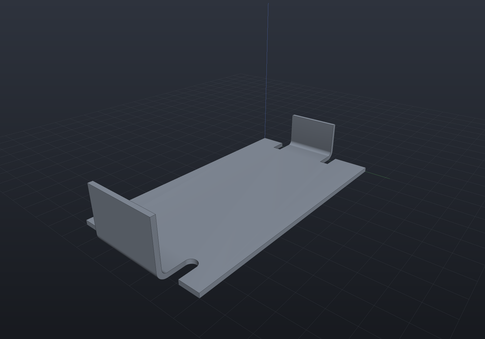
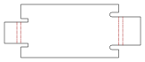

A sheet-metal part is not a solid that happens to be thin: it is a **flat blank plus a
list of bends**, and the two views of it — the folded body you assemble and the flat
pattern the shop cuts — have to agree exactly. EngrCAD models the declaration, and
derives both.

```csharp
var spec = new SheetMetalSpec(Thickness: 1.5, BendRadius: 1.5, KFactor: SheetMaterials.MildSteel);

var bracket = SheetMetalBody
    .Base(Sketch.Polygon([new(0, 0), new(90, 0), new(90, 60), new(0, 60)]), spec)
    .WithFlange(SheetFlangeTarget.BaseEdge(1), length: 25)
    .WithFlange(SheetFlangeTarget.BaseEdge(3), length: 25);

var solid = bracket.Solid;      // the folded part
var flat  = bracket.Unfold();   // the blank plus its bend lines
```

## The bend model

Two formulas cover industry practice, and both live in `SheetMetalSpec` so nothing
downstream can restate one of them differently.

| Quantity | Formula | What it is |
| --- | --- | --- |
| **Bend allowance** | `BA = θ·(R + K·T)` | The flat length one bend consumes — the arc length of the *neutral axis*. |
| **Outside setback** | `OSSB = (R + T)·tan(θ/2)` | Tangent line to **outer virtual sharp**, the corner the two outside faces would meet at if the bend were square. |
| **Bend deduction** | `BD = 2·OSSB − BA` | Derived, not a third model: flat length = sum of the two *outside* legs − BD. |

`K` is the **K-factor**: where in the thickness the neutral axis sits, as a fraction.
`K = 0.5` is mid-sheet; real values run 0.3–0.5 because the outer fibres stretch and
the neutral axis migrates inward. `SheetMaterials` carries the common defaults
(`SoftAluminium` 0.33, `Aluminium` 0.40, `MildSteel` 0.44, `Stainless` 0.45, `Coined`
0.50) — **transcribed from shop practice and flagged verify-against-datasheet**: the
authority is your press brake's bend-deduction chart, not this table.

Spring-back compensation is deliberately out of scope. It belongs to the press and the
material batch, not to the geometry.

```csharp run:sheet-bend-model
double theta = Math.PI / 2, radius = 2, thickness = 1.5, k = 0.44;

double allowance = SheetMetalSpec.BendAllowance(theta, radius, thickness, k);
double setback   = SheetMetalSpec.OutsideSetback(theta, radius, thickness);
double deduction = SheetMetalSpec.BendDeduction(theta, radius, thickness, k);

// A square bend's setback is exactly R + T, because tan(45 degrees) = 1.
if (Math.Abs(setback - (radius + thickness)) > 1e-12) throw new Exception("setback");
// And the deduction is what its definition says it is.
if (Math.Abs(deduction - (2 * setback - allowance)) > 1e-12) throw new Exception("deduction");

// Flat length of a 60 x 25 outside-dimensioned L, two ways round:
double flatLength = 60 + 25 - deduction;                      // outside legs, less BD
double walked = (60 - setback) + allowance + (25 - setback);  // leg, bend, leg
if (Math.Abs(flatLength - walked) > 1e-12) throw new Exception("the two forms must agree");
```

## Base flange and edge flanges

A **base flange** is a sketch plus a spec: a flat sheet solid, which is an extrusion,
exactly. An **edge flange** grows from one straight edge of it.

Three conventions are worth stating once, because every dimension on the drawing
depends on them:

- **`Length` is measured from the outer virtual sharp**, along the flange's outside
  face — the dimension a drawing carries. It must exceed the outside setback.
- **Bend outside**: the bend's tangent line *is* the edge you named, so the material
  continues outboard through the bend. The parent's flat region is therefore exactly
  the outline you drew, which is what makes the flat pattern "the base sketch plus one
  rectangle per flange".
- **A flange folds toward the face its edge is quoted on.** Name an edge of the top
  face and `SheetBendDirection.Up` raises the flange, with the top face becoming the
  *inside* of the bend; `Down` folds the other way.

```csharp render:sheet-metal-bracket
var spec = new SheetMetalSpec(Thickness: 1.5, BendRadius: 1.5, KFactor: SheetMaterials.MildSteel);

// A U-channel with a return lip: base, two side walls, and a flange on a flange.
var bracket = SheetMetalBody
    .Base(Sketch.Polygon([new(0, 0), new(90, 0), new(90, 60), new(0, 60)]), spec)
    .WithFlange(SheetFlangeTarget.BaseEdge(1), length: 25)
    .WithFlange(SheetFlangeTarget.BaseEdge(3), length: 25)
    .WithFlange(SheetFlangeTarget.FlangeTip(0), length: 10);

var scene = new Scene();
scene.Add(new Part("bracket", bracket.Solid) { Color = new PartColor(0.62f, 0.66f, 0.72f) });
```


The bends are **exact cylindrical bands welded straight into the parent's loops** —
never booleans. A bend meets both the parent sheet and the flange wall *tangentially*,
which is degenerate boolean input, and there is nothing to compute anyway: every face
is a closed form. So the whole part is B-Rep **Native**.

```csharp run:sheet-metal-native
var spec = new SheetMetalSpec(1.5, 1.5);
var body = SheetMetalBody.Base(Sketch.Rectangle(60, 40), spec)
    .WithFlange(SheetFlangeTarget.BaseEdge(1), 20);

var report = body.Solid.Explain(TargetRep.Brep);
if (!report.IsConvertible) throw new Exception(report.ToString());
```

### Partial flanges

Give a flange a `startOffset` and a `width` and it occupies part of the edge, leaving
the wall intact either side. **A flange's two ends are independent**: each is either
*flush* with its edge's own end — where the flange's cross-section is spliced into the
neighbouring wall — or *inset* from it, where the flange gets a cap and the leftover
wall a stub. A flange running to one end of a plate is one of each, which is the
ordinary shop case and needs no special path.

```csharp render:sheet-metal-tabs
var spec = new SheetMetalSpec(Thickness: 1.2, BendRadius: 1.2, KFactor: SheetMaterials.Aluminium);

var tabbed = SheetMetalBody
    .Base(Sketch.Polygon([new(0, 0), new(120, 0), new(120, 50), new(0, 50)]), spec)
    .WithFlange(SheetFlangeTarget.BaseEdge(1), length: 15, startOffset: 8, width: 14)
    .WithFlange(SheetFlangeTarget.BaseEdge(1), length: 15, startOffset: 28, width: 14)
    .WithFlange(SheetFlangeTarget.BaseEdge(3), length: 22, angleDegrees: 120);

var scene = new Scene();
scene.Add(new Part("tabbed", tabbed.Solid) { Color = new PartColor(0.72f, 0.68f, 0.55f) });
```


### Bend reliefs

Where a flange stops short of its edge, the parent material beside the bend has to give
way — so a **bend relief** is notched into it. Give a flange a `BendRelief` and one is
cut at each *inset* end (a flush end has no parent material beside it to relieve).

**A relief is a notch in the blank, not a cut in the folded body.** It changes
`BaseOutline` — the base sketch with every relief cut into it — which is what the folded
sheet is extruded from *and* what the flat pattern starts from. So there is no boolean
and no second description: the same declaration produces both views, exactly as an edge
flange does. It also makes the geometry *simpler*, because between its two notches a
relieved flange runs the full width of the shortened wall, which is the ordinary flush
case.

```csharp render:sheet-metal-relief
var spec = new SheetMetalSpec(Thickness: 2, BendRadius: 2, KFactor: SheetMaterials.MildSteel);

var bracket = SheetMetalBody
    .Base(Sketch.Polygon([new(0, 0), new(110, 0), new(110, 60), new(0, 60)]), spec)
    .WithFlange(
        SheetFlangeTarget.BaseEdge(1), length: 24, startOffset: 14, width: 32,
        relief: BendRelief.Obround(width: 5, depth: 10))
    .WithFlange(
        SheetFlangeTarget.BaseEdge(3), length: 18, startOffset: 20, width: 24,
        relief: BendRelief.Rectangular(width: 4, depth: 8));

var scene = new Scene();
scene.Add(new Part("relieved", bracket.Solid) { Color = new PartColor(0.62f, 0.66f, 0.72f) });
```



| | |
| --- | --- |
| `BendRelief.Rectangular(width, depth)` | Two sides and a flat bottom. |
| `BendRelief.Obround(width, depth)` | Rounded at the bottom with a semicircle of half the width — the fatigue-friendly form, since a square inside corner is a stress raiser. `Depth` reaches the *deepest* point, so it can never be less than half the width. |

Both dimensions default: **width** to one sheet thickness, **depth** to `R + T`, which
takes the notch past the bend's own tangent region. A **tear relief** is deliberately
absent from the vocabulary — it is what happens when no relief is cut at all, and the
shape the material tears into belongs to the press, not to the geometry.

Reliefs are cut only on the **base flange's** edges: a flange's own wall is built as a
plain rectangle rather than from a sketch, so a relief on a flange tip is refused by
name.

## The flat pattern

`Unfold()` is **bookkeeping, not geometry re-derivation**: it walks the flange tree,
gives each bend its allowance, and splices a rectangle into the blank outline. Holes
drawn in the base sketch keep their position, because the flat pattern's coordinates
*are* the base sketch's.

The result carries the blank and one `FlatBendLine` per bend — both tangent lines of
the bend zone, the angle, the radius, the allowance and whether the fold is up or
down.

```csharp svg:sheet-metal-flat
var spec = new SheetMetalSpec(Thickness: 1.5, BendRadius: 1.5, KFactor: SheetMaterials.MildSteel);

var chassis = SheetMetalBody
    .Base(
        Sketch.Polygon([new(0, 0), new(120, 0), new(120, 70), new(0, 70)])
            .WithHole(Sketch.Circle(new Vector2d(30, 35), 6))
            .WithHole(Sketch.Circle(new Vector2d(90, 35), 6)),
        spec)
    .WithFlange(SheetFlangeTarget.BaseEdge(1), length: 22)
    .WithFlange(SheetFlangeTarget.BaseEdge(3), length: 22)
    .WithFlange(SheetFlangeTarget.BaseEdge(0), length: 14, startOffset: 15, width: 90);

var svg = chassis.Unfold().ToDrawing().ToSvg();
```


Reliefs appear in the blank as the notches they are, because the blank *is* the outline
they were cut into:

```csharp svg:sheet-metal-relief-flat
var spec = new SheetMetalSpec(Thickness: 2, BendRadius: 2, KFactor: SheetMaterials.MildSteel);

var svg = SheetMetalBody
    .Base(Sketch.Polygon([new(0, 0), new(110, 0), new(110, 60), new(0, 60)]), spec)
    .WithFlange(
        SheetFlangeTarget.BaseEdge(1), length: 24, startOffset: 14, width: 32,
        relief: BendRelief.Obround(width: 5, depth: 10))
    .WithFlange(
        SheetFlangeTarget.BaseEdge(3), length: 18, startOffset: 20, width: 24,
        relief: BendRelief.Rectangular(width: 4, depth: 8))
    .Unfold()
    .ToDrawing()
    .ToSvg();
```



### The bend table

`BendTable()` is the press brake's setup sheet: one row per bend in declaration order,
with the length of the bend line, the angle, which way it folds, the inside radius and
the allowance. Every column is read off the same `FlatBendLine` records the drawing's
bend zones are drawn from, so the table and the picture cannot disagree.

```csharp run:sheet-metal-bend-table
var spec = new SheetMetalSpec(1.5, 1.5);
var body = SheetMetalBody.Base(Sketch.Rectangle(80, 50), spec)
    .WithFlange(SheetFlangeTarget.BaseEdge(1), 25)
    .WithFlange(SheetFlangeTarget.BaseEdge(3), 18, direction: SheetBendDirection.Down);

Console.WriteLine(body.Unfold().BendTable());
// BEND  LENGTH   ANGLE  DIR   RADIUS  ALLOWANCE
//    1  50.000    90.0  UP     1.500      3.394
//    2  50.000    90.0  DOWN   1.500      3.394
var rows = body.Unfold().BendTable().Split('\n', StringSplitOptions.RemoveEmptyEntries);
if (rows.Length != 3) throw new Exception("a header and one row per bend");
```

### Out to the shop

`ToDxf()` writes what a laser cutter wants: the blank on a `CUT` layer, the bend
zones' tangent lines on a `BEND` layer given the `CENTER` line type, so a reader that
honours the LTYPE table shows them chain-dashed rather than as cuts.

```csharp run:sheet-metal-dxf
var spec = new SheetMetalSpec(1.5, 1.5);
var body = SheetMetalBody.Base(Sketch.Rectangle(80, 50), spec)
    .WithFlange(SheetFlangeTarget.BaseEdge(1), 25);

var flat = body.Unfold();
flat.ToDxf().SaveFile(Path.Combine(Scratch, "bracket-flat.dxf"));

// One outline plus two bend-zone lines.
var reloaded = DxfDocument.LoadFile(Path.Combine(Scratch, "bracket-flat.dxf"));
if (reloaded.ToSketches("CUT").Count != 1) throw new Exception("expected one blank outline");
if (reloaded.Entities.Count(e => e.Layer == "BEND") != 2) throw new Exception("expected two bend lines");
```

## The oracle: folded volume versus flat volume

The bend model has a built-in test, and it is sharper than "the two volumes are about
equal". A bend's folded material is an annular sector — `θ·T·(R + T/2)` per unit width
— while the blank spends `BA·T = θ·T·(R + K·T)` on it. So:

- at **K = 0.5** the folded body and the flat blank have **exactly** the same volume;
- at any other K they differ by **`Σ width·θ·T²·(0.5 − K)`**, a closed form.

That is the K-factor doing its job (a lower K means the neutral axis sits nearer the
inside, so the blank is shorter), not an error — and pinning it in both direction and
magnitude is what makes it a real check.

```csharp run:sheet-metal-volume-identity
var coined = new SheetMetalSpec(1.5, 2.0, SheetMaterials.Coined);   // K = 0.5
var body = SheetMetalBody.Base(Sketch.Polygon([new(0, 0), new(80, 0), new(80, 50), new(0, 50)]), coined)
    .WithFlange(SheetFlangeTarget.BaseEdge(1), 25);

double folded = BrepMassProperties.Compute(body.Solid.ToBrep()).Volume;
double flat = body.Unfold().Volume;
if (Math.Abs(folded / flat - 1) > 1e-6) throw new Exception($"folded {folded:g10} vs flat {flat:g10}");

// And away from 0.5 the gap is exactly the formula's.
var steel = new SheetMetalSpec(1.5, 2.0, SheetMaterials.MildSteel);
var other = SheetMetalBody.Base(Sketch.Polygon([new(0, 0), new(80, 0), new(80, 50), new(0, 50)]), steel)
    .WithFlange(SheetFlangeTarget.BaseEdge(1), 25);
double gap = BrepMassProperties.Compute(other.Solid.ToBrep()).Volume - other.Unfold().Volume;
double predicted = 50 * (Math.PI / 2) * 1.5 * 1.5 * (0.5 - SheetMaterials.MildSteel);
if (Math.Abs(gap - predicted) > 1e-4) throw new Exception($"gap {gap:g10}, predicted {predicted:g10}");
```

**A bend relief leaves that discrepancy exactly where it was**, which is what makes the
oracle worth extending rather than replacing: a relief takes the same material out of the
folded body and out of the blank, so it contributes nothing to the gap. A relief that
notched only one of the two views — the failure a "the volumes are about equal" test
waves through — shows up here as a gap wrong by the whole notch volume.

```csharp run:sheet-metal-relief-identity
var spec = new SheetMetalSpec(1.5, 2.0, SheetMaterials.SoftAluminium);
var body = SheetMetalBody.Base(Sketch.Polygon([new(0, 0), new(80, 0), new(80, 50), new(0, 50)]), spec)
    .WithFlange(SheetFlangeTarget.BaseEdge(1), 25, startOffset: 10, width: 30,
        relief: BendRelief.Obround(width: 3, depth: 4));

double gap = BrepMassProperties.Compute(body.Solid.ToBrep()).Volume - body.Unfold().Volume;
double predicted = 30 * (Math.PI / 2) * 1.5 * 1.5 * (0.5 - SheetMaterials.SoftAluminium);
if (Math.Abs(gap - predicted) > 1e-4) throw new Exception($"gap {gap:g10}, predicted {predicted:g10}");
```

## As a parametric feature

`BaseFlangeFeature` and `EdgeFlangeFeature` put sheet metal in the
[feature history](features.md), so a sheet part regenerates, caches, suppresses and
saves like any other. The bend line is named with an
[`EdgeSetRef`](geometry-inputs.md) resolved against the regenerated body — the
topological-naming story — and mapped back into the flange tree, so "the flange on
THAT edge" survives an edit upstream of it.

```csharp run:sheet-metal-feature
var history = new FeatureHistory();
history.Add(new BaseFlangeFeature(Sketch.Polygon([new(0, 0), new(80, 0), new(80, 50), new(0, 50)]))
{
    Thickness = 1.5,
    BendRadius = 2.0,
    KFactor = SheetMaterials.MildSteel,
});
history.Add(new EdgeFlangeFeature
{
    Length = 25,
    Edge = SheetMetalFeatures.EdgeBetween((80, 0, 1.5), (80, 50, 1.5)),
    // A relief is a parameter like any other. It is an enum with its own None rather
    // than a nullable one, because a [Param] dropdown lists the type's members and so
    // has no way to say "unset" -- the same rule that keeps KFactor's sentinel 0.
    Relief = SheetReliefOption.None,
});

var result = history.Regenerate();
if (!result.Succeeded) throw new Exception(result.ToString());

// The flat pattern comes off the regenerated body, not off a second model.
var flat = SheetMetalFeatures.TryUnfold(result.Body)!;
if (flat.Bends.Count != 1) throw new Exception("expected one bend");
```

## What is not supported

Refused **by name**, rather than approximated:

| Not supported | Why |
| --- | --- |
| Bends along non-straight edges | A curved bend line sweeps a developable band, not a cylinder. |
| Closed corners and miters | Two flanges meeting at a corner of the sheet: their bends' bands have to be trimmed against each other and a corner face built. Caught as a wall that is no longer four-sided. |
| Jogs, hems, louvres, curls | Each is a different forming operation with its own geometry; a hem in particular folds the flange back against the sheet, which is coincident boundary. |
| Two flanges sharing a stretch of one edge | Two bends cannot occupy the same material — and a relief counts as part of the stretch its flange occupies. |
| Flanges on a flange's *side* edges | Only the tip: a side flange is a corner interaction. |
| Reliefs on a flange's tip edge | A relief notches its parent's *outline*, and a flange's wall is built as a plain rectangle rather than from a sketch. |
| Holes and cuts declared *on* a flange | Cut them on the folded solid; the flat pattern will not know about them. Base-sketch holes do carry through. |
| Multi-body sheets, welded assemblies | One flange tree, one body. |
| Mirrored placements | A flange tree is ordered and quoted on named edges, so a reflection needs it rebuilt the other way round rather than re-placed. |
| Tear reliefs, spring-back compensation | Both belong to the press rather than to the geometry — a tear relief is what happens when no relief is cut. |

Every one of these throws with a message naming what it hit and what to do instead.
