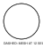
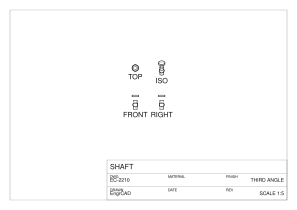

A **silhouette** is where a surface turns away from the viewer — the outline a cylinder,
a sphere or a fillet shows on a drawing, at exactly the places the model carries *no
edge at all*. Every other line on a drawing is a modelled edge and comes out exact; the
silhouette was the one part that did not, because it was read off the display mesh.

`BrepSilhouette` computes it from the **surfaces themselves**. For a parallel view along
`d` the silhouette on `S(u, v)` is the zero set of

```
g(u, v) = N(u, v) · d,      N = ∂S/∂u × ∂S/∂v
```

and for a perspective eye `e` it is `N · (S − e) = 0`. The normal is never normalised
inside the solve: the **sign** is the whole content, and a division could only lose
precision.

## Exact against mesh: a sphere

A sphere's silhouette is a great circle of exactly the sphere's own radius. A mesh
outline is the inscribed polygon of whatever tessellation it was handed — and no
tessellation density removes that, because the polygon is always *inside* the circle.

```csharp svg:silhouette-sphere
using EngrCAD.BRep;

const double radius = 20;
var sphere = Shape.Sphere(radius);
var view = SketchPlane.At((0, 0, 0), Vector3d.UnitX, Vector3d.UnitY);   // looking along +Z

var svgDoc = new SvgDrawing { Margin = 4 };

// The mesh route: Shape.Silhouette unions the projected front-facing triangles.
foreach (var region in sphere.Silhouette(view, new MeshQuality { SegmentsPerCircle = 12 }))
    svgDoc.Add(region, SvgLineClass.Hidden, layer: "mesh outline");

// The exact route: one circle, sampled here only so SVG can draw it.
var exact = sphere.SilhouetteCurves(view);
foreach (var curve in exact.Curves)
{
    var d = curve.Curve.Domain;
    var points = Enumerable.Range(0, 241)
        .Select(i => curve.Curve.PointAt(d.ParameterAt(i / 240.0)))
        .Select(p => new Vector2d(p.X, p.Y))
        .ToList();
    svgDoc.AddPolyline(points, closed: true, SvgLineClass.Visible, layer: "exact outline");
}

svgDoc.AddText((-radius, -radius - 6), "DASHED: MESH AT 12 SEGMENTS   SOLID: EXACT", 2.5);
var svg = svgDoc.ToSvg();
```



The dashed dodecagon is what a drawing used to be given; the solid circle is the answer.
Every point of the exact curve is at radius 20 to nine decimals, at any view direction —
the closed form, not a tolerance.

## What each surface family answers

The interesting property is that **most of this is closed form**, and one derivation
covers most of it. A surface of revolution has `N(u, v) = R_u M(v)` for a vector `M`
depending on the generator alone, so `g` separates into

```
A(v)·cos u + B(v)·sin u + C(v) = 0    ⇒    u(v) = φ(v) ± acos(−C / √(A² + B²))
```

— an azimuth per generator parameter, in closed form. Cones and cylindrical bands fall
out of it as the case where `u` does not depend on `v` (their `A`, `B` and `C` all carry
the same factor of the radius, which cancels), so they come back as exact **rulings**
with nothing special-cased. Viewed **along** the axis, `A` and `B` collapse and `C(v) = 0`
is a condition on the generator alone, whose roots are exact latitude **circles**.

```csharp svg:silhouette-families
using EngrCAD.BRep;

var view = SketchPlane.At((0, 0, 0), Vector3d.UnitX, Vector3d.UnitZ);   // looking along −Y

var shapes = new (string Label, Shape Shape, double X)[]
{
    ("CONE", Shape.Cone(14, 5, 26), -46),
    ("TORUS", Shape.Torus(14, 5), 0),
    ("CYLINDER", Shape.Cylinder(11, 26), 44),
};

var svgDoc = new SvgDrawing { Margin = 5 };
foreach (var (label, shape, x) in shapes)
{
    var placed = shape.Translate(x, 0, 0);
    var result = placed.SilhouetteCurves(view);
    foreach (var curve in result.Curves)
    {
        var d = curve.Curve.Domain;
        // A ruling is exactly a straight line, so its sampling density is irrelevant;
        // an exact CIRCLE still needs points, and a traced curve needs plenty.
        int samples = curve.Fidelity == SilhouetteFidelity.Exact ? 2 : 200;
        if (curve.Curve.Underlying is Circle3d)
            samples = 240;
        var points = Enumerable.Range(0, samples + 1)
            .Select(i => curve.Curve.PointAt(d.ParameterAt((double)i / samples)))
            .Select(p => new Vector2d(p.X, p.Z))
            .ToList();
        svgDoc.AddPolyline(points, closed: curve.Curve.IsClosed, SvgLineClass.Visible, layer: label);
    }
    svgDoc.AddText((x, -22), label, 2.6, SheetTextAnchor.Center);
}
var svg = svgDoc.ToSvg();
```


The cone and the cylinder give two exact rulings each; the torus gives a genuinely
transcendental curve, whose points are still solved in closed form and chorded between
them. `SilhouetteCurve.Fidelity` says which you have:

| Fidelity | Meaning |
| --- | --- |
| `Exact` | An analytic curve that *is* the silhouette — a `Line3d` ruling on a cone, a cylinder or an extrusion, or a `Circle3d` on a sphere or an axis-viewed revolve. |
| `Sampled` | A polyline whose vertices are solved in **closed form** on the exact silhouette, chorded between them. |
| `Traced` | A polyline whose vertices are Newton-corrected onto `N·d = 0` — the families with no closed form (NURBS, swept, lofted, helical). |

Beside it, `Deviation` reports the largest `|N̂·v̂|` over the curve's own samples: the
**sine of the angle** by which the reported curve misses being edge-on. It is
dimensionless and comparable across every curve kind. Its own floor is the *surface's*
inverse evaluation rather than the answer's accuracy — the probe has to project each
sample back to read a normal — so an exactly-constructed circle reads about `1e-9` while
its radius holds to nine decimals. Read the closed form for the claim and the deviation
for corroboration.

## Faces that have no silhouette curve are named

A plane's normal is constant, so `g` is constant: the face is either wholly edge-on or
contributes nothing. Neither is a *curve* — an edge-on plane projects to a segment whose
ends are its own boundary edges, which a drawing already carries exactly. The same
applies to a cylinder viewed straight down its axis, where the outline is its rim.

```csharp run:silhouette-notes
using EngrCAD.BRep;

var cylinder = SolidFactory.MakeCylinder(6, 20);

// Down the axis: every ruling is equally edge-on, and the outline is the rim.
var alongAxis = BrepSilhouette.OfSolid(cylinder, SilhouetteView.Along(Vector3d.UnitZ));
Console.WriteLine($"curves: {alongAxis.Curves.Count}");
foreach (var note in alongAxis.Notes.Distinct())
    Console.WriteLine(note);
```

These are statements about the geometry, not gaps — which is why they are `Notes` rather
than exceptions, and why a caller can tell "this face has no outline of its own" from
"this family is not supported".

## In a drawing

`HiddenLineRemoval` draws smooth outlines from the display mesh by default and labels
them `EdgeSource.Silhouette`. Set `ExactSilhouettes` and a B-Rep part's outline comes
from its own surfaces instead.

```csharp svg:silhouette-drawing
var scene = new Scene();
scene.Add(new Part("shaft", Shape.Cylinder(9, 44)
    .Union(Shape.Cylinder(16, 8).Translate(0, 0, 44))
    .Union(Shape.Sphere(12).Translate(0, 0, 0))));

var sheet = DrawingSheet.StandardLayout(scene, SheetFormat.A4);
sheet.Title = sheet.Title with { Title = "SHAFT", DrawingNumber = "EC-2210", Author = "EngrCAD" };
foreach (var v in sheet.Views)
    v.Options = new HiddenLineOptions { ExactSilhouettes = true };

var svg = sheet.ToSvg();
```



The substitution is **all-or-nothing per part** and **opt-in**, and both have reasons:

- The display mesh carries no face attribution, so a mesh silhouette cannot be asked for
  "everything except these faces". A part is drawn from its surfaces only when the kernel
  answers without refusing and returns at least one curve, and otherwise falls back to the
  mesh entirely. That is what stops a partly exact outline drawing some stretches twice.
- Switching it on legitimately changes what an existing drawing looks like: a mesh
  silhouette is an inscribed polyline and the exact curve is the true outline, so line
  work **moves** — outward, by the tessellation's own sagitta. Off, a drawing is
  byte-identical to what it always was.

## Perspective, and what is refused

`SilhouetteView.From(eye)` gives the perspective form. A sphere then silhouettes to its
**polar circle** — plane at `r²/D` from the centre toward the eye, radius
`r·√(D² − r²)/D`, which is *smaller* than the great circle and tends to it as the eye
recedes. An eye inside the sphere sees no silhouette at all, and says so.

There is deliberately **no `Shape.SilhouetteExact`** returning 2D regions, and the reason
is the 2D tier rather than the 3D one. Assembling an exact outline *region* needs a curved
2D arrangement over the **projected** curves — and an orthographic projection of a circle
is an **ellipse**, while `CurvedRegion2d` carries lines and circular arcs only. (That tier
is complete precisely because a line and a circle cannot osculate; ellipses would break the
property its cell walk stands on.) So every curved silhouette but the degenerate ones would
be flattened at the arrangement's door — which is what `Shape.Silhouette` already does,
more cheaply. Take `SilhouetteCurves` when exactness is the point: a drawing consumes 3D
curves, not a region.
