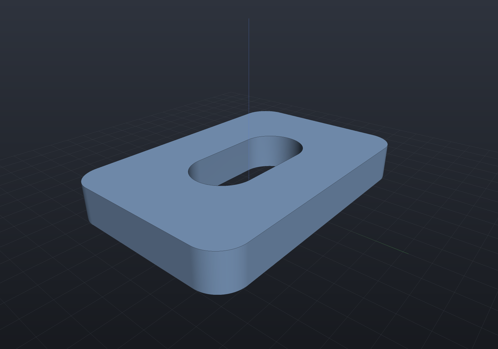
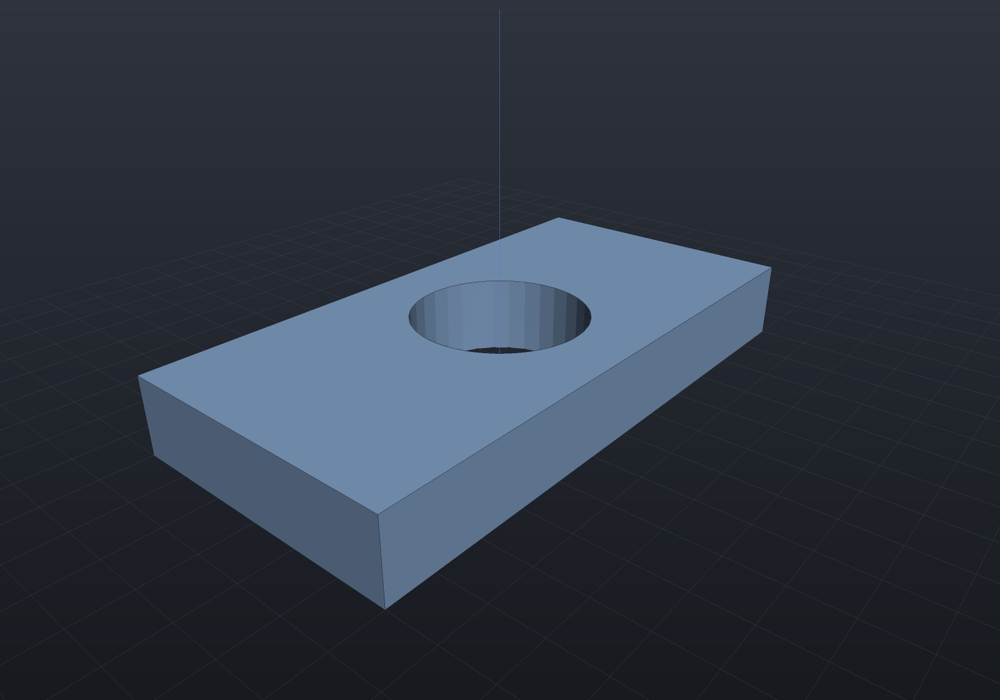

[Sketches](sketching.md) can be combined in 2D before they ever become a solid.
`Union`, `Intersect`, and `Subtract` turn sketches into **regions** — polygon-with-holes
areas — and the region model works out the nesting for you: a cut that *creates* a hole
produces a hole loop, and loose inner loops are recognised as holes without a single
`WithHole` call.

## Cutting a pocket: the hole is discovered, not declared

```csharp render:sketch-booleans
// A plate and a pocket, drawn as two independent sketches.
var plate  = Sketch.RoundedRectangle(60, 40, 6);
var pocket = Sketch.Slot(30, 14);

// One 2D boolean. The cut CREATES a hole loop neither sketch carried, and the
// region model detects the nesting itself - no WithHole anywhere.
var region = plate.Subtract(pocket)[0];

var (outer, holes) = Profile.FromRegion(region, SketchPlane.XY.Frame);
var scene = new Scene();
scene.Add(new Part("plate", Shape.Extrude(outer, Vector3d.UnitZ * 8, holes)));
```



The result is a genus-1 solid: one region, one hole, area 1991.16 against an analytic
1991.16. `Profile.FromRegion` hands back exactly the `(outer, holes)` pair the solid
factories take, so regions are a first-class front door into `Extrude`, `Revolve`, and
`Sweep`.

## Nesting detection

Give the region model a bag of loops and it sorts out which are outers and which are
holes by containment depth — even depth is material, odd depth is a hole, and an island
inside a hole becomes its own region again:

```csharp run:sketch-region-nesting
var outline = Sketch.Rectangle(60, 30);
var boltCircle = Enumerable.Range(0, 4)
    .Select(i => Sketch.Circle(new Vector2d(-21 + 14 * i, 0), 3));

// Four loose circles and an outline: the nesting is DETECTED, not declared.
var nested = Sketch.ToRegions([outline, .. boltCircle]);
if (nested.Count != 1 || nested[0].Holes.Count != 4)
    throw new Exception("expected one region with four holes");
```

## Keeping the arcs: the exact curved route

A `Region2d` is a polygon-with-holes, so arcs and béziers are **flattened** to polylines
at a chord tolerance (1e-3 by default) when a sketch enters `Union`/`Intersect`/`Subtract`
— and everything built from that region inherits the flattening.

`UnionExact` / `IntersectExact` / `SubtractExact` / `OffsetExact` run the same algebra on
a **curved** arrangement instead: lines and circular arcs cross unchanged, so a bore stays
a circle and the result has a closed-form area. `Sketch.FromCurvedRegion` brings the answer
back as an ordinary sketch, so it extrudes, revolves and sweeps with its arcs intact:

```csharp render:sketch-booleans-exact
var plate = Sketch.Rectangle(60, 30);
var bore  = Sketch.Circle(new Vector2d(0, 0), 9);

// The arcs survive the boolean, so the hole is a real circle...
var region = plate.SubtractExact(bore)[0];

// ...and the area is the closed form, not an inscribed polygon's.
double exact = 60 * 30 - Math.PI * 81;
if (Math.Abs(region.Area - exact) > 1e-9)
    throw new Exception($"expected {exact}, got {region.Area}");

// Back to a sketch, so every modelling operation takes it unchanged.
var scene = new Scene();
scene.Add(new Part("plate", Shape.Extrude(Sketch.FromCurvedRegion(region), 8)));
```



The extruded solid's volume is `(60·30 − 81π)·8` to about 1e-6 relative. Through the
flattened route it is off by ~3e-5 — and that error is a **floor**: it is baked into the
profile before any solid exists, so no tessellation setting can lower it.

`OffsetExact` gets the same treatment, with round joins as true arcs rather than the
inscribed fans `Offset` produces:

```csharp run:sketch-offset-exact
var grown = Sketch.Rectangle(20, 10).OffsetExact(2)[0];
// w*h + 2d(w + h) + pi*d^2, exactly.
double exact = 200 + 2 * 2 * 30 + Math.PI * 4;
if (Math.Abs(grown.Area - exact) > 1e-9)
    throw new Exception($"expected {exact}, got {grown.Area}");
```

**What still flattens.** Béziers. The curved arrangement orders the curves meeting at a
node by their tangent, breaking ties by curvature — which is decidable for lines and
circles (a line and a circle never osculate, and two circles that osculate are one circle)
and not for béziers, which can agree to second order and separate only in the third
derivative. So béziers cross as chords at the tolerance you pass, and the API says so
rather than hiding it.

A sketch handed **straight** to `Shape.Extrude`/`Revolve`/`Sweep` is untouched either way:
it keeps its exact arcs and rational NURBS for B-Rep, and its exact 2D signed distance for
the implicit engine.

Under the hood the booleans run on an exact 2D arrangement: every orientation and
containment decision goes through adaptive-exact predicates, so coincident edges,
touching corners, and vertices lying exactly on other edges are decided correctly
rather than by epsilon.
