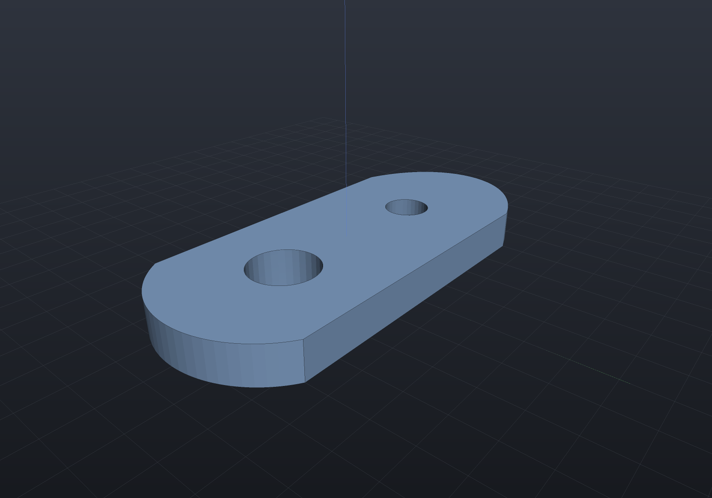
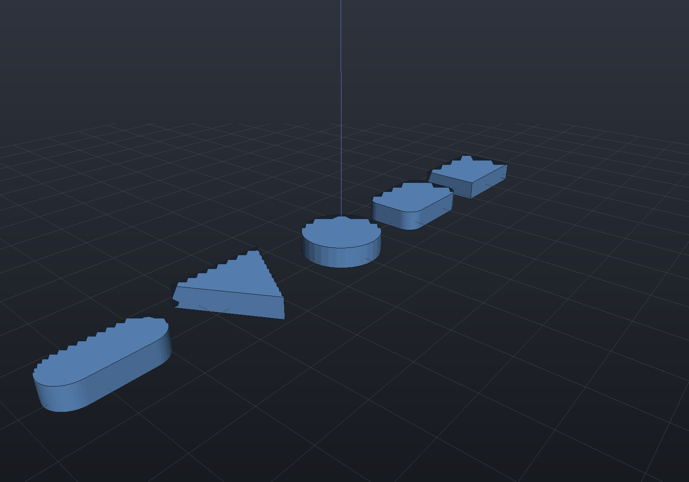
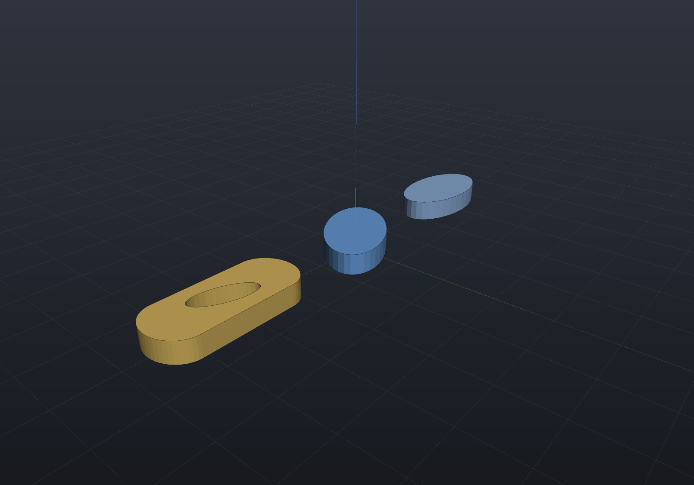
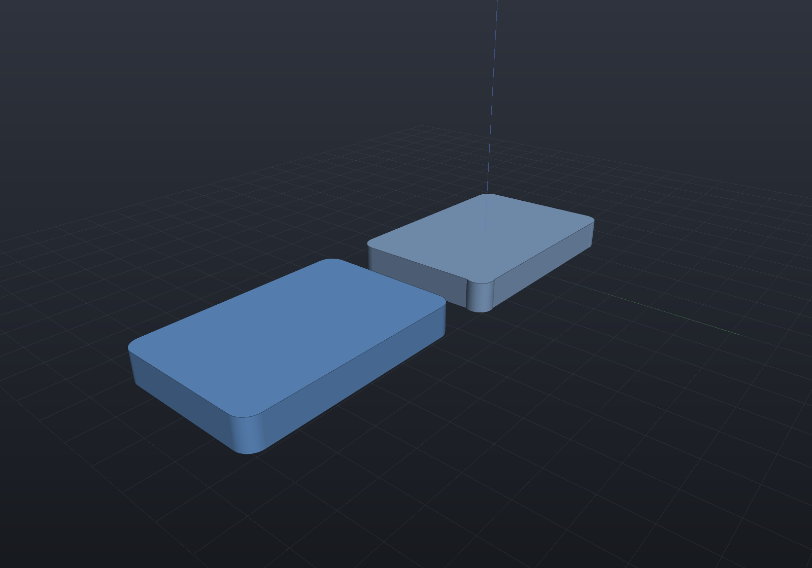

2D sketches are the profile language for [extrude, revolve, and sweep](extrude-revolve-sweep.md).
Draw them with the fluent builder — `LineTo`, `ArcTo`, `ArcThrough`, `EllipticalArcTo`,
`BezierTo`, `QuadraticTo` — or start from a primitive, and punch holes with `WithHole`.

## The fluent builder

```csharp render:sketch-plate
var plate = Sketch.Start(-20, -12)
    .LineTo(20, -12)
    .ArcTo(new(20, 12), radius: 14, clockwise: false)   // bulged arc on the right
    .LineTo(-20, 12)
    .BezierTo(new(-34, 7), new(-34, -7), new(-20, -12)) // sculpted bézier on the left
    .Close()
    .WithHole(Sketch.Circle(new(11, 0), 4.5))
    .WithHole(Sketch.Circle(new(-13, 0), 3));

var scene = new Scene();
scene.Add(new Part("sketched plate", Shape.Extrude(plate, 5), Palette.Steel));
```



Lines and arcs lower to **exact rational NURBS** profiles for B-Rep, and every sketch
knows its **exact 2D signed distance** (`sketch.ToRegion()`), which makes sketch
extrusions and full revolutions *native* in the implicit engine too — no mesh bridge.
`sketch.Area()` is exact (arc terms analytic, béziers by Gauss quadrature).

## Sketch primitives

`Rectangle`, `RoundedRectangle`, `Circle`, `Polygon`, and `Slot` cover the common
profiles without builder ceremony:

```csharp render:sketch-primitives
var scene = new Scene();
double x = -48;
foreach (var (name, sketch) in new (string, Sketch)[]
{
    ("rectangle", Sketch.Rectangle(18, 12)),
    ("rounded",   Sketch.RoundedRectangle(18, 12, 3)),
    ("circle",    Sketch.Circle(7.5)),
    ("polygon",   Sketch.Polygon([new(-9, -7), new(9, -7), new(0, 9)])),
    ("slot",      Sketch.Slot(length: 18, width: 8)),
})
{
    scene.Add(new Part(name, Shape.Extrude(sketch, 4), Palette.Sky,
        Matrix4d.CreateTranslation((x, 0, 0))));
    x += 24;
}
```



## Elliptical arcs

`Sketch.Ellipse` and the builder's `EllipticalArcTo` carry an ellipse **exactly** — the
segment stores the centre and both semi-axis *vectors*, so a rotated ellipse needs no
third parameter and there is no flattened polyline anywhere in the chain. That makes an
elliptical profile native in all three representations, exactly like a circular one:
`πab` from `Area()`, an exact 2D distance field, and an `Ellipse3d` in the B-Rep.

`EllipticalArcTo` is SVG's `A rx ry rotation largeArc sweep` command with the same two
flags and the same meaning, including SVG's out-of-range rule — semi-axes too small to
span the chord are scaled up by the common factor that just reaches, so the ellipse's
**aspect and rotation survive** and you never have to solve for the minimum ellipse
before drawing.

```csharp render:sketch-ellipse
// A full ellipse, a rotated one, and a slotted plate whose ends are elliptical arcs.
var oval = Sketch.Ellipse(semiX: 11, semiY: 6);
var tilted = Sketch.Ellipse(default, semiX: 11, semiY: 6, rotationDegrees: 35);

var plate = Sketch.Start(-9, -6)
    .LineTo(9, -6)
    .EllipticalArcTo(new(9, 6), semiX: 5, semiY: 6)     // right cap: a half-ellipse
    .LineTo(-9, 6)
    .EllipticalArcTo(new(-9, -6), semiX: 5, semiY: 6)   // left cap
    .Close()
    .WithHole(Sketch.Ellipse(default, 6, 2.5, rotationDegrees: -20));

var scene = new Scene();
scene.Add(new Part("ellipse", Shape.Extrude(oval, 4), Palette.Steel,
    Matrix4d.CreateTranslation((-30, 0, 0))));
scene.Add(new Part("rotated", Shape.Extrude(tilted, 4), Palette.Sky));
scene.Add(new Part("elliptical ends", Shape.Extrude(plate, 4), Palette.Brass,
    Matrix4d.CreateTranslation((32, 0, 0))));
```



One consequence worth knowing: an ellipse with equal semi-axes is *geometrically* a
circle but stays an `Ellipse2d`, so `BrepQueries.IsCircular` and cylinder promotion will
not claim it. Use `Sketch.Circle` when the shape really is a circle.

Everything else in the sketch vocabulary works on an elliptical arc: it round-trips
through `ToCurves`/`FromCurves` (so it survives feature persistence), exports as an
exact SVG `A` command, and moves with its chord under the constraint solver. What it
does **not** yet have is its own constraint variables — like a bézier, only its endpoint
joints can be constrained, and a tangency to an elliptical arc is not in the vocabulary.

## Sketch constraints

Draw roughly, constrain, solve exact. `sketch.Constrain()` opens the variational
constraint layer: coincident, horizontal/vertical, parallel/perpendicular, tangent,
equal, concentric and fix constraints plus distance/angle/radius/diameter dimensions,
solved by Levenberg–Marquardt from the sketch **as drawn** — the drawing is the seed
and the branch selector (a tangent arc stays on the side it was drawn on). The result
is an ordinary `Sketch` that extrudes, revolves and sweeps like any other.

Below, a rounded rectangle drawn by hand — nothing square, radii disagreeing — next to
the same sketch fully constrained to a 30 × 20 plate with R2 fillets (zero degrees of
freedom remain):

```csharp render:sketch-constraints
// Drawn by hand: nothing is square, the corners are off, the radii disagree.
var drawn = Sketch.Start(12.8, -10.3)
    .ArcTo(new(15.3, -8.1), 2.3, clockwise: false)
    .LineTo(15.1, 7.6)
    .ArcTo(new(12.9, 10.2), 1.8, clockwise: false)
    .LineTo(-12.7, 10.4)
    .ArcTo(new(-15.2, 8.2), 2.1, clockwise: false)
    .LineTo(-14.8, -7.7)
    .ArcTo(new(-13.1, -9.8), 2.0, clockwise: false)
    .Close();

var cs = drawn.Constrain();
cs.Vertical(cs.Line(1)).Horizontal(cs.Line(3)).Vertical(cs.Line(5)).Horizontal(cs.Line(7))
  .Tangent(cs.Line(7), cs.Arc(0)).Tangent(cs.Line(1), cs.Arc(0))
  .Tangent(cs.Line(1), cs.Arc(2)).Tangent(cs.Line(3), cs.Arc(2))
  .Tangent(cs.Line(3), cs.Arc(4)).Tangent(cs.Line(5), cs.Arc(4))
  .Tangent(cs.Line(5), cs.Arc(6)).Tangent(cs.Line(7), cs.Arc(6))
  .EqualRadius(cs.Arc(0), cs.Arc(2))
  .EqualRadius(cs.Arc(0), cs.Arc(4))
  .EqualRadius(cs.Arc(0), cs.Arc(6))
  .Radius(cs.Arc(0), 2)
  .Distance(cs.Point(1), cs.Point(2), 16)   // right edge = height − 2r
  .Distance(cs.Point(3), cs.Point(4), 26)   // top edge = width − 2r
  .Fix(cs.Point(0));

var result = cs.Solve();                    // throws if the constraints contradict
var solved = result.Sketch!;                // IsFullyConstrained: 0 DOF remain

var scene = new Scene();
scene.Add(new Part("drawn", Shape.Extrude(drawn, 4), Palette.Steel));
scene.Add(new Part("solved", Shape.Extrude(solved, 4), Palette.Sky,
    Matrix4d.CreateTranslation((36, 0, 0))));
```



The solve report is honest about freedom: under-constrained is *normal* (the
Levenberg–Marquardt step lies in the Jacobian's row space, so geometry no constraint
mentions keeps its drawn proportions, and the remaining degree-of-freedom count is
always reported — rank-revealing, so redundant constraints are not miscounted). A
consistent extra dimension converges and reports the redundancy; a contradictory one
fails **naming the constraints that cannot drop**, and a failed solve produces
nothing — the drawn sketch is never modified:

```
FAILED in 6 iterations; worst residual 1; 1 of 8 DOF constrained (7 free); 1 redundant row
  · 'Distance(outer point 0, outer point 1) = 10' is off by 1
  · 'Distance(outer point 0, outer point 1) = 12' is off by 1
  · no solved sketch was produced — the drawn sketch is unchanged
```

Entities address the sketch's normalized segment order, holes included — a washer is
`cs.Concentric(cs.Arc(0), cs.HoleArc(0, 0))` plus two diameters. Full circles carry
center + radius only (constrain them via `CenterOf`); bézier and elliptical-arc segments
carry no shape variables and ride the *similarity* of their two endpoints, which is what
`cs.Curve(i)` addresses.

**Point-on-object** — `cs.PointOn(point, line)` and `cs.PointOn(point, arc)` — pins a
point to another entity's *carrier*, which is the sketcher's usual way of saying "this
corner runs along that edge" or "this joint sits on that circle":

```csharp
var cs = drawn.Constrain();
cs.PointOn(cs.Point(2), cs.Line(0));   // corner 2 anywhere on line 0's carrier
cs.PointOn(cs.Point(3), cs.Arc(1));    // corner 3 on arc 1's carrier CIRCLE
```

Two things are worth stating because they are choices rather than accidents. The carrier
is **infinite** — the point need not land between the line's own endpoints or inside the
arc's drawn sweep, which is what makes the constraint useful against a datum edge;
constrain the endpoints too if you mean the segment. And point-on-line is exactly the
point-to-line *dimension* at zero, which is the right reduction rather than a shortcut:
that residual is the signed offset, so it passes smoothly through zero, where the
point-to-*point* distance's zero is a cone point and is refused in favour of
`Coincident`. A point drawn exactly at an arc's centre is refused by name, since
`|p − c| − r` has no gradient direction there.

The two *curved* carriers — a cubic bézier and an elliptical arc — take the same
`PointOn`, addressed through `cs.Curve(i)`, and they need **different residuals for a
reason worth knowing**. An ellipse is a conic, so membership is closed form: with the
centre C and semi-axis vectors A and B, `|M⁻¹(p − C)| − 1` is the arc's own
`|p − c| − r` with the radius replaced by a matrix, and it costs one row and no new
unknown. A cubic has no such form, so the foot parameter joins the system as its own
variable and the residual is the vector equation `B(t) − p = 0` — two rows against one
unknown, which removes exactly the one degree of freedom "the point is on the curve"
means. The drawn foot is the seed *and* the branch selector, since a cubic can pass a
point three times.

The same two carriers can have their **end tangent** held parallel (or perpendicular)
to a line, which is what the vocabulary lacked for them:

```csharp
var cs = drawn.Constrain();
cs.PointOn(cs.Point(0), cs.Curve(2));                          // on the bézier's carrier
cs.Tangent(cs.Curve(2), SketchCurveEnd.End, cs.Line(0));       // leaving along line 0
```

Because both carriers ride their chord, their end tangent is a *fixed multiple of the
live chord* (a cubic leaves its start along `3(C₁ − P₀)`), so this is the ordinary
two-direction row with the curve's constant folded in. Note the consequence: on a loop
where the curve and the line share **both** joints, that relation is a constant no
motion can change, and the solver correctly reports a stationary configuration rather
than converging to something arbitrary.

An **elliptical arc can also be tangent to a line along its whole carrier**, not just at
an end — `cs.Tangent(line, curve)`, the conic twin of `cs.Tangent(line, arc)`:

```csharp
cs.Tangent(cs.HoleLine(0, 0), cs.Curve(1));   // that edge touches the ellipse
```

It needs no foot parameter either, and for the reason the `PointOn` split already gave.
Writing the conic as `p(u) = C + M u` with `M = [A B]` and `|u| = 1`, the signed
distance from a point of it to a line with unit normal n̂ through q is
`n̂·(C − q) + (Mᵀn̂)·u`, whose extremes over the unit circle are `n̂·(C − q) ± |Mᵀn̂|` —
so tangency is *one extreme vanishing*: one signed, first-order row, no new unknown, and
exactly the circular form when A and B are perpendicular and equal. Which of the two
tangents is meant is read off the drawing, so a line drawn **through** the centre states
no side and is refused by name. A cubic bézier **works too**, by the different shape its
lack of a closed-form support function forces: the foot parameter joins the system as
its own variable — `B(t)` lies on the line and `B′(t)` runs along it, two rows against
one unknown, removing exactly the one degree of freedom a tangency means (asserted off
the solver's own rank). The drawn configuration seeds the foot and selects the branch:
of the up-to-two carrier tangents parallel to the drawn line, the solve lands on the one
the drawing put the line near.

### Saving a constrained sketch

The constraint declarations serialize as canonical token records —
`["Distance", "point(0)", "point(1)", "40"]`, entity refs spelled the way they were
built (`point(3)`, `holeLine(0,0)`, `centerOf(holeArc(1,0))`) — and
`ConstrainedSketch.LoadConstraints(sketch, json)` **replays** them through the same
public methods against the same drawn sketch. That replay is the whole design: the
loaded system is the built one *by construction* (every branch selector re-derives
from the same drawing), `SaveConstraints()` round-trips as a byte fixed point, and a
replayed solve is bit-identical to the original's. The vocabulary is all data — no
lambdas anywhere in it — so nothing loads as a warning; an unknown record refuses by
name, and a reflection test holds every public constraint method to having a record
form, so a method added without one fails a test rather than taking a document down.

```csharp run:sketch-constraint-persistence
var drawn = Sketch.Start(0, 0).LineTo((40, 0)).LineTo((40, 10))
    .BezierTo((30, 30), (10, 30), (0, 0)).Close();
var cs = drawn.Constrain();
cs.Fix(cs.Point(0)).Horizontal(cs.Line(0)).Distance(cs.Point(0), cs.Point(1), 40);

string saved = cs.SaveConstraints();
var loaded = ConstrainedSketch.LoadConstraints(drawn, saved);
if (loaded.SaveConstraints() != saved)
    throw new Exception("save -> load -> save must be a byte fixed point");
if (!loaded.TrySolve().Converged)
    throw new Exception("the replayed system must solve");
```

## Placing sketches in 3D

Sketches are pure 2D. The modeling operations place them with a `SketchPlane` —
`SketchPlane.XY` / `XZ` / `YZ` presets, or `SketchPlane.At(origin, xAxis, yAxis)` for
arbitrary placement (used by [`Drill`](holes.md) to pick the face being drilled).
Extrusion runs along the plane normal; revolution spins around the plane's y axis.
