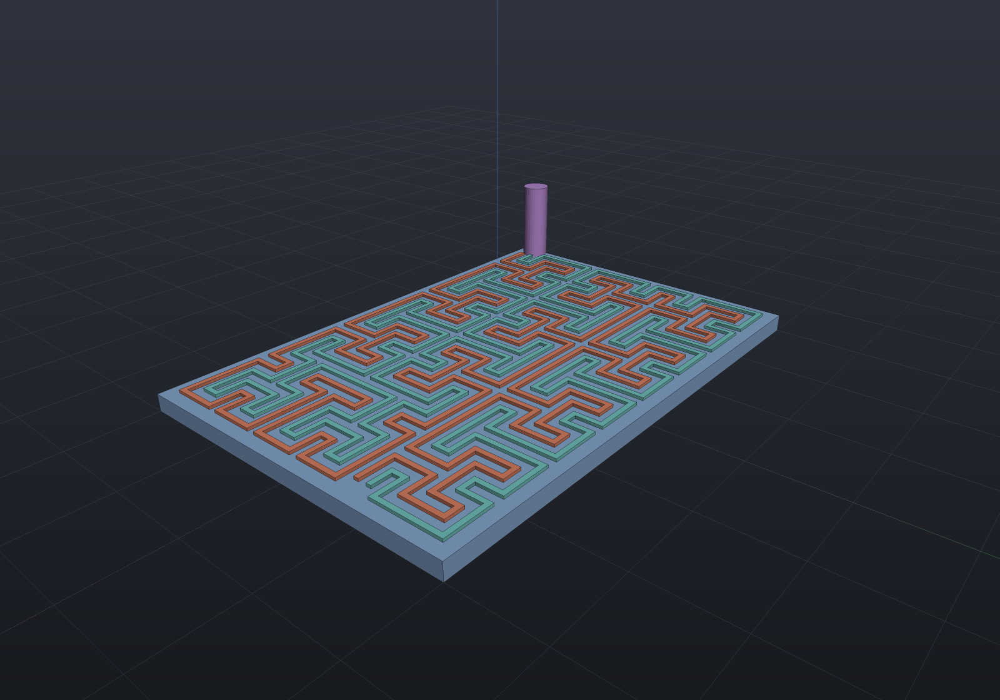

A **tamper mesh** is a conductive serpentine covering an enclosure wall, wired into a
continuity monitor: drill through the wall to reach the protected circuit and you sever the
trace, which raises a tamper event. It is what HSMs, payment terminals and secure set-top
boxes use.

`TamperMesh` (in `EngrCAD.Modeling`) lays one out on a rectangular wall. "Mesh" is the
security-hardware term — nothing here is a `HalfEdgeMesh`; the deliverable is 2D line work you
extrude as copper, subtract as a channel, or export to DXF for a flex circuit.

## The deliverable is a guarantee, not a pattern

Anyone can draw a squiggle. What makes this engineering is the number it comes with: **what is
the largest drill that can reach the inside without touching copper?**

Every cell of the lattice has the route running through its centre, so no point of the
footprint is further from the route than a cell's **circumradius** `R = ½·hypot(pitchX, pitchY)`
— and that bound is *attained*, so it is the answer rather than a bound. Writing `w` for the
trace width, a drill of diameter `d` centred at `c` misses the copper exactly when
`dist(c, route) > d/2 + w/2`, which gives two thresholds and a band between them:

| | Diameter | Meaning |
| --- | --- | --- |
| **Touch** | `2R − w` | the largest drill that *can* pass. At or above it, a drill must hit copper somewhere. |
| **Sever** | `2R + w` | the smallest drill that *must* cut a net wherever it lands — its disc spans the trace's full width at some point of the centreline. |

Touching is not cutting, so between the two it is position-dependent and the honest answer is
the band. Size to the sever end. At a square cell `2R = √2·h`, giving the familiar `√2·h − w`
and `√2·h + w`, and the **design equation**

```
pitch ≤ (d − w) / √2
```

which is `TamperMesh.PitchForDrill`. The loop closes on itself — ask for the pitch, build at
it, and read the *measured* guarantee back:

```csharp run:tamper-mesh-guarantee
// A 120 x 80 enclosure wall that must defeat a 3 mm drill, on 0.2 mm flex-circuit copper.
double pitch = TamperMesh.PitchForDrill(drillDiameter: 3.0, traceWidth: 0.2);
if (Math.Abs(pitch - (3.0 - 0.2) / Math.Sqrt(2)) > 1e-12) throw new Exception("the design equation");

var mesh = TamperMesh.Over(
    Sketch.Rectangle(120, 80), pitch, traceWidth: 0.2, nets: 1, clearance: 1.0);

// The achieved pitch is never coarser than the request, and is reported per axis.
if (mesh.PitchX > pitch || mesh.PitchY > pitch) throw new Exception("never coarser");

// The guarantee is MEASURED — a branch and bound over the footprint, certified because the
// distance to a polyline is 1-Lipschitz — and it lands on the closed form.
var guarantee = mesh.Guarantee;
double closedForm = 0.5 * Math.Sqrt(mesh.PitchX * mesh.PitchX + mesh.PitchY * mesh.PitchY);
if (Math.Abs(guarantee.GapRadius - closedForm) > guarantee.Uncertainty + 1e-12)
    throw new Exception($"measured {guarantee.GapRadius}, closed form {closedForm}");

if (!guarantee.Defeats(3.0)) throw new Exception("the 3 mm drill is not defeated");
Console.WriteLine(
    $"{mesh.CellsX} x {mesh.CellsY} cells at {mesh.PitchX:F4} / {mesh.PitchY:F4} mm; "
    + $"a drill up to {guarantee.TouchDiameter:F3} mm can pass, one of "
    + $"{guarantee.SeverDiameter:F3} mm must cut. {mesh.Length:F0} mm of copper.");
```

On that wall the measurement reads **1.384763** against a closed form of **1.384763**, so a
2.570 mm drill can still slip through and a 2.970 mm one cannot — inside the 3 mm the design
asked for, because the achieved pitch came out finer than the request.

> **Where the worst gap is.** The `√2` factor is a *corner* effect: a dual-grid corner is only
> `h/2` from the route whenever one of the four cell pairs meeting there is consecutive on it,
> and the full circumradius when none is. Both happen. The footprint's own four corners touch a
> single cell, so they always reach it; and **blind interior corners** — a 2×2 block of cells no
> two of which are consecutive — appear from block order 3 upward and multiply from there
> (counted on a plain Hilbert block: 0, 1, 9, 47 at orders 2, 3, 4, 5). `WeakestPoint` says
> which one your layout found.

## A wall with a mesh on it

```csharp render:tamper-mesh
var wall = Sketch.Rectangle(60, 40);
var mesh = TamperMesh.Over(wall, pitch: 4.0, traceWidth: 0.6, nets: 2, clearance: 1.0);

Shape Copper(Region2d region) =>
    Shape.Extrude(Profile.FromRegion(region).Outer, Vector3d.UnitZ * 0.35);

var scene = new Scene();
scene.Add(new Part("wall", Shape.Extrude(wall, 2), Palette.Steel));

var colours = new[] { Palette.Coral, Palette.Teal };
for (int i = 0; i < mesh.Nets.Count; i++)
{
    scene.Add(new Part($"net {i}", Copper(mesh.Nets[i].Outline), colours[i],
        Matrix4d.CreateTranslation((0, 0, 2))));
}

// The guarantee made visible: the largest drill that reaches the inside without touching
// copper, standing on the point where it fits.
var guarantee = mesh.Guarantee;
scene.Add(new Part("largest drill through", Shape.Cylinder(guarantee.TouchDiameter / 2, 20),
    Palette.Plum,
    Matrix4d.CreateTranslation((guarantee.WeakestPoint.X, guarantee.WeakestPoint.Y, 2))));
```



The drill lands on the footprint's **edge**, which is the design lesson the picture is worth:
with two or more nets neither conductor rides the route through the corner cell's centre, so
the boundary is the weakest place. Treat it the way `Shape.Drill` treats a through hole — make
the mesh footprint *overhang* the volume you are protecting, so its own weak corners sit
outside what matters.

## Two nets, and the honest reason for them

Hilbert is the right curve here, but not for the reason it is usually reached for.

**Why Hilbert and not Moore.** A continuity monitor needs *two terminals*, so the open curve is
right and Moore's closed loop would have to be cut. Hilbert's two ends sit on the footprint's
outer boundary — for one row of blocks or an even number of rows, at the two ends of the *same*
edge, which is where a two-pin connector wants them.

**Hilbert's locality is a liability here, and that is worth saying plainly.** Points near in
space are near in path order, so an attacker who exposes a small window can bridge across a
break with a short wire. No choice of curve fixes that. The countermeasure is **two or more
interleaved nets**, monitored for continuity *and* for mutual isolation, so a bypass wire — or
conductive paint, or a probe — that spans the gap shorts the nets together and is seen.

The nets are the same route offset evenly across each corridor, which is what makes the
interleaving structural rather than arranged: every gap between neighbouring conductors —
inside a corridor and across the boundary between two — is the same number. The offsets are
symmetric about the route, so the pattern stays centred on the footprint; an odd net count
puts one net on the bare route and an even one straddles it.

```csharp run:tamper-mesh-nets
var wall = Sketch.Rectangle(120, 80);
double pitch = TamperMesh.PitchForDrill(3.0, 0.2);

foreach (int nets in new[] { 1, 2, 3 })
{
    var mesh = TamperMesh.Over(wall, pitch, traceWidth: 0.2, nets, clearance: 1.0);
    Console.WriteLine(
        $"{nets} net(s): isolation gap {mesh.IsolationGap:F4} mm, "
        + $"largest drill through {mesh.Guarantee.TouchDiameter:F4} mm, "
        + $"{mesh.Length:F0} mm of copper");
}

// More copper in the way narrows the gap as well as guarding it — reported, not claimed.
double one = TamperMesh.Over(wall, pitch, 0.2, 1, clearance: 1.0).Guarantee.GapRadius;
double two = TamperMesh.Over(wall, pitch, 0.2, 2, clearance: 1.0).Guarantee.GapRadius;
if (two >= one) throw new Exception("a second net should not widen the gap");
```

**What the second net actually buys is the short, not a second opinion.** The two nets are
parallel everywhere and half a pitch apart, so a drill that cuts one almost certainly cuts the
other — they are not independent detectors. They are an isolation monitor's geometry: any
conductive bridge wider than `IsolationGap` shorts them.

A trace at or above the corridor share is refused outright, because that is an electrical
short rather than a tolerance question:

```csharp run:tamper-mesh-short
try
{
    TamperMesh.Over(Sketch.Rectangle(120, 80), pitch: 2.0, traceWidth: 1.2, nets: 2);
    throw new Exception("should have refused");
}
catch (ArgumentException e) when (e.Message.Contains("electrical short")) { }
```

## What the curve is actually for

Not the drill guarantee. The bound depends only on the cell size and on every cell being
visited, so a plain serpentine at the same *achieved* pitch measures the same circumradius —
and the two numbers below differ only because block order 0 fits the rectangle more tightly
(15 × 10 cells against 16 × 12) and therefore lands on a **coarser cell**, closer to the pitch
that was asked for. What Hilbert buys is that the free space between passes has **no long
straight channel** for a slot or a saw to run down, and that is a number rather than a slogan:

```csharp run:tamper-mesh-channel
var wall = Sketch.Rectangle(60, 40);

// Block order 0 makes every block one cell, so the tiling degenerates to a boustrophedon
// serpentine — a legitimate member of the family, and the comparison.
var serpentine = TamperMesh.Over(wall, 4.0, 0.6, nets: 1, blockOrder: 0, clearance: 1.0);
var hilbert = TamperMesh.Over(wall, 4.0, 0.6, nets: 1, blockOrder: 2, clearance: 1.0);

Console.WriteLine($"serpentine: straight run {serpentine.LongestStraightRun} cells "
    + $"(the whole row), largest drill through {serpentine.Guarantee.TouchDiameter:F3}");
Console.WriteLine($"hilbert:    straight run {hilbert.LongestStraightRun} cells, "
    + $"largest drill through {hilbert.Guarantee.TouchDiameter:F3}");

if (serpentine.LongestStraightRun != serpentine.CellsX) throw new Exception("a serpentine runs the wall");
if (hilbert.LongestStraightRun != 4) throw new Exception("a tiled Hilbert route is bounded at 4 cells");
```

The route is a **tiling of Hilbert blocks**, which is what lets it cover a rectangle rather
than a square: an order-*n* block enters and leaves at two adjacent corners of its own square,
so under the eight symmetries of the square it can be asked for whichever entry and exit its
neighbours need, and a boustrophedon over the block grid links them into one Hamiltonian path.
`BlocksX × BlocksY == 1 × 1` is Core's plain Hilbert curve, site for site.

That is also why the achieved pitch lands near the request instead of the next power of two —
the block order is the granularity of the fit, and it is a **trade you state**:

```csharp run:tamper-mesh-order
var wall = Sketch.Rectangle(60, 40);
foreach (int order in new[] { 0, 1, 2, 3 })
{
    var mesh = TamperMesh.Over(wall, 4.0, 0.6, nets: 1, blockOrder: order, clearance: 1.0);
    Console.WriteLine(
        $"order {order}: {mesh.CellsX} x {mesh.CellsY} cells, pitch {mesh.PitchX:F3} / "
        + $"{mesh.PitchY:F3} (anisotropy {mesh.Anisotropy:F3}), straight run "
        + $"{mesh.LongestStraightRun} cells");
}
```

Small blocks fit an arbitrary rectangle tightly and keep the cells nearly square; large blocks
are more isotropic and quantise the fit coarsely, which shows up as **anisotropy** — the cells
stop being square, and the guarantee follows `hypot(pitchX, pitchY)` rather than `√2·pitch`.
The default is order 2: the Hilbert pattern's straight run is already at its saturated length
there, while a four-cell fit granularity keeps the cells nearly square.

## Fabrication

Each net is one unbroken centreline plus its **copper outline** — a single simple polygon,
built from the two mitered offsets with no boolean at all (a stroke through the arrangement is
`O(E²)` and takes minutes at mesh scale). A mitered ribbon's area is exactly its centreline
length times its width, which is the identity the construction is checked against:

```csharp run:tamper-mesh-export
var mesh = TamperMesh.Over(Sketch.Rectangle(80, 50), 3.0, traceWidth: 0.25, nets: 2, clearance: 1.0);

foreach (var net in mesh.Nets)
{
    if (Math.Abs(net.CopperArea - net.Length * net.TraceWidth) > 1e-9)
        throw new Exception("a mitered ribbon's area is length x width exactly");
}

// One DXF layer per net plus the footprint, for a flex-circuit house.
string path = Path.Combine(Scratch, "tamper.dxf");
mesh.ToDxf().SaveFile(path);
Console.WriteLine($"{new FileInfo(path).Length} bytes, layers "
    + string.Join(", ", mesh.ToDxf().Layers));

// Or straight to a solid, to union onto a substrate or subtract as a channel.
var conductor = mesh.Nets[0].Conductor(thickness: 0.035);
if (!conductor.ToMesh().IsClosed) throw new Exception("closed");
```

## What is refused, and why

A tamper mesh that quietly leaves a gap is worse than none, so everything that could produce
one is named:

```csharp run:tamper-mesh-refusals
// (a) A wall that is not a rectangle. The route would break into runs, and a broken net
//     cannot be monitored for continuity at all — so this is refused rather than filled.
//     SpaceFillingInfill is the answer when runs are acceptable; it reports them honestly.
foreach (var face in new[] { Sketch.Circle(40), Sketch.Rectangle(100, 60).WithHole(Sketch.Circle(6)) })
{
    try
    {
        TamperMesh.Over(face, pitch: 4, traceWidth: 0.5);
        throw new Exception("should have refused");
    }
    catch (ArgumentException e) when (e.Message.Contains("cannot be monitored for continuity")) { }
}

// (b) A drill no wider than the trace. The design equation has no positive solution: a drill
//     that narrow can pass through the conductor without removing a full cross-section.
try
{
    TamperMesh.PitchForDrill(drillDiameter: 0.2, traceWidth: 0.25);
    throw new Exception("should have refused");
}
catch (ArgumentOutOfRangeException e) when (e.Message.Contains("no positive solution")) { }

// (c) A pitch the cell cap cannot reach, naming the finest it allows.
try
{
    TamperMesh.Over(Sketch.Rectangle(300, 200), pitch: 0.05, traceWidth: 0.01);
    throw new Exception("should have refused");
}
catch (ArgumentOutOfRangeException e) when (e.Message.Contains("FINEST pitch")) { }
```

**Conformal placement on a doubly-curved wall is not offered at all** — not approximated
quietly. It is the still-open surface-decoration consumer of the space-filling curves, and
`MeshLocalParam`'s discrete exp map carries 2–5% distortion, which would land directly in the
pitch and therefore in the guarantee. A guarantee derived from a distorted pitch is not a
guarantee. Place the mesh on a planar face with `SketchPlane.On(face)`, or unfold the wall
yourself and state the pitch you meant.

## See also

- [Space-filling curves & 2D infill](infill.md) — the generator this is built on, and the
  clipped-and-broken-into-runs answer for outlines that are not rectangles.
- [DXF & SVG](dxf-svg.md) — what `ToDxf()` writes and how to read it back.
