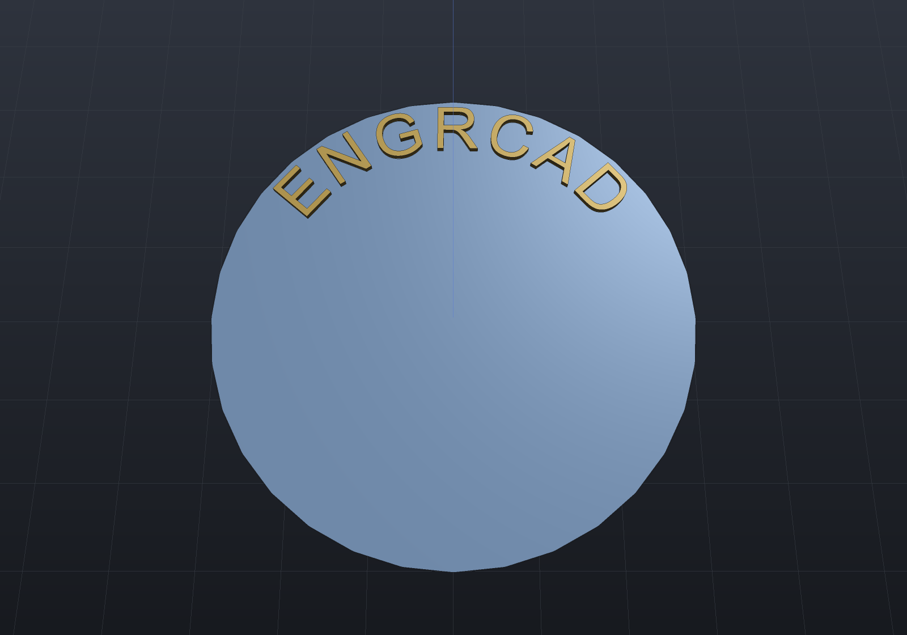

`Shape.Text` turns a font into real geometry — nameplates, part numbers, logos,
engraved labels. TrueType (`.ttf`) glyph outlines are **lines and quadratic Béziers**
and OpenType/CFF (`.otf`) outlines are **lines and cubic Béziers** — both exactly the
sketch vocabulary, so glyphs become sketches with no flattening: text is native in all
three representations, with exact profiles for B-Rep and crisp tessellation for printing.

## A nameplate

```csharp render:text-nameplate
string fonts = Environment.GetFolderPath(Environment.SpecialFolder.Fonts);
string fontPath = new[] { "arial.ttf", "segoeui.ttf", "verdana.ttf" }
    .Select(name => Path.Combine(fonts, name)).First(File.Exists);
var font = TrueTypeFont.Load(fontPath);

// Lettering runs along +Y so it reads left-to-right from the default iso view.
var top = SketchPlane.At((0, 0, 2), Vector3d.UnitY, -Vector3d.UnitX);
var lettering = Shape.Text("ENGRCAD", font,
                           size: font.EmSizeForCapHeight(9),   // 9 mm capitals
                           height: 1.2, top,
                           new TextStyle { Align = TextAlign.Center });

var scene = new Scene();
scene.Add(new Part("plate", Shape.Box(22, 70, 4), Palette.Steel));
scene.Add(new Part("lettering", lettering, Palette.Brass));
```


## Sizing, origin, and layout

`size` is the **em size** — the typographic "12 point". Drawings usually specify letter
height instead, so `font.EmSizeForCapHeight(9)` converts: capitals come out exactly 9 mm.

The origin is the **baseline** at the start of the first line, x along the writing
direction and y up. `TextStyle` carries alignment (measured per line), tracking, and line
spacing as em multiples; `\n` starts a new line. Advance widths and pair kerning are
applied automatically — from the OpenType `GPOS` `kern` feature when the font has one
(where modern fonts keep it), else from the legacy `kern` table. `font.HasKerning`
tells you whether a font supplies either.

A character the font doesn't contain throws, naming the character and the font, rather
than silently dropping it.

`TextStyle.VerticalAlign` moves the whole block off that baseline — to its `Top`,
`Middle` or `Bottom`. It is measured from the **font's** ascender and descender, never
from the ink, so two labels centred on one point line up whether or not either happens
to contain a descender or a capital; `TextOutlines.Bounds` is still there when you
genuinely want the ink.

## Counters are found, not assumed

The holes in **O**, **A**, and **8** — counters — are detected by containment: contours
are nested by an exact point-in-region test, even depth draws material and odd depth
becomes a hole, and an island inside a counter (the middle of a **䷀**-style glyph, or a
dot inside a ring) becomes its own outline again.

That is deliberate rather than trusting the format. TrueType specifies outer contours
clockwise and counters counter-clockwise, but real fonts routinely violate it, so
orientation is not a reliable signal — containment is.

## Text on a curve

`Shape.TextOnPath` lays one line along any `Curve2d` in the sketch plane's own 2D
coordinates — the ring of lettering round a dial, a bezel, or a curved nameplate.

```csharp render:text-on-path
string fonts = Environment.GetFolderPath(Environment.SpecialFolder.Fonts);
var font = TrueTypeFont.Load(new[] { "arial.ttf", "segoeui.ttf", "verdana.ttf" }
    .Select(name => Path.Combine(fonts, name)).First(File.Exists));

var dial = Shape.Cylinder(radius: 30, height: 4);
var top = SketchPlane.At((0, 0, 2), Vector3d.UnitX, Vector3d.UnitY);

// CLOCKWISE, so the letters stand outward and read right-way-up from outside the dial.
double ring = 21;
var path = new Arc2d(Vector2d.Zero, ring, Math.PI, -2 * Math.PI);
var style = new TextStyle { Align = TextAlign.Center, VerticalAlign = TextVerticalAlign.Bottom };

var marks = Shape.TextOnPath("ENGRCAD", font, size: font.EmSizeForCapHeight(6),
                             height: 0.8, path, top, style,
                             startOffset: ring * Math.PI / 2);   // a quarter turn along

var scene = new Scene();
scene.Add(new Part("dial", dial, Palette.Steel));
scene.Add(new Part("marks", marks, Palette.Brass));

// Looking down with +y up the screen, so the quarter-turn offset reads at the top.
var camera = new CameraState(-Math.PI / 2, 1.3, 95, (0, 0, 2));
```



Four conventions carry it, and each was a real choice:

- **Glyphs are placed rigidly, not bent.** Each letter is rotated to the path's tangent
  and translated there; its outline keeps its shape exactly. Only the *control points*
  are mapped, which **is** the curve — a Bézier is an affine combination of its control
  points at every parameter, the same property that makes a transformed NURBS curve a
  lossless STEP export. A warp that followed the curve's curvature is not affine, so no
  exact Bézier image of a glyph exists under it; text on a path is therefore as exact as
  straight text, native in all three representations.
- **Spacing is arc length**, so letters are spaced the way the font asked however the
  curve happens to be parameterized. A glyph anchors at the **middle** of its advance
  (SVG's rule), so it leans about its own centre instead of pivoting off its left edge.
- **A glyph's "up" is the path's left normal** — the tangent turned a quarter turn
  counter-clockwise, which is the only choice that makes a straight left-to-right path
  reproduce ordinary layout exactly. On a *counter-clockwise* circle that normal points
  at the centre, so lettering hangs inward; run the path clockwise, as above, for text
  standing on a rim.
- **A closed path is a ring** and a run may cross its seam. An open one may not run off
  either end, and text longer than the path is refused with both lengths named — rather
  than extrapolating a curve past its own domain.

### Upright, not tilted

Pass `upright: true` to translate each glyph to its path point and leave it **un-rotated**
— the banner or map-label case, where letters follow the curve's position but stay
vertical. It still anchors at the middle of the advance and spaces by arc length, so on a
straight horizontal path it reproduces ordinary layout exactly; on a curve the difference
is that a glyph keeps its axis-aligned footprint instead of leaning with the tangent (and
`VerticalAlign` then lifts along world +Y — the glyph's own up — rather than the path's
normal). Upright is a property of the *placement*, so it is an argument here rather than on
`TextStyle`.

```csharp run:text-upright
string fonts = Environment.GetFolderPath(Environment.SpecialFolder.Fonts);
var font = TrueTypeFont.Load(new[] { "arial.ttf", "segoeui.ttf", "verdana.ttf" }
    .Select(name => Path.Combine(fonts, name)).First(File.Exists));

// A gentle arc across the top of a large circle keeps upright glyphs clear of one another.
double r = 120;
double sweep = Math.PI * 0.3;
var arc = new Arc2d(Vector2d.Zero, r, Math.PI * 0.35, sweep);
var banner = Shape.TextOnPath("ENGRCAD", font, size: 8, height: 1, arc,
                              style: new TextStyle { Align = TextAlign.Center },
                              startOffset: r * sweep / 2, upright: true);   // centred on the arc
if (!banner.ToMesh().IsClosed) throw new Exception("upright banner did not build");
```

Multi-line text on a path is refused by name: a second line would sit on an *offset* of
the path, which is a different curve and can self-intersect. Build that curve deliberately
(`Sketch.Offset` on a closed path, or a concentric `Arc2d`) and lay its line on it.

## Text as a parametric feature

`TextFeature(text, font)` puts modeled text in a `FeatureHistory` — an engraved serial
number or an embossed label whose `Size`, `Height`, `LetterSpacing` and `Engrave` are
`[Param]` values, so they re-tune through the same seam a design study, a configuration or
the properties panel drives. The text string and font are *constructor* inputs (a font is a
binary blob, not a value), so changing either replaces the instance — and because a fresh
instance always re-runs, the regeneration cache covers the font without the parameter
snapshot having to name it. Embossing overshoots the surface a little so the boolean stays
transversal (the `Shape.Drill` doctrine); engraving cuts a recess of the stated depth.

Persistence is honest rather than complete: a font has no data form, so the feature is
opaque to `SaveHistory` — its type, name and `[Param]` values are written, and a load skips
it with a warning unless a resolve hook rebuilds it (exactly the contract a `ComponentFeature`
over a non-catalogue component follows).

## Fonts it reads

TrueType outlines: `head`, `maxp`, `cmap` (formats 4 and 12), `loca`, `glyf` (simple
**and** composite glyphs, so accented characters work), `hhea`/`hmtx`, plus optional
`kern` and `OS/2`. The reader is hand-rolled and dependency-free, like the PNG writer.

OpenType/CFF fonts (`.otf`, PostScript Type 2 charstrings — cubic Béziers) load the
same way, including CID-keyed fonts; `font.HasPostScriptOutlines` reports which flavour
you got. A nameplate in an `.otf` face is exactly the code above with a different path —
`TrueTypeFont.Load(@"C:\path\to\SourceSans3-Regular.otf")` — and the geometry is just as
exact, with cubic glyph walls becoming exact NURBS profiles in B-Rep.

TrueType Collections (`.ttc`) and variable-font `CFF2` tables are **rejected with a
clear message** rather than partially misread — support for them is future work.

## Engraving

Cutting lettering *into* a body is a plain subtraction, and it is exact — a whole word
lowers to a single-shell B-Rep whose volume is the plate minus the glyph section times
the pocket depth. Put the sketch plane at the pocket floor and let the tool overshoot
the face, the same rule `Shape.Drill` follows so booleans never meet coplanar faces:

```csharp run:text-engraved
string fonts = Environment.GetFolderPath(Environment.SpecialFolder.Fonts);
var font = TrueTypeFont.Load(new[] { "arial.ttf", "segoeui.ttf", "verdana.ttf" }
    .Select(name => Path.Combine(fonts, name)).First(File.Exists));
var style = new TextStyle { Align = TextAlign.Center };

var pocket = SketchPlane.At((0, 0, 1), Vector3d.UnitX, Vector3d.UnitY);   // face at z = 2
var engraved = Shape.Box(70, 22, 4)
             - Shape.Text("ENGRCAD", font, 12, height: 1.5, pocket, style);   // 1 mm deep

// Exact: the plate minus the glyph section times the 1 mm depth. The only error is
// the tessellator chording the curved glyph outlines.
double section = TextOutlines.Sketches("ENGRCAD", font, 12).Sum(s => s.Area());
var mesh = engraved.ToMesh();
if (!mesh.IsClosed || Math.Abs(mesh.Volume() - (70 * 22 * 4 - section)) > 0.05)
    throw new Exception($"engraving is off: {mesh.Volume()}");
```

Two things to know:

- **Keep the lettering inside the face.** A glyph that runs off an edge makes a cut chain
  crossing the boundary part-way, which the face splitter rejects — loudly.
- **Flush embossing does not fuse.** Text placed exactly on a face is a coplanar pair, so
  the union leaves the body and the glyphs as *touching* shells (right volume, several
  shells). Sink the lettering a fraction into the face — sketch plane 0.1 mm below,
  0.1 mm added to the height — and the boolean fuses into one shell.

Where the exact route refuses, the error message names the fallback:
`Shape.From(result.ToImplicit()).ToMesh(quality)`, which is exact as a field and always
available (raise `SdfResolution` for crisp lettering).
