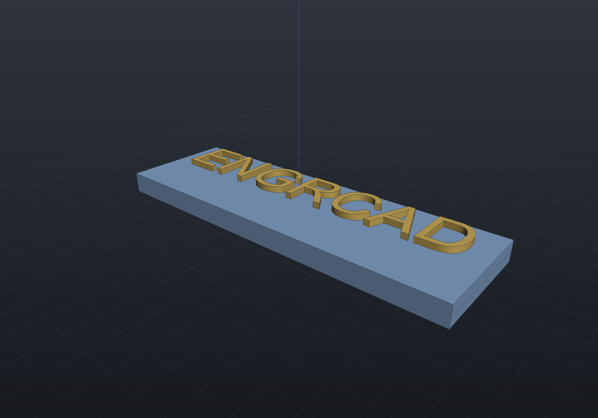

# Text

`Shape.Text` turns a TrueType font into real geometry — nameplates, part numbers, logos,
engraved labels. Glyph outlines are **lines and quadratic Béziers**, which is exactly the
sketch vocabulary, so glyphs become sketches with no flattening: text is native in all
three representations, with exact profiles for B-Rep and crisp tessellation for printing.

## A nameplate

```csharp render:text-nameplate
string fonts = Environment.GetFolderPath(Environment.SpecialFolder.Fonts);
string fontPath = new[] { "arial.ttf", "segoeui.ttf", "verdana.ttf" }
    .Select(name => Path.Combine(fonts, name)).First(File.Exists);
var font = TrueTypeFont.Load(fontPath);

// Lettering runs along +Y so it reads left-to-right from the default iso view.
var top = SketchPlane.At((0, 0, 2), Vector3d.UnitY, -Vector3d.UnitX);
var lettering = Shape.Text("ENGRCAD", font,
                           size: font.EmSizeForCapHeight(9),   // 9 mm capitals
                           height: 1.2, top,
                           new TextStyle { Align = TextAlign.Center });

var scene = new Scene();
scene.Add(new Part("plate", Shape.Box(22, 70, 4), Palette.Steel));
scene.Add(new Part("lettering", lettering, Palette.Brass));
```



## Sizing, origin, and layout

`size` is the **em size** — the typographic "12 point". Drawings usually specify letter
height instead, so `font.EmSizeForCapHeight(9)` converts: capitals come out exactly 9 mm.

The origin is the **baseline** at the start of the first line, x along the writing
direction and y up. `TextStyle` carries alignment (measured per line), tracking, and line
spacing as em multiples; `\n` starts a new line. Advance widths and legacy `kern` pair
kerning are applied automatically — `font.HasKerning` tells you whether a font supplies
them.

A character the font doesn't contain throws, naming the character and the font, rather
than silently dropping it.

## Counters are found, not assumed

The holes in **O**, **A**, and **8** — counters — are detected by containment: contours
are nested by an exact point-in-region test, even depth draws material and odd depth
becomes a hole, and an island inside a counter (the middle of a **䷀**-style glyph, or a
dot inside a ring) becomes its own outline again.

That is deliberate rather than trusting the format. TrueType specifies outer contours
clockwise and counters counter-clockwise, but real fonts routinely violate it, so
orientation is not a reliable signal — containment is.

## Fonts it reads

TrueType outlines: `head`, `maxp`, `cmap` (formats 4 and 12), `loca`, `glyf` (simple
**and** composite glyphs, so accented characters work), `hhea`/`hmtx`, plus optional
`kern` and `OS/2`. The reader is hand-rolled and dependency-free, like the PNG writer.

OpenType/CFF fonts (`.otf` with PostScript outlines) and TrueType Collections (`.ttc`)
are **rejected with a clear message** rather than partially misread — support for them
is future work.

## Engraving

Raised lettering unioned onto a body works today. Cutting lettering *into* a body is a
boolean between a body and many straight-edged sketch extrusions; see the Modeling
README for the current state and the implicit-lowering workaround
(`Shape.From(result.ToImplicit()).ToMesh(quality)`), which is exact and always available.
