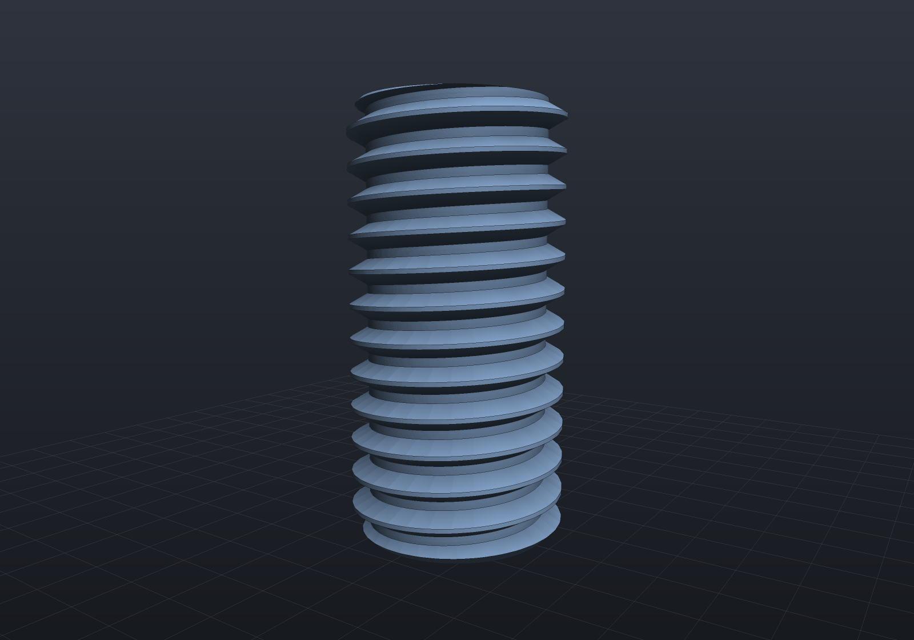
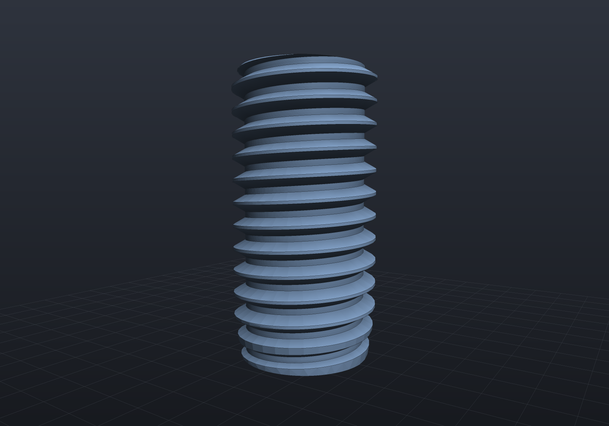
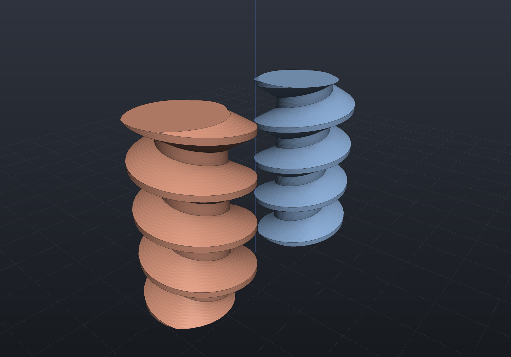

EngrCAD models **real thread geometry** — helical ridges you can 3D-print and screw
together — not cosmetic thread annotations. `StandardThreads.Metric(size)` supplies
the ISO 261/262 coarse-pitch series **M2–M12** with the **ISO 68-1 basic profile**:
the 60° symmetric V whose dimensions all follow from the nominal diameter d and pitch
P via the fundamental triangle height H = (√3/2)·P — crest flat P/8 at the major
diameter, root flat P/4 at the minor diameter d − (5/4)·H, thread depth 5H/8. A
custom `ThreadSpec(nominalDiameter, pitch)` covers anything outside the catalog.

`StandardThreads.Fine(size)` gives the first-choice ISO 261 **fine** pitch of the same
sizes, and `Metric(size, pitch)` names a second- or third-choice one:

```csharp
var m8 = StandardThreads.Metric(8);      // M8×1.25 coarse, tap drill 6.8
var m8f = StandardThreads.Fine(8);       // M8×1 fine,      tap drill 7.0
var m10 = StandardThreads.Metric(10, 0.75);                 // third-choice fine
var odd = new ThreadSpec(nominalDiameter: 7, pitch: 1.0);   // custom 60° thread

StandardThreads.Pitches(10);             // [1.5, 1.25, 1.0, 0.75] — coarse, then fine
StandardHoles.Tapped(m8f);               // the pilot for any spec, from its own tap drill
```

Fine tap drills are exactly `d − P`; the coarse chart rounds to a stock drill (6.8 for
M8, not 6.75), which is why only the coarse table stores a second column. ⚠ Verify the
pitch and tap-drill values against a current standard before production use.

## External threads

`Shape.ExternalThread(spec, length, clearance, chamferEnds, chamferLength)` builds a
threaded stud along +Z over z ∈ [0, length], with 45° lead-in chamfers down to the minor
diameter on both ends by default; `chamferLength` asks for a shallower one instead. A
plain `double` first argument is shorthand for the metric catalog:

```csharp render:thread-stud
// An M8×1.25 stud welded onto a plain boss. Threads mesh through Surface Nets, so
// give the scene enough SDF resolution for the ridges — the cell size is the longest
// scene axis divided by SdfResolution (about 0.1 mm here, well under the 1.25 pitch).
var stud = Shape.ExternalThread(8, length: 16);                 // z in [0, 16]
var boss = Shape.Cylinder(radius: 8, height: 6).Translate(0, 0, -3);

var scene = new Scene(new MeshQuality { SdfResolution = 220 });
scene.Add(new Part("M8 stud", boss | stud, Palette.Steel,
    Matrix4d.CreateTranslation((0, 0, 6))));
```


## Threaded holes

`ThreadedHole(spec, points, depth, plane?, clearance)` taps holes the way a machinist
does: at each 2D point it drills the tap pilot (`ThreadSpec.TapDrillDiameter`, via
[`Drill`](holes.md)) and then subtracts a modeled thread void, both along −normal to
`depth` below the plane. The pilot truncates the internal crests to the tap-drill
diameter — exactly what tapping a drilled hole does. A real **section plane** through
the hole axis shows the internal thread profile (the viewer's
[section mode](viewer.md) interactively; here the fence's `section:y,0` option). Note
what makes this cut possible: a downstream *boolean* may slice a modeled thread only
with axis-perpendicular planes (helical∩tilted-plane falls to the tracer and fails
loudly), but the viewer's section is a fragment-shader clip, not a boolean — so it
slices ALONG the thread axis effortlessly, on the same whole geometry. The crests here
are crisp because the clearance form is B-Rep-exact, not polygonized:

```csharp render:thread-hole section:y,0
var top = SketchPlane.At((0, 0, 5), Vector3d.UnitX, Vector3d.UnitY);
var block = Shape.Box(16, 12, 10)   // printable clearance — and still exact in B-Rep
    .ThreadedHole(StandardThreads.Metric(6), [new(0, 0)], depth: 12, top, clearance: 0.15);

var scene = new Scene(new MeshQuality { SdfResolution = 220 });
scene.Add(new Part("tapped block", block, Palette.Brass,
    Matrix4d.CreateTranslation((0, 0, 5))));
```


## Printing clearance

A snug modeled thread pair has zero gap and will not assemble off an FDM printer.
The `clearance` parameter is the fit allowance, applied **normal to the flanks** (the
profile offsets perpendicular to its own boundary, so crests and roots move radially
by the same amount):

- an **external** thread *shrinks* by the clearance,
- an **internal** thread void *grows* by the clearance.

Both are derived from the same ISO 68-1 basic profile, so pairing the **same value**
on the stud and the hole splits the total gap evenly between them. Typical FDM
values are **0.1–0.25 mm** (start around 0.15 mm and tune for your printer); the
default is 0, and values at or beyond half the thread depth are rejected because
they would degenerate the profile.

"Normal to its own boundary" is a distance-field offset, and it has a shape worth
knowing because it is what makes clearance **exact in every representation**. Eroding
the material MITERS its crest corners — the two offset lines simply meet — and ROUNDS
its root corners into arcs of the clearance radius, because that is where the disc
being subtracted has to fit. An internal thread's void grows instead, so the two swap.
Past a clearance of `tan(30°)` times the crest half-width the crest flat is consumed
altogether and the thread is correctly a **pointed ridge** — on an M6×1 that happens at
0.108 mm, well inside the printable band, so it is the ordinary case rather than an
edge one:

```csharp run:thread-clearance
var quality = new MeshQuality { SdfResolution = 96 };
double snug = Shape.ExternalThread(8, length: 10).ToMesh(quality).Volume();
double printed = Shape.ExternalThread(8, length: 10, clearance: 0.2).ToMesh(quality).Volume();
if (printed >= snug)
    throw new Exception("clearance must shrink an external thread");

try
{
    // M8×1.25 thread depth is 5H/8 ≈ 0.68 mm; 0.4 exceeds the half-depth cap.
    Shape.ExternalThread(8, length: 10, clearance: 0.4);
    throw new Exception("expected the degenerate-profile guard to throw");
}
catch (ArgumentOutOfRangeException) { }

// And clearance is B-Rep-native: the eroded profile's rounded root corners sweep to
// ARC-generator helical bands, so the lateral boundary is still one boolean-free
// helical sweep. The two representations are one geometry, not two approximations.
var printedStud = Shape.ExternalThread(8, length: 10, clearance: 0.2, chamferEnds: false);
printedStud.ToBrep().Validate();
if (!printedStud.CanConvertTo(TargetRep.Brep))
    throw new Exception("a clearance thread is B-Rep-native");
```

## Representation support (the honest part)

Threads are **implicit-native**: `Sdf.Thread` evaluates the helical profile with an
exact sign (and a documented approximate distance), so thread shapes compose with
every SDF operator, and chamfered or clearance-fitted threads mesh through Surface
Nets polygonization — the 3D printing route (`ToMesh()` → [STL export](exports.md)).

**External threads are also B-Rep-native** (with `chamferEnds: false`, and with or
without a printing clearance). The entire lateral boundary is ONE
boolean-free helical sweep (`SolidFactory.MakeThreadedRod`): each facet of the
per-pitch profile — root flat, flank, crest flat, flank — sweeps to a single exact
`HelicalSurface` band wrapping *all* the turns, adjacent bands share exact `Helix3d`
rail edges, and the flat end caps are disks bounded by the spiral arcs the cap planes
cut from the bands. No core cylinder exists for a ridge to weld onto, so no tangent
seams and zero booleans. A clearance adds ARC pieces to that profile and nothing else
changes: the arc bands are the same kind of sweep, and their cap cuts are the same
closed form one generator up (`HelicalArcCut3d`, where a straight generator gives
`SpiralArc3d`). Any length works (no whole-turn constraint), and such threads mesh
through exact B-Rep tessellation with crisp helical edges:

```csharp render:thread-brep
// A B-Rep-native M8 stud: exact helical surfaces, tessellated with crisp rails —
// no SDF resolution concerns.
var stud = Shape.ExternalThread(8, length: 16, chamferEnds: false);

var scene = new Scene();
scene.Add(new Part("M8 B-Rep stud", stud, Palette.Steel));
```


### Lead-in chamfers, exactly

A **sub-depth** chamfer is B-Rep-native as well. A coaxial cone meets a helical band in
an exact *conical spiral*: substitute the band's `r = r₀ + dr·v`, `z = z₀ + dz·v + rate·u`
into the cone's `r = a + b·z` and the generator parameter comes out **linear in the
turning angle**, so the cut has a closed form (`SpiralArc3d`) rather than a sampled one.
The chamfer is then one ordinary difference against
`SolidFactory.MakeThreadEndChamferTool`, whose other faces are pushed clear of the rod so
every intersecting pair stays transversal.

Pass the depth you want with `chamferLength`:

```csharp render:thread-chamfered
// A 0.5 mm 45-degree lead-in on both ends, exact in B-Rep: the cone cuts each helical
// band in a conical spiral arc, so the chamfer needs no sampled geometry at all.
var stud = Shape.ExternalThread(8, length: 16, chamferLength: 0.5);

var scene = new Scene();
scene.Add(new Part("chamfered M8 stud", stud, Palette.Steel));

// Nearly side-on rather than the auto-framed iso view: a chamfer is on BOTH ends, and
// looking down at the rod hides the lower one behind the rod's own body.
var camera = new CameraState(0.6, 0.12, 29, (0, 0, 8));
```



The default `chamferEnds: true` asks for a chamfer of the full **thread depth**, which
puts the cone's base exactly on the minor diameter and therefore *tangent* to every root
band along the end plane — coincident curved-surface boolean input, which the kernel
refuses by name rather than attempts. So the B-Rep-native range is
`0 < chamferLength < spec.ThreadDepth` (0.677 mm for M8×1.25); at or past that depth,
and for any clearance, take `ToImplicit()`/`ToMesh()`.

> [!NOTE]
> Every depth in that range now builds and tessellates cleanly. Scanning 5% steps of the
> thread depth across M6×1, M8×1.25, M10×1.5 and M12×1.75 with both ends chamfered, all
> 76 return a valid two-manifold solid with **no inverted facets**. Ten of them used to
> emit a few silently inverted triangles on the chamfer cone — an alignment effect rather
> than a depth threshold — which is fixed; a previous version of this note claimed those
> depths failed *loudly*, and they did not, which is why it went unnoticed for so long.
>
> What remains is resolution, not correctness: a shallow chamfer makes a cone band a few
> hundredths of a millimetre tall wrapped around the whole rod, so at a given
> segments-per-circle its facets are coarser than the rest of the model. Raise the mesh
> quality if a lead-in renders faceted.

### Thread runout

A thread cut by a die or rolled by a head does not stop in a full-form crest: over a
pitch or two before the shank the tool withdraws, the crests get shorter, and the thread
*washes out*. `runoutLength` models that, and it needed no new geometry — the 45° lead-in
was never a special shape, only the **equal-drop member of a family of coaxial cones**, and
every member of that family cuts a helical band in the same exact conical spiral. So a
shallow cone stretched over two pitches is exactly as native as a short steep one:

```csharp render:thread-runout
// A stud with a lead-in chamfer at its free end and a two-pitch runout at its shank
// end: the crests are truncated progressively from the major diameter down to the
// pitch diameter. Native in B-Rep AND in the implicit field.
var stud = Shape.ExternalThread(8, length: 16, chamferLength: 0.5, runoutLength: 2.5);
stud.ToBrep().Validate();

var scene = new Scene();
scene.Add(new Part("M8 stud with a runout", stud, Palette.Steel));

// Side-on: the runout is a change of crest height along the rod, which an iso view
// foreshortens away.
var camera = new CameraState(0.6, 0.08, 29, (0, 0, 8));
```



The runout drops to the **pitch** diameter rather than the minor one, and that is what
keeps it exact: a cone reaching the minor diameter is tangent to every root band along the
end plane — the same coincident-surface input a full-depth chamfer earns a refusal for. It
also *replaces* that end's lead-in chamfer, because a stud has a lead-in at its free end
and a runout at its shank end, not both at once.

**Threaded holes are B-Rep-native too**, clearance included: the B-Rep path never
drills the pilot separately — the pilot bore wall and the thread tool's root band
would be coaxial (tangent, unsupported boolean input) — and instead subtracts ONE
combined tool per point, the internal thread form clipped at the pilot radius, whose
helical bands cross the drilled plane in exact spiral arcs chaining into a closed
loop. A clearance simply GROWS that tool by the same distance-field offset, which is
why its crest corners round where an external thread's miter:

```csharp run:thread-hole-brep
var top = SketchPlane.At((0, 0, 4), Vector3d.UnitX, Vector3d.UnitY);
var tapped = Shape.Box(20, 20, 8)
    .ThreadedHole(StandardThreads.Metric(8), [new(0, 0)], depth: 6, top);

var brep = tapped.ToBrep();                       // B-Rep-native threaded hole
if (!tapped.CanConvertTo(TargetRep.Brep))
    throw new Exception("threaded holes are B-Rep-native");

var printable = Shape.Box(20, 20, 8)
    .ThreadedHole(StandardThreads.Metric(8), [new(0, 0)], depth: 6, top, clearance: 0.2);
printable.ToBrep().Validate();                    // and so is the printable fit
```

## Calling a thread out

A modelled thread should still say what it *is* — a reader of a drawing wants "M8×1.25",
not a helix to measure. `ThreadAnnotations` attaches that callout, and the interesting
decision is where each half comes from: the **spec** from the construction graph, the
**anchor** from the geometry, matched on the two numbers a thread is — its major diameter
and its pitch, read off the helical bands the lowering produced.

```csharp run:thread-callout
var stud = new Part("stud", Shape.ExternalThread(8, length: 20, chamferLength: 0.4));
foreach (var site in ThreadAnnotations.Sites(stud))
    Console.WriteLine($"{site.Callout} at {site.Anchor}");   // M8x1.25, on its own crest

ThreadAnnotations.AutoAttach(stud);                          // one LeaderNote per thread

// Threaded holes carry their depth, as a drawing's callout does.
var plate = new Part("plate", Shape.Box(40, 30, 12)
    .ThreadedHole(StandardThreads.Metric(6), [new(0, 0), new(12, 0)], depth: 8));
if (ThreadAnnotations.AutoAttach(plate) != 2)
    throw new Exception("one callout per tapped hole");
```

Pairing the n-th thread in the graph with the n-th group of faces would be free to put a
correct-looking M6 callout on an M10 thread — the one failure a naming scheme must not
have — so it is not done that way. Matching on the geometry can only find *nothing*, and
then nothing is attached. This is also the first callout an **external** thread has ever
had here: [the hole table](drawings.md) structurally cannot carry one, a stud not being a
hole.

## Left-hand threads

`spec.LeftHanded()` winds the same profile the other way. Every diameter is shared —
handedness is not a different thread — the designation becomes `M8×1.25-LH`, and
`ThreadCallout` picks that up on its own:

```csharp render:thread-left-hand
// A handed pair, drawn with a deliberately coarse 5 mm lead so the two helices spiral
// visibly opposite ways. The left-hand stud is Native in every representation,
// because it is exactly the mirror image of its right-hand twin.
var coarse = new ThreadSpec(nominalDiameter: 12, pitch: 5);
var right = Shape.ExternalThread(coarse, 20, chamferEnds: false);
var left = Shape.ExternalThread(coarse.LeftHanded(), 20, chamferEnds: false);

var scene = new Scene();
scene.Add(new Part("right-hand", right, Palette.Steel, Matrix4d.CreateTranslation((-9, 0, 0))));
scene.Add(new Part("left-hand", left, Palette.Copper, Matrix4d.CreateTranslation((9, 0, 0))));
```



Because a left-hand thread IS the mirror image, **mirroring a thread is Native too**
rather than refused: the compiler recognizes that a reflection across a plane containing
the axis is precisely the handedness flip, so `Mirror` leaves an ordinary rigid placement
of a rod wound the other way. Mirroring twice comes back right-handed.

```csharp run:thread-mirror
var stud = Shape.ExternalThread(8, length: 12, chamferEnds: false);
var handedPair = stud.Mirror(Vector3d.UnitX);          // the left-hand twin
handedPair.ToBrep().Validate();
if (!handedPair.CanConvertTo(TargetRep.Brep))
    throw new Exception("a mirrored thread is the left-hand thread, and is B-Rep-native");
```

One boundary to know: downstream B-Rep booleans can cut a modeled thread only with
planes **perpendicular to its axis** (the exact spiral-arc case). A cut slicing
*along* the threads — like the sectioned illustration above — fails loudly in the
B-Rep kernel; drop to `ToImplicit()` and the SDF route handles it exactly.

`Explain` reports each case truthfully — Native for the basic profile with or without a
sub-depth chamfer or a printing clearance, and Impossible for the one remaining cause,
which is a geometric coincidence rather than a missing capability: a **full-depth
chamfer** lands its cone tangent to every root band along the end plane. Helical
surfaces are not STEP-exportable yet (same bucket as swept surfaces):

```csharp run:thread-explain
var plain = Shape.ExternalThread(8, length: 12, chamferEnds: false);
var brep = plain.ToBrep();                          // B-Rep-native: exact helical sweep
brep.Validate();
if (!plain.CanConvertTo(TargetRep.Brep))
    throw new Exception("unchamfered external threads are B-Rep-native");

var lead = Shape.ExternalThread(8, length: 12, chamferLength: 0.5);
lead.ToBrep().Validate();                           // also Native: the cone cut is exact
if (!lead.CanConvertTo(TargetRep.Brep))
    throw new Exception("sub-depth chamfers are B-Rep-native");

var chamfered = Shape.ExternalThread(8, length: 12);   // default: full-thread-depth cones
Console.WriteLine(chamfered.Explain(TargetRep.Brep));  // names the tangency
if (chamfered.CanConvertTo(TargetRep.Brep))
    throw new Exception("a full-depth chamfer is tangent to every root band");
if (!chamfered.CanConvertTo(TargetRep.Implicit) || !chamfered.CanConvertTo(TargetRep.Mesh))
    throw new Exception("threads are implicit-native and meshable");

try
{
    chamfered.ToBrep();
    throw new Exception("expected ShapeConversionException");
}
catch (ShapeConversionException) { }
```

> [!NOTE]
> Because threads mesh through Surface Nets, ridge fidelity is set by
> `MeshQuality.SdfResolution` — the cell count along the scene's longest axis. Keep
> the cell size well below the pitch (the renders above use ~0.1 mm cells for a
> 1.25/1.0 mm pitch); at the default resolution a small thread in a large scene can
> average away entirely.
