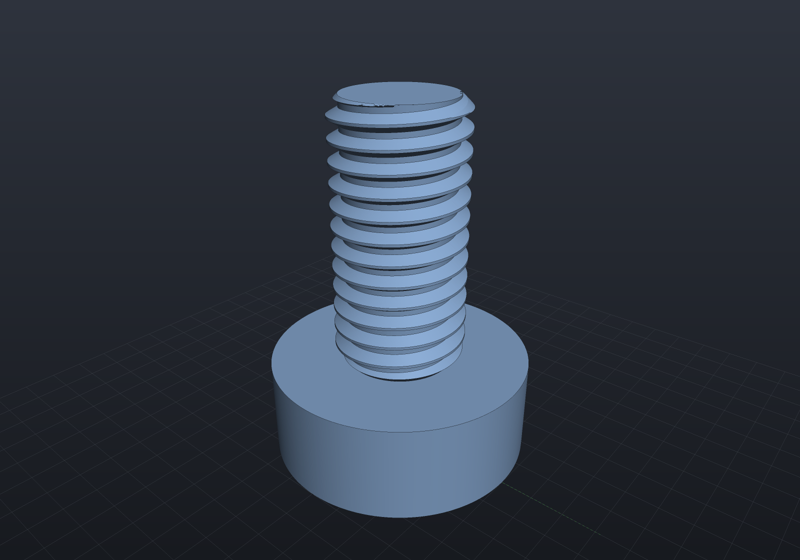
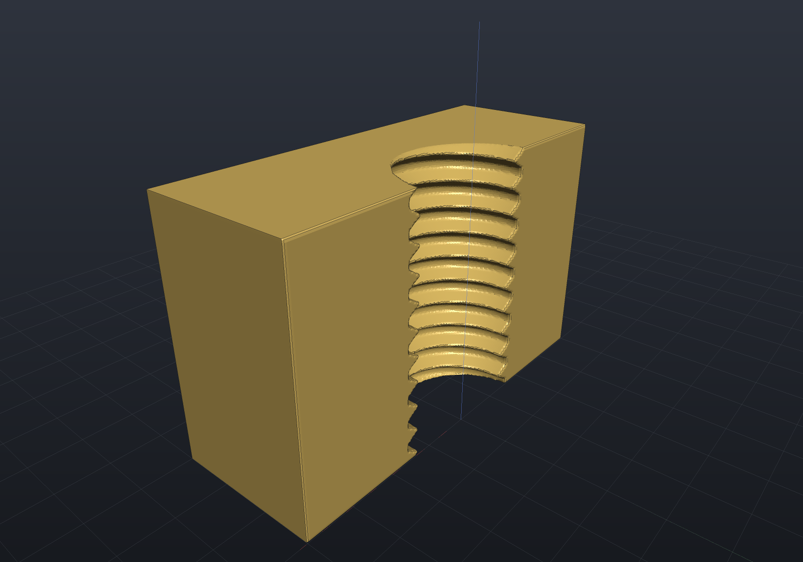
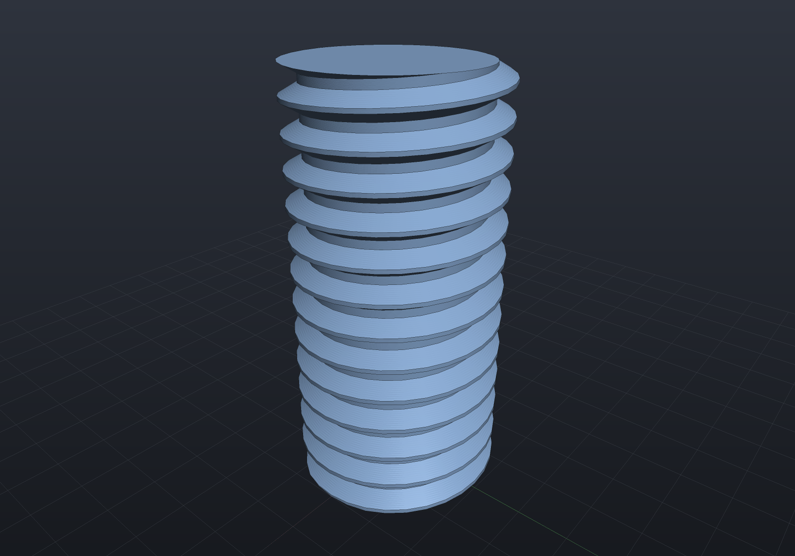

# Threads

EngrCAD models **real thread geometry** — helical ridges you can 3D-print and screw
together — not cosmetic thread annotations. `StandardThreads.Metric(size)` supplies
the ISO 261/262 coarse-pitch series **M2–M12** with the **ISO 68-1 basic profile**:
the 60° symmetric V whose dimensions all follow from the nominal diameter d and pitch
P via the fundamental triangle height H = (√3/2)·P — crest flat P/8 at the major
diameter, root flat P/4 at the minor diameter d − (5/4)·H, thread depth 5H/8. A
custom `ThreadSpec(nominalDiameter, pitch)` covers anything outside the catalog;
right-hand threads only.

```csharp
var m8 = StandardThreads.Metric(8);      // M8×1.25, tap drill 6.8
var odd = new ThreadSpec(nominalDiameter: 7, pitch: 1.0);   // custom 60° thread
```

## External threads

`Shape.ExternalThread(spec, length, clearance, chamferEnds)` builds a threaded stud
along +Z over z ∈ [0, length], with 45° lead-in chamfers down to the minor diameter
on both ends by default. A plain `double` first argument is shorthand for the
metric catalog:

```csharp render:thread-stud
// An M8×1.25 stud welded onto a plain boss. Threads mesh through Surface Nets, so
// give the scene enough SDF resolution for the ridges — the cell size is the longest
// scene axis divided by SdfResolution (about 0.1 mm here, well under the 1.25 pitch).
var stud = Shape.ExternalThread(8, length: 16);                 // z in [0, 16]
var boss = Shape.Cylinder(radius: 8, height: 6).Translate(0, 0, -3);

var scene = new Scene(new MeshQuality { SdfResolution = 220 });
scene.Add(new Part("M8 stud", boss | stud, Palette.Steel,
    Matrix4d.CreateTranslation((0, 0, 6))));
```



## Threaded holes

`ThreadedHole(spec, points, depth, plane?, clearance)` taps holes the way a machinist
does: at each 2D point it drills the tap pilot (`ThreadSpec.TapDrillDiameter`, via
[`Drill`](holes.md)) and then subtracts a modeled thread void, both along −normal to
`depth` below the plane. The pilot truncates the internal crests to the tap-drill
diameter — exactly what tapping a drilled hole does. Cutting the block in half shows
the internal thread profile (the viewer's [section mode](viewer.md) does this
interactively):

```csharp render:thread-hole
var top = SketchPlane.At((0, 0, 5), Vector3d.UnitX, Vector3d.UnitY);
var block = Shape.Box(16, 12, 10)
    .ThreadedHole(StandardThreads.Metric(6), [new(0, 0)], depth: 12, top);

// Expose the internal thread by cutting away the front half through the hole axis.
var sectioned = block - Shape.Box(20, 14, 14).Translate(0, 7, 0);

var scene = new Scene(new MeshQuality { SdfResolution = 220 });
scene.Add(new Part("tapped block", sectioned, Palette.Brass,
    Matrix4d.CreateTranslation((0, 0, 5))));
```



## Printing clearance

A snug modeled thread pair has zero gap and will not assemble off an FDM printer.
The `clearance` parameter is the fit allowance, applied **normal to the flanks** (the
profile offsets perpendicular to its own boundary, so crests and roots move radially
by the same amount):

- an **external** thread *shrinks* by the clearance,
- an **internal** thread void *grows* by the clearance.

Both are derived from the same ISO 68-1 basic profile, so pairing the **same value**
on the stud and the hole splits the total gap evenly between them. Typical FDM
values are **0.1–0.25 mm** (start around 0.15 mm and tune for your printer); the
default is 0, and values at or beyond half the thread depth are rejected because
they would degenerate the profile:

```csharp run:thread-clearance
var quality = new MeshQuality { SdfResolution = 96 };
double snug = Shape.ExternalThread(8, length: 10).ToMesh(quality).Volume();
double printed = Shape.ExternalThread(8, length: 10, clearance: 0.2).ToMesh(quality).Volume();
if (printed >= snug)
    throw new Exception("clearance must shrink an external thread");

try
{
    // M8×1.25 thread depth is 5H/8 ≈ 0.68 mm; 0.4 exceeds the half-depth cap.
    Shape.ExternalThread(8, length: 10, clearance: 0.4);
    throw new Exception("expected the degenerate-profile guard to throw");
}
catch (ArgumentOutOfRangeException) { }
```

## Representation support (the honest part)

Threads are **implicit-native**: `Sdf.Thread` evaluates the helical profile with an
exact sign (and a documented approximate distance), so thread shapes compose with
every SDF operator, and chamfered or clearance-fitted threads mesh through Surface
Nets polygonization — the 3D printing route (`ToMesh()` → [STL export](exports.md)).

**External threads with the unmodified basic profile — zero clearance and
`chamferEnds: false` — are also B-Rep-native.** The entire lateral boundary is ONE
boolean-free helical sweep (`SolidFactory.MakeThreadedRod`): each facet of the
per-pitch profile — root flat, flank, crest flat, flank — sweeps to a single exact
`HelicalSurface` band wrapping *all* the turns, adjacent bands share exact `Helix3d`
rail edges, and the flat end caps are disks bounded by the spiral arcs the cap planes
cut from the bands. No core cylinder exists for a ridge to weld onto, so no tangent
seams and zero booleans. Any length works (no whole-turn constraint), and such
threads mesh through exact B-Rep tessellation with crisp helical edges:

```csharp render:thread-brep
// A B-Rep-native M8 stud: exact helical surfaces, tessellated with crisp rails —
// no SDF resolution concerns.
var stud = Shape.ExternalThread(8, length: 16, chamferEnds: false);

var scene = new Scene();
scene.Add(new Part("M8 B-Rep stud", stud, Palette.Steel));
```



`Explain` reports each case truthfully — Native for the basic profile, and a
per-cause Impossible otherwise (45° chamfer cones cutting helical bands are future
surface-intersection work; clearance offsets the profile as a distance field whose
rounded reflex corners have no exact B-Rep counterpart; `ThreadedHole` needs the
pilot bore wall split by multi-turn helix curves). Helical surfaces are not
STEP-exportable yet (same bucket as swept surfaces):

```csharp run:thread-explain
var plain = Shape.ExternalThread(8, length: 12, chamferEnds: false);
var brep = plain.ToBrep();                          // B-Rep-native: exact helical sweep
brep.Validate();
if (!plain.CanConvertTo(TargetRep.Brep))
    throw new Exception("unchamfered external threads are B-Rep-native");

var chamfered = Shape.ExternalThread(8, length: 12);   // default: 45° lead-in chamfers
Console.WriteLine(chamfered.Explain(TargetRep.Brep));  // names the chamfer as the blocker
if (chamfered.CanConvertTo(TargetRep.Brep))
    throw new Exception("chamfered threads must not silently drop their chamfers");
if (!chamfered.CanConvertTo(TargetRep.Implicit) || !chamfered.CanConvertTo(TargetRep.Mesh))
    throw new Exception("threads are implicit-native and meshable");

try
{
    chamfered.ToBrep();
    throw new Exception("expected ShapeConversionException");
}
catch (ShapeConversionException) { }
```

> [!NOTE]
> Because threads mesh through Surface Nets, ridge fidelity is set by
> `MeshQuality.SdfResolution` — the cell count along the scene's longest axis. Keep
> the cell size well below the pitch (the renders above use ~0.1 mm cells for a
> 1.25/1.0 mm pitch); at the default resolution a small thread in a large scene can
> average away entirely.
