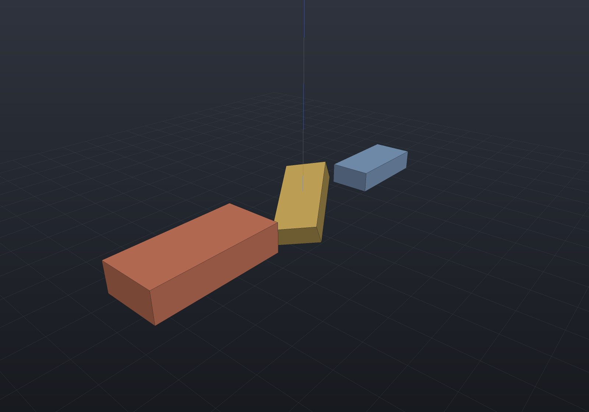
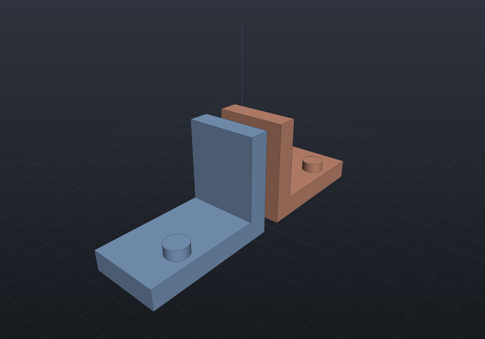
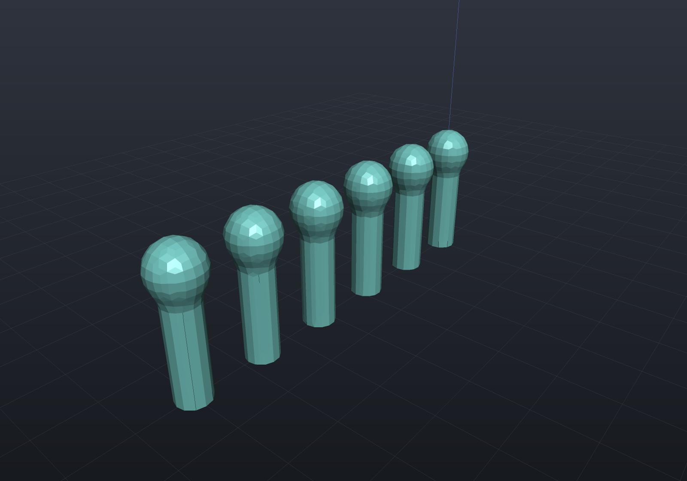
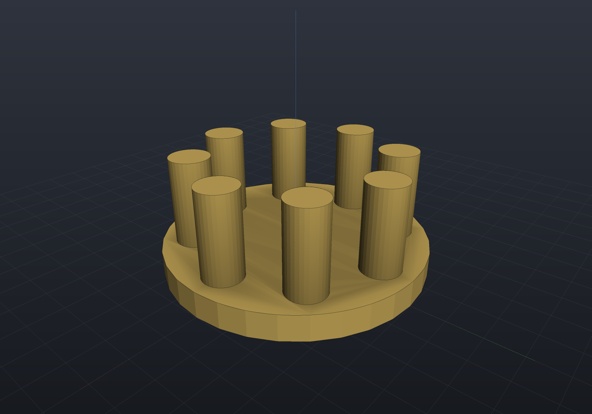

# Transforms & patterns

## Transforms

`Translate`, `RotateX/Y/Z`, `Rotate(axis, angle)`, `Scale`, and the general
`Transform(Matrix4d)` are ordinary graph nodes. Lowerings **bake accumulated
transforms into construction inputs** — a rotated-then-drilled B-Rep stays exact
because the transform moves the profiles and axes, never finished geometry:

```csharp render:transforms
var blank = Shape.Box(26, 12, 6);

var scene = new Scene();
scene.Add(new Part("original", blank, Palette.Steel,
    Matrix4d.CreateTranslation((-36, 0, 8))));
scene.Add(new Part("rotated", blank.RotateZ(Math.PI / 6).RotateY(Math.PI / 8),
    Palette.Brass, Matrix4d.CreateTranslation((0, 0, 8))));
scene.Add(new Part("scaled x1.4", blank.Scale(1.4), Palette.Coral,
    Matrix4d.CreateTranslation((38, 0, 8))));
```



Uniform scaling keeps everything exact (feature sizes scale with it); shear and
non-uniform scale are exact for boxes, cylinders, and extrusions, and bridge or
reject elsewhere — `Explain` names the offending node
([details](representations.md)).

## Mirror

`Mirror(point, normal)` reflects across the plane through `point` with `normal`
(OpenSCAD's `mirror()`); `Mirror(normal)` mirrors through the origin. It is the way
to get left/right-hand pairs of a chiral part from one model:

```csharp render:mirror
// An L-bracket with an off-center boss (a genuinely chiral part) and its mirror
// image across the YZ plane — the classic handed pair.
var lSection = Sketch.Start(0, 0).LineTo(26, 0).LineTo(26, 4).LineTo(4, 4)
    .LineTo(4, 20).LineTo(0, 20).Close();

var bracket = Shape.Extrude(lSection, 14,
        SketchPlane.At((2, 7, 0), Vector3d.UnitX, Vector3d.UnitZ))
    | Shape.Cylinder(2.2, 4).Translate(20, 3.5, 4);

var scene = new Scene();
scene.Add(new Part("right-hand", bracket, Palette.Steel));
scene.Add(new Part("left-hand", bracket.Mirror(Vector3d.UnitX), Palette.Copper));
```



Mirroring is a single exact reflection matrix, correct in every representation:
meshes transform positions and reverse triangle winding (staying outward-oriented),
and the implicit lowering reflects the query point, which is exact for any SDF.
B-Rep support follows the node under the mirror: boxes, cylinders, and sketch
extrusions handle any affine map (this bracket stays fully B-Rep-native);
spheres, tori, and cones are re-placed natively under mirrored similarities; but
mirrored revolve/sweep/chamfer/fillet/drill nodes have **no B-Rep lowering yet** —
their mirrors are still exact via mesh or SDF, and `Explain` names the node
([support matrix](representations.md)).

## Linear patterns

`PatternLinear(count, step)` unions transformed copies (as a balanced tree, in every
representation). Disjoint copies become a valid multi-shell solid:

```csharp render:pattern-linear
var post = Shape.Cylinder(3, 20).Translate(0, 0, 10)
    .SmoothUnion(Shape.Sphere(4.5).Translate(0, 0, 22), 2);

var scene = new Scene();
scene.Add(new Part("fence", post.PatternLinear(6, step: (14, 0, 0)), Palette.Teal));
```



## Circular patterns

`PatternCircular(count, axisOrigin, axisDirection, angleStep?)` revolves copies about
an axis — the classic bolt-circle / carousel layout:

```csharp render:pattern-circular
var carousel = Shape.Cylinder(20, 4)
    | Shape.Cylinder(3, 14).Translate(15, 0, 8)   // posts overlap the disc (tangent
        .PatternCircular(8, Vector3d.Zero, Vector3d.UnitZ);  // contact is not supported)

var scene = new Scene();
scene.Add(new Part("carousel", carousel, Palette.Brass,
    Matrix4d.CreateTranslation((0, 0, 2))));
```



For arrays of *holes*, keep passing point lists to [`Drill`](holes.md) — one boolean
with many tools is cheaper than patterning a drilled body.
