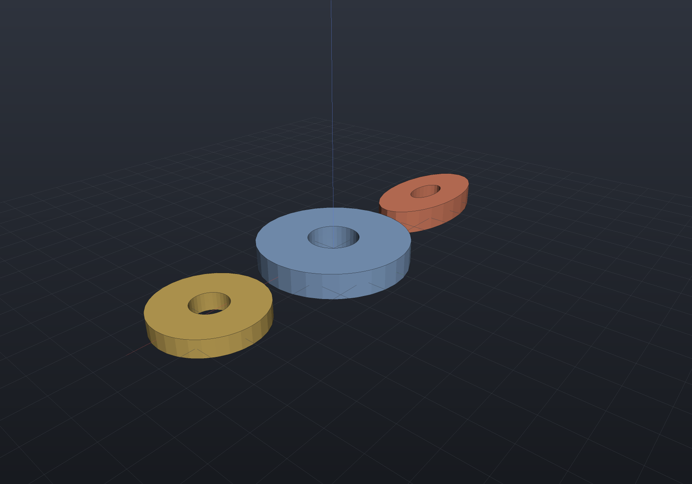
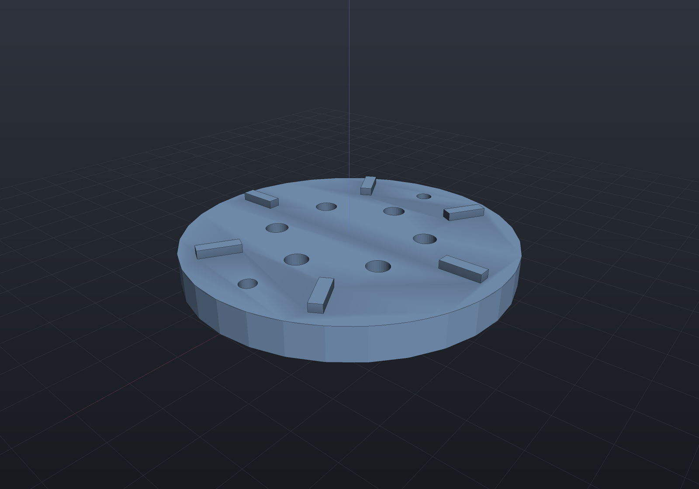

## Transforms

`Translate`, `RotateX/Y/Z`, `Rotate(axis, angle)`, `Scale`, and the general
`Transform(Matrix4d)` are ordinary graph nodes. Lowerings **bake accumulated
transforms into construction inputs** — a rotated-then-drilled B-Rep stays exact
because the transform moves the profiles and axes, never finished geometry:

```csharp render:transforms
var blank = Shape.Box(26, 12, 6);

var scene = new Scene();
scene.Add(new Part("original", blank, Palette.Steel,
    Matrix4d.CreateTranslation((-36, 0, 8))));
scene.Add(new Part("rotated", blank.RotateZ(Math.PI / 6).RotateY(Math.PI / 8),
    Palette.Brass, Matrix4d.CreateTranslation((0, 0, 8))));
scene.Add(new Part("scaled x1.4", blank.Scale(1.4), Palette.Coral,
    Matrix4d.CreateTranslation((38, 0, 8))));
```


Uniform scaling keeps everything exact (feature sizes scale with it); shear and
non-uniform scale — `Scale(x, y, z)`, OpenSCAD's `scale([x,y,z])` — are exact for
boxes, cylinders, and extrusions, and bridge or reject elsewhere — `Explain` names
the offending node ([details](representations.md)).

## Resize

`Resized(newSize, auto?)` is OpenSCAD's `resize()`: measure the shape's bounds (on
its mesh lowering — `Shape.Bounds(quality)`), then scale per axis about the origin so
they hit the target. A zero component keeps its axis; with the matching `auto` flag it
follows the first sized axis's factor instead, which is the proportional resize:

```csharp render:resize
var gear = Shape.Cylinder(12, 4) - Shape.Cylinder(4, 5);

var scene = new Scene();
scene.Add(new Part("original", gear, Palette.Steel));
// Proportional: x to 16, y and z follow (factor 2/3).
scene.Add(new Part("resized", gear.Resized((16, 0, 0), auto: true).Translate(24, 0, 0),
    Palette.Brass));
// Per-axis: an elliptical squash - B-Rep keeps it exact (cylinders become ellipses,
// and those rims tessellate at segmentsPerCircle like any other angular curve).
scene.Add(new Part("squashed", gear.Resized((24, 12, 4)).Translate(-26, 0, 0),
    Palette.Coral));
```



Because `Resized` is just a scale about the origin, representation support is the
non-uniform-scale story above: equal factors change nothing, unequal factors keep
boxes/cylinders/extrusions B-Rep-exact and make a sphere B-Rep-Impossible (the
message names the ellipsoid it would need) while mesh and implicit routes stay
available. The bounds are *measured*, eagerly, at the call — a tessellation inscribes
curved surfaces, so extremes read a chord's sagitta small at coarse quality.

## Mirror

`Mirror(point, normal)` reflects across the plane through `point` with `normal`
(OpenSCAD's `mirror()`); `Mirror(normal)` mirrors through the origin. It is the way
to get left/right-hand pairs of a chiral part from one model:

```csharp render:mirror
// An L-bracket with an off-center boss (a genuinely chiral part) and its mirror
// image across the YZ plane — the classic handed pair.
var lSection = Sketch.Start(0, 0).LineTo(26, 0).LineTo(26, 4).LineTo(4, 4)
    .LineTo(4, 20).LineTo(0, 20).Close();

var bracket = Shape.Extrude(lSection, 14,
        SketchPlane.At((2, 7, 0), Vector3d.UnitX, Vector3d.UnitZ))
    | Shape.Cylinder(2.2, 4).Translate(20, 3.5, 4);

var scene = new Scene();
scene.Add(new Part("right-hand", bracket, Palette.Steel));
scene.Add(new Part("left-hand", bracket.Mirror(Vector3d.UnitX), Palette.Copper));
```


Mirroring is a single exact reflection matrix, correct in every representation:
meshes transform positions and reverse triangle winding (staying outward-oriented),
and the implicit lowering reflects the query point, which is exact for any SDF.
B-Rep support follows the node under the mirror, and every modeling node now has a
mirrored lowering: boxes, cylinders, and sketch extrusions handle any affine map
(this bracket stays fully B-Rep-native); spheres, tori, and cones re-place natively
under mirrored similarities; revolves sweep about the **negated** transformed axis
(a reflection conjugates the rotation — the same identity that makes a mirrored
thread the left-hand thread); sweeps need no fix at all (rotation-minimizing frames
are intrinsic); and chamfers, fillets, and drilled holes follow because their
geometry commutes with isometries ([support matrix](representations.md)).

## Linear patterns

`PatternLinear(count, step)` unions transformed copies (as a balanced tree, in every
representation). Disjoint copies become a valid multi-shell solid:

```csharp render:pattern-linear
var post = Shape.Cylinder(3, 20).Translate(0, 0, 10)
    .SmoothUnion(Shape.Sphere(4.5).Translate(0, 0, 22), 2);

var scene = new Scene();
scene.Add(new Part("fence", post.PatternLinear(6, step: (14, 0, 0)), Palette.Teal));
```


## Circular patterns

`PatternCircular(count, axisOrigin, axisDirection, angleStep?)` revolves copies about
an axis — the classic bolt-circle / carousel layout:

```csharp render:pattern-circular
var carousel = Shape.Cylinder(20, 4)
    | Shape.Cylinder(3, 14).Translate(15, 0, 8)   // posts overlap the disc (tangent
        .PatternCircular(8, Vector3d.Zero, Vector3d.UnitZ);  // contact is not supported)

var scene = new Scene();
scene.Add(new Part("carousel", carousel, Palette.Brass,
    Matrix4d.CreateTranslation((0, 0, 2))));
```


For arrays of *holes*, keep passing point lists to [`Drill`](holes.md) — one boolean
with many tools is cheaper than patterning a drilled body.

## Location sets: one layout, every consumer

"Place this feature at these N poses" is a *value*, not an operation:
`LocationSet.Grid` / `Polar` / `PolarArc` / `Hex` / `Linear` / `At(points)` build one,
`Translate` / `Rotate` / `+` compose it, and the same value feeds `Shape.Drill`,
`Shape.Pattern` and `ComponentAssembly.Place` — build123d's
`GridLocations`/`PolarLocations`/`HexLocations` and CadQuery's
`pushPoints`/`rarray`/`polarArray` as one idea instead of three:

```csharp render:location-sets
// One layout value: a bolt circle plus two dowel positions.
var bolts = LocationSet.Polar(6, 18);
var dowels = LocationSet.At(new Vector2d(32, 0), new Vector2d(-32, 0));

// The same LocationSet vocabulary drives holes and patterns alike.
var top = SketchPlane.At((0, 0, 8), Vector3d.UnitX, Vector3d.UnitY);
var plate = Shape.Extrude(Sketch.Circle(40), 8)
    .Drill(StandardHoles.Clearance(5), bolts, 20, top)
    .Drill(HoleSpec.Simple(4), dowels, 20, top);

// Pattern stamps a copy per location: the rib is modeled at the plane origin and
// each polar location moves AND rotates it (rotate: false would keep copies upright).
var rib = Shape.Box(10, 3, 4).Translate(31, 0, 8);
var ribbed = plate | rib.Pattern(LocationSet.Polar(6, 0, Math.PI / 6));

var scene = new Scene();
scene.Add(new Part("ribbed plate", ribbed, Palette.Steel));
```



Points run deterministically (grids x-fastest and centred, polar counter-clockwise
without repeating the seam; hex fields are the closest packing at the given pitch),
and each location carries an in-plane **rotation** that `Pattern` honors — a polar
location turns its copy with its position, exactly matching `PatternCircular` of the
pre-translated shape. Everything is **serializable** the way
[geometry references](geometry-inputs.md) are: `Descriptor` is a canonical parseable
string (`grid(3,2,10,8)`, `translate([5,0],hex(3,3,6))`) that `LocationSet.Parse`
reconstructs bit for bit, so a `[Param]` location set is an honest regeneration cache
key and survives feature JSON.

```csharp run:location-set-roundtrip
var layout = (LocationSet.Grid(3, 2, 10, 8) + LocationSet.Polar(4, 30)).Rotate(0.2);
var parsed = LocationSet.Parse(layout.Descriptor);
if (parsed.Descriptor != layout.Descriptor) throw new Exception("descriptor drifted");
for (int i = 0; i < layout.Count; i++)
{
    if (parsed[i] != layout[i])
        throw new Exception($"location {i} did not round-trip bit for bit");
}
```
