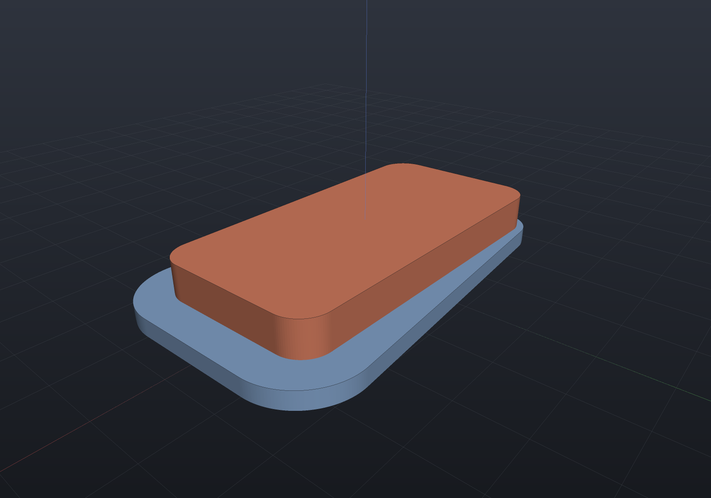
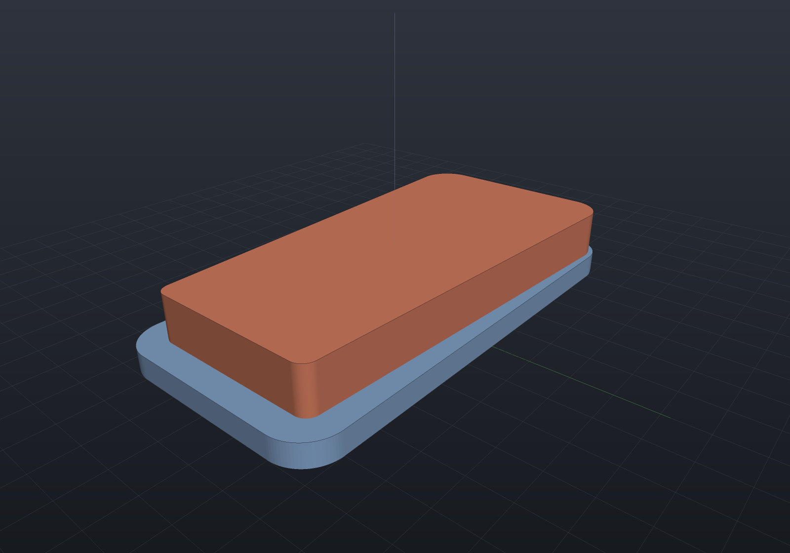
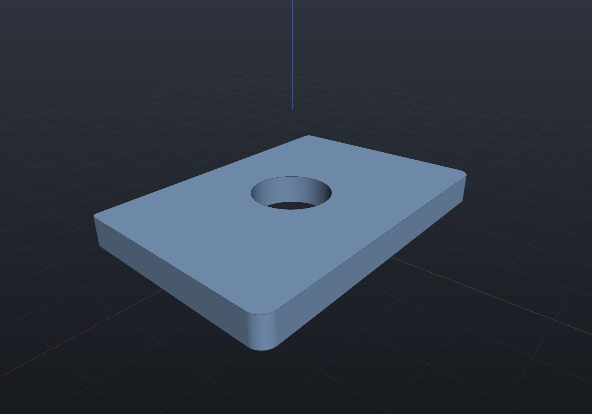
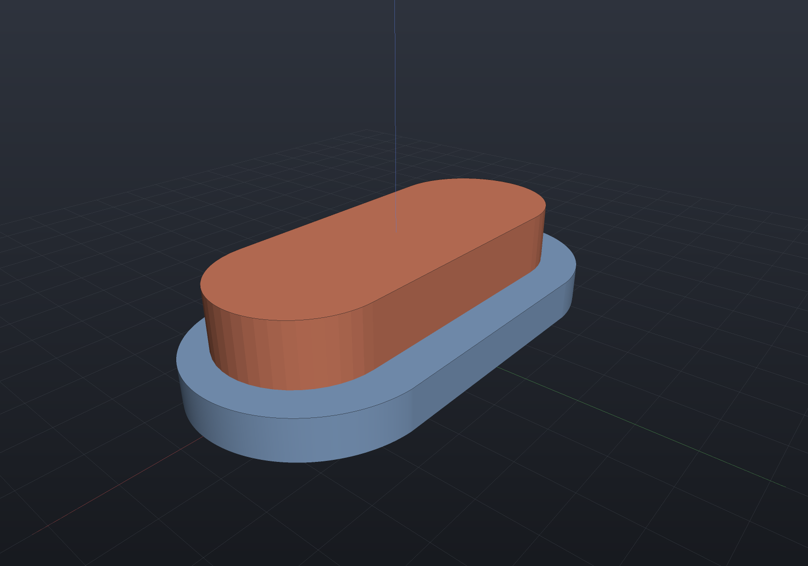

A constant offset grows every part of an outline by the same distance. A **variable**
offset lets the distance change around the boundary — a clearance that opens toward one
end, a draft that eases off, a wall thicker where it carries load.

`Sketch.Offset(law)` takes the distance as a function of **position**, and the sign carries
the direction exactly as the constant overload's does: all positive grows, all negative
shrinks.

## A clearance that opens along the part

```csharp render:variable-offset-plate
// 1 mm of clearance at the left end, opening to 6 mm at the right.
var plate = Sketch.RoundedRectangle(60, 30, 5);
var clearance = plate.Offset(p => 3.5 + p.X / 12.0)[0];

var (outer, holes) = Profile.FromRegion(clearance, SketchPlane.XY.Frame);
var scene = new Scene();
scene.Add(new Part("clearance", Shape.Extrude(outer, Vector3d.UnitZ * 3, holes), Palette.Steel));
scene.Add(new Part("plate", Shape.Extrude(plate, 9), Palette.Coral));
```



**The boundary of a varying offset is not the perpendicular one.** Sweeping a disc whose
radius changes along an edge leaves a region bounded by the **external tangent line** of
the two end circles, tilted off the normal by `sin φ = Δr / L` — not by the line through
the two offset endpoints, which under-covers near the smaller end by exactly the tangency
wedge. Each vertex then takes a round join of its own radius between the two adjacent
tangency feet.

## Eroding by a varying distance

A negative law erodes. There is no frame and no complement: the classical erosion
`B \ dilate(B \ R, d)` has a frame whose distances a variable law would have to define, and
that frame **cancels** — the answer is the region minus the inward collar, built from the
same tangent slabs with the normal flipped.

```csharp render:variable-offset-erosion
// A wall that thins toward the right: 0.5 mm taken off the left end, 3.5 mm off the right.
var plate = Sketch.RoundedRectangle(60, 30, 5);
var eroded = plate.Offset(p => -(2.0 + p.X / 20.0))[0];

var (outer, holes) = Profile.FromRegion(eroded, SketchPlane.XY.Frame);
var scene = new Scene();
scene.Add(new Part("plate", Shape.Extrude(plate, 3), Palette.Steel));
scene.Add(new Part("eroded", Shape.Extrude(outer, Vector3d.UnitZ * 9, holes), Palette.Coral));
```



Which corners need filling swaps with the direction, and it is a derivation rather than a
sign flip: a point just outside a **reflex** corner has no nearest boundary point at the
vertex, which is why the outward pass fills convex corners only — and inside, a point near a
**convex** corner projects onto one of its two edges while a reflex corner opens a wedge of
exactly `α − 180°`. Since `Cross(−a, −b)` equals `Cross(a, b)` exactly, negating both
normals does not swap which corners are filled; reversing their order does.

## Holes go the same way

A distance is how far the material advances **into the void**, on the outline and on every
hole alike. So one positive law grows the outline *and* shrinks each bore, with no separate
rule and no sign to remember:

```csharp render:variable-offset-hole
var plate = Sketch.Rectangle(60, 40).WithHole(Sketch.Circle((0, 0), 10));

// One law. The plate grows outward and the bore closes in.
var grown = plate.Offset(p => 2.0 + p.Y / 25.0)[0];

if (grown.Holes.Count != 1)
    throw new Exception("expected the bore to survive as one hole");

var (outer, holes) = Profile.FromRegion(grown, SketchPlane.XY.Frame);
var scene = new Scene();
scene.Add(new Part("grown", Shape.Extrude(outer, Vector3d.UnitZ * 6, holes)));
```



## Keeping the arcs — and reporting what is fitted

`OffsetExact(law)` runs the same construction on the exact curved tier. Straight edges keep
exact tangent slabs and vertex joins become true circular sectors, so **a polygonal outline
comes back exact** — better than the flattened route, whose round joins are inscribed
chords.

An **arc** is the one primitive that cannot stay exact. Substituting an arc into the
tangency condition gives

```
q(u) = C + (R + σ·r(u)·cos φ)·û(u) − sign(sweep)·r(u)·sin φ·t̂(u)
```

which is a **spiral**, not an arc of any radius — so it is fitted, and the departure is
reported rather than hidden:

```csharp render:variable-offset-exact
var slot = Sketch.Slot(40, 16);

// The law varies across the caps, so their swept boundary is a spiral and is fitted.
var grown = slot.OffsetExact(p => 3.0 + p.Y / 8.0, fitTolerance: 1e-4);

if (!(grown.MaxDeviation > 0 && grown.MaxDeviation <= 1e-4))
    throw new Exception($"unexpected fit deviation {grown.MaxDeviation}");

var scene = new Scene();
scene.Add(new Part("slot", Shape.Extrude(slot, 10), Palette.Coral));
scene.Add(new Part("grown", Shape.Extrude(Sketch.FromCurvedRegion(grown.Regions[0]), 4), Palette.Steel));
```



An edge whose law is locally **constant** takes an exact concentric branch, so a bore under
one stated distance stays exact and `MaxDeviation` reads exactly zero:

```csharp run:variable-offset-constant-arc
// Each of a slot's caps has BOTH its ends at one x, so an x-ramp gives that arc
// equal distances at both ends - a locally constant law, and the exact branch.
var exact = Sketch.Slot(24, 10).OffsetExact(p => 1.5 + p.X / 20.0);
if (exact.MaxDeviation != 0)
    throw new Exception($"expected an exact answer, got {exact.MaxDeviation}");
```

## What the law is sampled at, and what that costs

The law is evaluated at the boundary's own vertices and interpolated **linearly in arc
length** between them. So a law that is **affine in position** is reproduced exactly along
every straight edge — refining the sampling does not move the answer — while a curved law
carries the flattening's own sampling. The chord tolerance is the knob for both.

## Refused by name

```csharp run:variable-offset-refusals
var plate = Sketch.Rectangle(30, 20);

// A law that grows in places and shrinks in others would pass through a zero-radius
// disc, where the swept set is not defined.
try
{
    plate.Offset(p => p.X);
    throw new Exception("expected a refusal");
}
catch (ArgumentException e) when (e.Message.Contains("SIGN"))
{
}

// An edge whose distance changes by more than its own LENGTH: the larger end's disc
// swallows the whole sweep and no external tangent exists.
try
{
    Region2dOffset.Offset(plate.ToRegions()[0], [1.0, 40.0, 1.0, 1.0]);
    throw new Exception("expected a refusal");
}
catch (ArgumentException e) when (e.Message.Contains("swallows"))
{
}
```

An arc offset inward past its own centre is refused too: the swept boundary has a cusp
there rather than a spiral, and the constant offset's pie-slice degeneration has no
varying-radius counterpart.

## Related

- [2D sketch booleans](sketch-booleans.md) — the constant offset and the exact curved tier
- [2D views](2d-views.md) — sections and silhouettes, which feed the same region model
- [Toolpath infill](infill.md) — a consumer of the stroked/offset footprint
