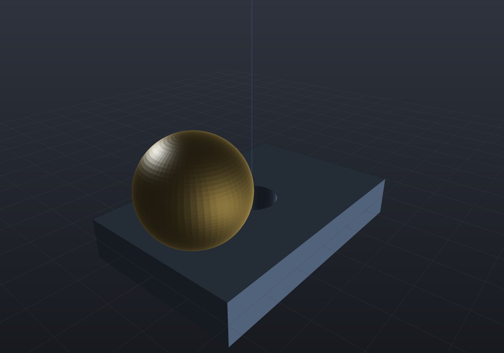
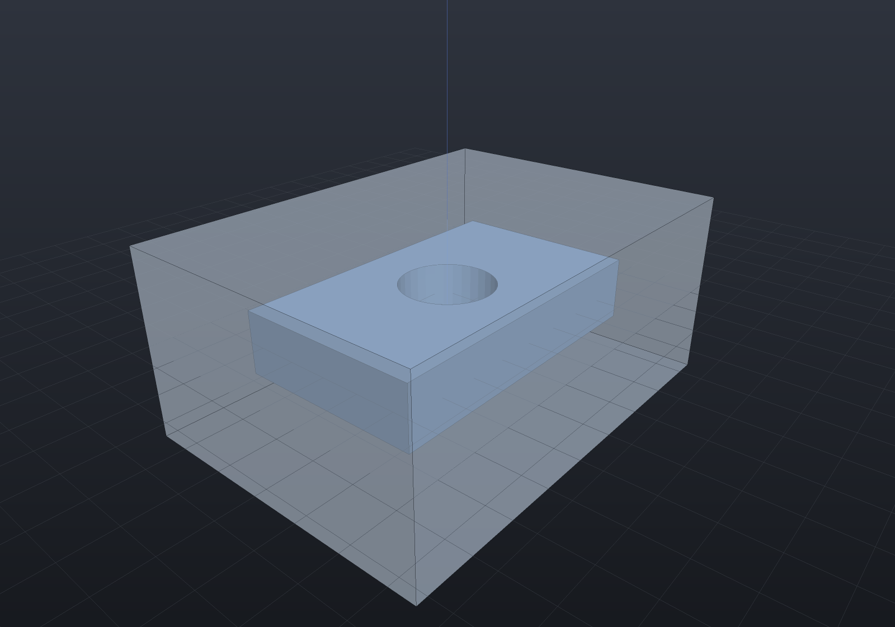
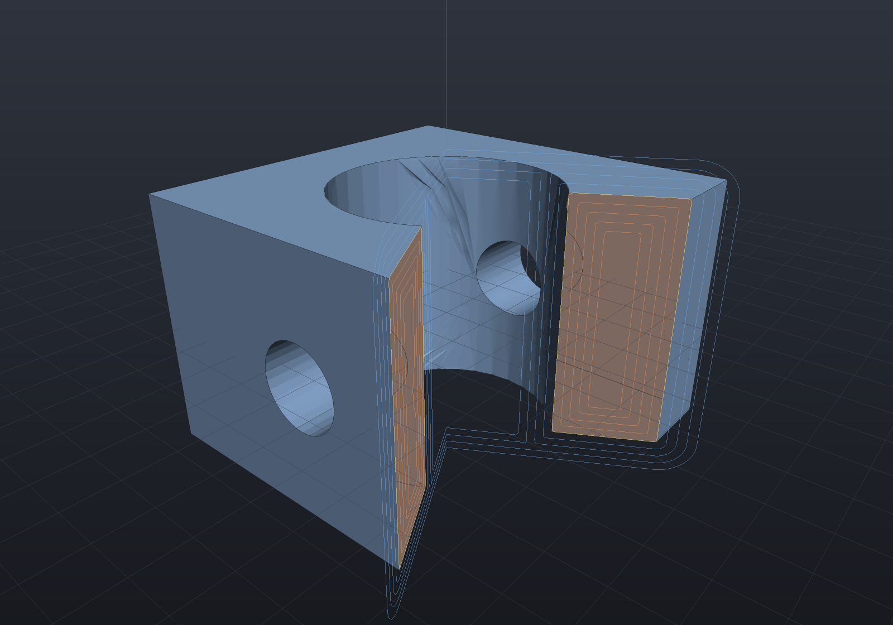
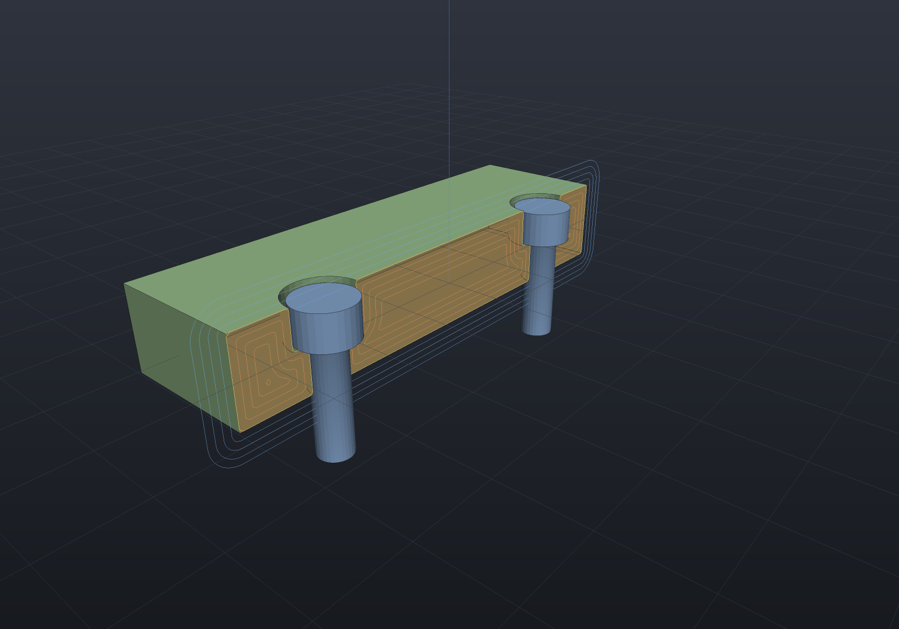
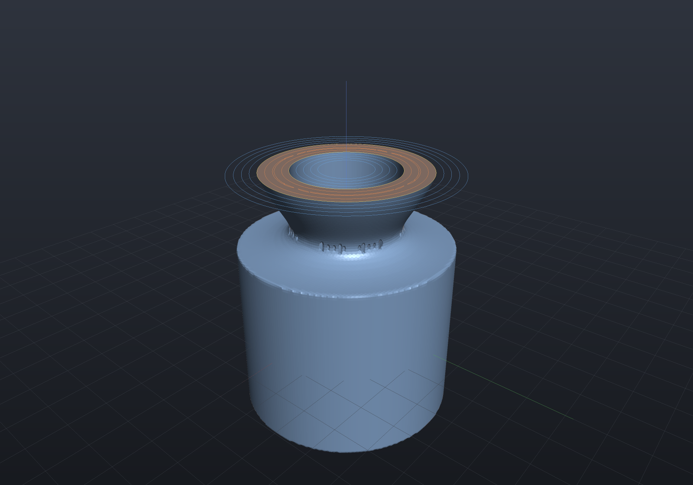
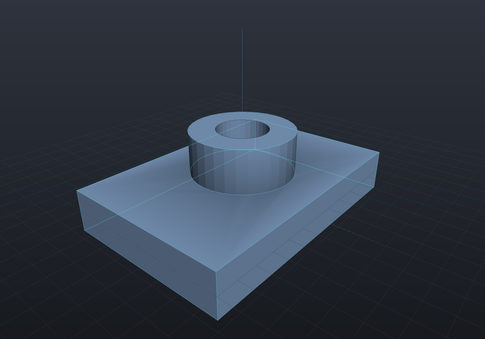

# Viewer

The viewer is a **library**, not an app: design code builds a `Scene` (parts grouped
into tabs) and hands it over. `EngrCad.Show(scene)` opens the interactive window;
`EngrCad.ShowLive(factory)` adds the hot-reload loop; `EngrCad.RenderToImage` renders
headless PNGs — which is how every screenshot in these docs is made.

```csharp render:viewer-scene
var scene = new Scene(new MeshQuality { SegmentsPerCircle = 48 });

var housing = scene.AddTab("housing");
housing.Add(new Part("body",
    Shape.Extrude(Sketch.RoundedRectangle(60, 40, 8), 20)
        .Fillet(3, s => s.PlanarFacesWithNormal(Vector3d.UnitZ)),
    Palette.Steel));
housing.Add(new Part("boss", Shape.Cylinder(9, 12), Palette.Brass,
    Matrix4d.CreateTranslation((0, 0, 24))));
housing.Add(new Part("pins", Shape.Cylinder(2.5, 10).Translate(22, 12, 22)
    .PatternLinear(2, (0, -24, 0)), Palette.Coral));
```


The interactive window adds the CAD chrome around this same rendering: toolbar (Fit,
Front/Top/Right/Iso views, perspective/orthographic toggle), model tree with
visibility checkboxes and two-way selection sync, properties panel (volume, area,
face count), click-picking by part name, adaptive ground grid with RGB axes, and a
feature-edge overlay — the classic shaded-with-edges CAD look.

```csharp
EngrCad.Show(scene, "housing");                    // blocking; one call per process
return EngrCad.Run(args, BuildScene, "housing");   // live loop + --view/--export/--render
```

## Per-part display modes

`Part.DisplayMode` selects **Shaded** (lit fill + feature edges), **Wireframe**
(every mesh edge as a line, no fill), or **Translucent** (alpha-blended fill with
opaque silhouette edges — see through a housing to its contents). Each model-tree row
has a `shade`/`wire`/`glass` cycler, and design code can set it directly:

```csharp
housing.Add(new Part("cover", coverShape, Palette.Sky)
    { DisplayMode = DisplayMode.Translucent });
```

Display modes are honored by both render paths — the interactive viewport and the
offscreen renderer these docs use draw with the same shaders and mode-precedence
rule, alongside a global view style (`ViewportControl.ViewStyle`, or
`--render-style points|wireframe|shaded|shaded-edges` for headless renders): parts
left at the default follow the global style, explicitly non-default parts keep
their own mode.

## Matcap shading

The **Shading** dropdown (or `EngrCad.Configure().WithShading(...)`, or the
`shading:` parameter on headless renders and the MCP `screenshot` tool) swaps the
standard directional light for an **analytic matcap** — a studio lit-sphere look
evaluated procedurally in the shared mesh shader, so no texture ever has to reach
the window, the offscreen renderer or the browser client. `ShadingStyle.Clay` is
the matte studio sphere; `ShadingStyle.Metal` the polished-metal one. Shading is
deliberately separate from the view *style*: the style says what is drawn (points,
lines, fills), shading says how a fill is lit, and the two compose. It is global
per pass — there is no per-part override, because a scene lit two ways reads as a
rendering bug.

```csharp render:shading-metal
// A render: snippet declares `shading` the way it declares `camera` or `explode`.
var shading = ShadingStyle.Metal;

var scene = new Scene(new MeshQuality { SegmentsPerCircle = 64 });
scene.Add(new Part("plate", Shape.Box(60, 40, 10) - Shape.Cylinder(6, 30), Palette.Steel));
scene.Add(new Part("dome", Shape.Sphere(12), Palette.Brass,
    Matrix4d.CreateTranslation((18, 0, 14))));
```



Ambient occlusion multiplies the matcap sample exactly as it multiplies the
standard ambient+diffuse product, section cut faces keep their flat cut material,
and selection gold blends the same way — a matcap changes how a fill is lit and
nothing else. The default (`ShadingStyle.Lit`) is pixel-identical to the viewer
before the feature existed.

## Debug modifiers (ghost, hide, isolate)

Three part-level flags — the OpenSCAD `%`/`*`/`!` analog — mark parts while you
debug a model, honored by the window, headless renders and every exporter through
one shared rule set (`DebugFilter`):

- **`part.Ghost = true`** (`%` background) — rendered translucent for reference,
  **excluded from geometry exports**: jigs, envelopes, reference bodies you want to
  see but never print.
- **`part.Hidden = true`** (`*` disable) — not rendered, not exported, but still in
  the model tree.
- **`part.Isolated = true`** (`!` root) — when any part is isolated, only isolated
  parts show and export.

```csharp render:debug-ghost
// The envelope is a ghost: visible as translucent context, absent from any
// --export file. The bracket is the real part.
var scene = new Scene();
scene.Add(new Part("bracket", Shape.Box(40, 24, 8) - Shape.Cylinder(6, 20), Palette.Steel));
var envelope = scene.Add(new Part("clearance envelope", Shape.Box(56, 40, 24), Palette.Sky));
envelope.Ghost = true;
```



## The validation report (Check)

The toolbar's **Check** button — or `SceneReport.Create(scene)` in code, the
`assert`/`echo` analog — reports every part's kind, face count, watertightness,
volume, surface area and size, with notes naming anything suspicious: an open mesh
(with its boundary-loop count), a part that failed to mesh (the exception becomes a
named note, not a crash), a non-positive volume, active debug modifiers. Scripts
assert on it:

```csharp run:scene-report
var scene = new Scene();
scene.Add(new Part("plate", Shape.Box(60, 40, 8) - Shape.Cylinder(5, 20)));
scene.Add(new Part("boss", Shape.Cylinder(8, 14)));

var report = SceneReport.Create(scene);
Console.WriteLine(report.ToText());
if (!report.AllClean) throw new Exception("expected a clean model");
if (report.Parts.Any(p => !p.Closed)) throw new Exception("everything should be watertight");
```

## Section planes

The toolbar's **Section** toggle clips everything beyond an axis-aligned plane —
X, Y, or Z (a toolbar cycler picks the axis, `[` / `]` keys nudge the offset) —
exposing interiors with a flat darker "cut material" on the revealed surfaces: the
standard way to inspect bores, cavities, and fillets in cross-section. Custom hosts
drive it via `ViewportControl.SectionEnabled` / `SectionAxis` / `SectionOffset`.

The render below uses the **real section plane** (the geometry is untouched — the
clipping happens in the shader), exactly what `--section z 6` produces headlessly:

```csharp render:section-cutaway section:z,18
var block = Shape.Box(40, 40, 24)
    .SmoothUnion(Shape.Sphere(10).Translate(0, 0, 14), 5)
    - Shape.Cylinder(6, 60)                       // vertical bore
    - Shape.Cylinder(5, 60).RotateX(Math.PI / 2); // horizontal bore

var scene = new Scene(new MeshQuality { SdfResolution = 140 });
scene.Add(new Part("block", block, Palette.Steel,
    Matrix4d.CreateTranslation((0, 0, 12))));
```


### Several planes, and oblique ones

Up to **four** section planes combine at once. `SectionCombine.Intersection` (the
default) clips only where *every* plane excludes, which gives the classic **quarter
cut** from two perpendicular planes and an **octant** from three; `Union` clips where
*any* does. With a single plane the two rules coincide.

Planes need not be axis-aligned — `SectionPlane.Through(point, normal)` takes any
normal, and `SectionPlane.On(frame)` any `Frame3d`. Fence options only spell
axis-aligned cuts, so a snippet declares the list itself:

```csharp render:section-oblique
var housing = Shape.Box(44, 44, 30)
    - Shape.Cylinder(13, 40)                                  // main bore
    - Shape.Cylinder(5, 60).RotateY(Math.PI / 2);             // cross bore

var scene = new Scene();
scene.Add(new Part("housing", housing, Palette.Steel));

// Quarter cut, rotated 30 degrees about Z: two perpendicular oblique planes.
double a = Math.PI / 6;
var sectionPlanes = new[]
{
    SectionPlane.Through((0, 0, 0), (Math.Cos(a), Math.Sin(a), 0)),
    SectionPlane.Through((0, 0, 0), (-Math.Sin(a), Math.Cos(a), 0)),
};
```



A `render:` snippet may declare `sectionPlanes` (any `IEnumerable<SectionPlane>`),
`sectionCombine`, and `camera` alongside its `scene` — the same convention `scene`
already uses. They win over the fence's `section:` option, which stays the short
spelling for the common axis-aligned case.

### Hardware is drawn unsectioned

`Part.ClippedBySection = false` renders **and picks** a part whole inside a cutaway.
That is not a rendering trick but a drafting rule: bolts, screws, nuts, keys, pins and
other solid fasteners are drawn unsectioned, because cutting a solid fastener
lengthwise shows nothing and only clutters the section. `HardwareComponent.ToPart()`
sets it for you, so a sectioned assembly shows its housing cut open with the fasteners
standing whole in their (sectioned) holes:

```csharp render:section-unsectioned-fasteners
var top = SketchPlane.At((0, 0, 6), Vector3d.UnitX, Vector3d.UnitY);

var build = new ComponentAssembly("plate", Shape.Box(70, 40, 12), Palette.Sage);
build.Place(StandardComponents.CapScrew(5, 16), [new(-22, 0), new(22, 0)], top);

var scene = new Scene();
scene.AddTab("cut").Add(build.ToAssembly("bracket"));

var sectionPlanes = new[] { SectionPlane.On(SectionAxis.Y, 0) };
```



### SDF isolines on the cut

Parts whose geometry is an `Sdf` — or a `Shape` with an implicit lowering, which is
most of them — automatically get **iso-distance contours** overlaid on the section
plane: the gold contour is the exact d = 0 surface cross-section, cool rings march
outward at +k·spacing, warm rings inward at −k·spacing. Wall thickness is readable
at a glance, and smooth blends and offsets show their actual field, which makes the
overlay a debugging tool as much as a display nicety:

```csharp render:section-isolines section:z,24 style:shaded
var body = Shape.Cylinder(16, 26)
    .SmoothUnion(Shape.Sphere(13).Translate(0, 0, 28), 9)   // blend-heavy top
    - Shape.Cylinder(8, 90);                                // through-bore

var scene = new Scene(new MeshQuality { SdfResolution = 200 });
scene.Add(new Part("blend", body, Palette.Steel));
```



## Construction previews

Every `Shape` part expands in the model tree into **how it was built** — the
operation graph as nested rows (a `FeatureHistory` part shows its feature list).
Clicking a row previews that step in the viewport: the model *as of that step*, a
rollback view, drawn as construction-cyan edges over the finished part.

Headless renders can draw the same overlay. A `render:` snippet (or any
`EngrCad.RenderToImage` caller) declares a `preview` — the part plus the
construction-tree row to show, addressed by its stable positional path:

```csharp render:construction-preview
// A boss on a plate, then a bore through both.
var body = (Shape.Box(60, 40, 10) | Shape.Cylinder(12, 14).Translate(0, 0, 8))
    - Shape.Cylinder(6, 60);

var part = new Part("bracket", body, Palette.Steel);
var scene = new Scene();
scene.Add(part);

// Row "0" is the union — the body BEFORE the bore. Previewing it overlays that
// step's feature edges on the finished part: the rollback view, in a still image.
var preview = new ConstructionPreviewRequest(part, part.ConstructionTree()!.Find("0")!);
```



The overlay draws through the same `PreviewLayer` the window uses (always on top,
never section-clipped), so the two paths cannot drift; a row that cannot be lowered
**fails the render** rather than silently omitting the overlay. In the window, the
tree rows of a feature-history part additionally carry a suppress toggle, a rollback
marker, and editable `[Param]` fields in the properties panel — see the
[parametric features](features.md) page.

## Undo and redo

Both model edits the window offers — the per-row **suppress** toggle and the properties
panel's **`[Param]` fields** — go through the document edit vocabulary described on the
[documents](documents.md) page, so the toolbar's **Undo** / **Redo** buttons (and
<kbd>Ctrl</kbd>+<kbd>Z</kbd> / <kbd>Ctrl</kbd>+<kbd>Y</kbd>, or
<kbd>Ctrl</kbd>+<kbd>Shift</kbd>+<kbd>Z</kbd>) take them back. The buttons name the step
they would undo in their tooltip.

A parameter that breaks the rebuild is **refused** rather than left applied: the value goes
back, the model rebuilds, the status bar says why, and nothing lands on the undo stack. The
rollback marker is deliberately outside the stack — it carries its own per-part suppression
bookkeeping — and stays a direct edit.

> The shortcut handler bubbles and does **not** claim already-handled events, unlike the
> viewport's pointer handlers. A focused text field has its own undo; taking
> <kbd>Ctrl</kbd>+<kbd>Z</kbd> away from it while you were typing a value would be worse
> than missing the shortcut.

## Headless rendering

`EngrCad.RenderToImage(scene, path, width, height, camera?, style?, sectionAxis?,
sectionOffset?)` renders with no window and no Avalonia lifetime — an offscreen EGL
pbuffer over the ANGLE runtime, with a software (WARP) fallback for CI. Check
`EngrCad.CanRenderToImage` to skip gracefully on machines with no GL at all. This is
the self-verification loop: tests and agents render a scene and inspect pixels
instead of screenshotting a window. Headless renders match the window — display
modes, view styles, section planes, and the SDF isolines above all render
identically (only interactive selection highlights are absent).

```csharp
if (EngrCad.CanRenderToImage)
    EngrCad.RenderToImage(scene, "out.png", width: 1280, height: 800,
        sectionAxis: SectionAxis.Z, sectionOffset: 6);   // optional real section plane
```

The interactive window's `Capture` toolbar button (or
`ViewportControl.SaveScreenshot`) saves the current framebuffer the same way. That
call is fire-and-forget — the capture happens in the *next* render pass, so the path
it names is a promise. A caller that intends to read the file back wants
`ViewportControl.CaptureScreenshotAsync(path?)`, whose `Task<string>` completes once
the PNG has been written; it is what the MCP `viewer_screenshot` bridge tool waits on
before returning the image.
