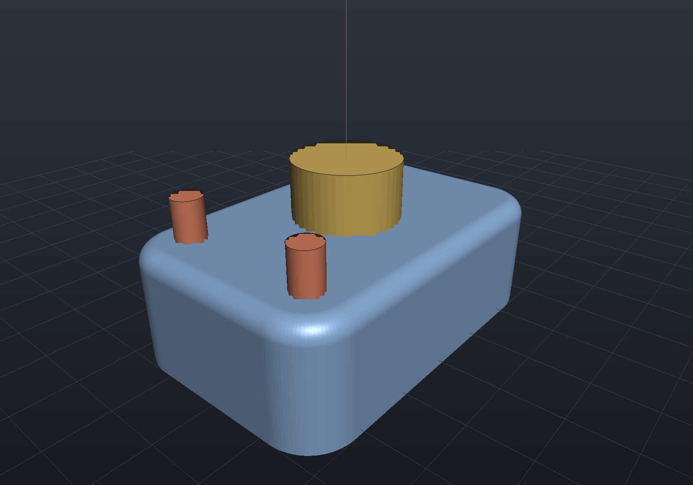
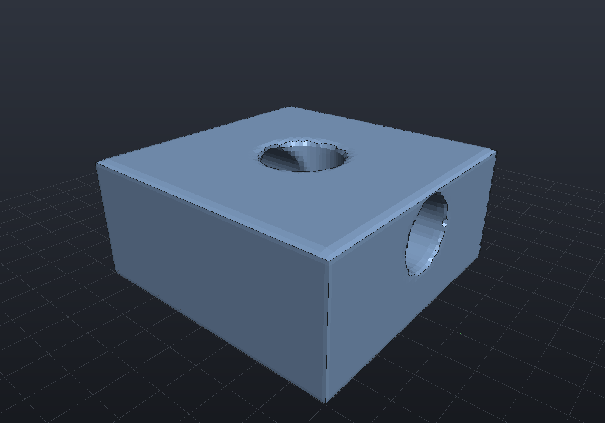

# Viewer

The viewer is a **library**, not an app: design code builds a `Scene` (parts grouped
into tabs) and hands it over. `EngrCad.Show(scene)` opens the interactive window;
`EngrCad.ShowLive(factory)` adds the hot-reload loop; `EngrCad.RenderToImage` renders
headless PNGs — which is how every screenshot in these docs is made.

```csharp render:viewer-scene
var scene = new Scene(new MeshQuality { SegmentsPerCircle = 48 });

var housing = scene.AddTab("housing");
housing.Add(new Part("body",
    Shape.Extrude(Sketch.RoundedRectangle(60, 40, 8), 20)
        .Fillet(3, s => s.PlanarFacesWithNormal(Vector3d.UnitZ)),
    Palette.Steel));
housing.Add(new Part("boss", Shape.Cylinder(9, 12), Palette.Brass,
    Matrix4d.CreateTranslation((0, 0, 24))));
housing.Add(new Part("pins", Shape.Cylinder(2.5, 10).Translate(22, 12, 22)
    .PatternLinear(2, (0, -24, 0)), Palette.Coral));
```



The interactive window adds the CAD chrome around this same rendering: toolbar (Fit,
Front/Top/Right/Iso views, perspective/orthographic toggle), model tree with
visibility checkboxes and two-way selection sync, properties panel (volume, area,
face count), click-picking by part name, adaptive ground grid with RGB axes, and a
feature-edge overlay — the classic shaded-with-edges CAD look.

```csharp
EngrCad.Show(scene, "housing");                    // blocking; one call per process
return EngrCad.Run(args, BuildScene, "housing");   // live loop + --view/--export/--render
```

## Per-part display modes

`Part.DisplayMode` selects **Shaded** (lit fill + feature edges), **Wireframe**
(every mesh edge as a line, no fill), or **Translucent** (alpha-blended fill with
opaque silhouette edges — see through a housing to its contents). Each model-tree row
has a `shade`/`wire`/`glass` cycler, and design code can set it directly:

```csharp
housing.Add(new Part("cover", coverShape, Palette.Sky)
    { DisplayMode = DisplayMode.Translucent });
```

> [!NOTE]
> Display modes are honored by the interactive viewport (`ViewportControl`). The
> offscreen renderer used for these docs draws everything shaded, so wireframe and
> translucent parts are shown here only as described — run the demo
> (`dotnet run --project samples/EngrCAD.Demo`) to see them live.

## Section planes

The toolbar's **Section** toggle clips everything above an adjustable world-z height
(`[` / `]` keys move it), exposing interiors with a flat darker "cut material" on the
revealed surfaces — the standard way to inspect bores, cavities, and fillets in
cross-section. Custom hosts drive it via `ViewportControl.SectionEnabled` /
`SectionHeight`.

The offscreen renderer has no section support yet, so the render below **simulates**
the effect by boolean-subtracting the upper half — in the viewer the section plane is
live and never modifies the geometry:

```csharp render:section-cutaway
var block = Shape.Box(40, 40, 24)
    .SmoothUnion(Shape.Sphere(10).Translate(0, 0, 14), 5)
    - Shape.Cylinder(6, 60)                       // vertical bore
    - Shape.Cylinder(5, 60).RotateX(Math.PI / 2); // horizontal bore

var sectioned = block - Shape.Box(60, 60, 40).Translate(0, 0, 26);  // clip above z = 6

var scene = new Scene();
scene.Add(new Part("sectioned block", sectioned, Palette.Steel,
    Matrix4d.CreateTranslation((0, 0, 12))));
```



## Headless rendering

`EngrCad.RenderToImage(scene, path, width, height, camera?)` renders with no window
and no Avalonia lifetime — an offscreen EGL pbuffer over the ANGLE runtime, with a
software (WARP) fallback for CI. Check `EngrCad.CanRenderToImage` to skip gracefully
on machines with no GL at all. This is the self-verification loop: tests and agents
render a scene and inspect pixels instead of screenshotting a window.

```csharp
if (EngrCad.CanRenderToImage)
    EngrCad.RenderToImage(scene, "out.png", width: 1280, height: 800);
```

The interactive window's `Capture` toolbar button (or
`ViewportControl.SaveScreenshot`) saves the current framebuffer the same way.
